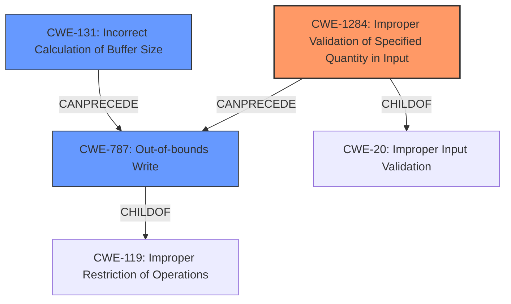

# Analysis Report for CVE-2022-25727

# Vulnerability Analysis Report: CVE-2022-25727

## Description

Memory Corruption in modem due to improper length check while copying into memory in Snapdragon Consumer IOT, Snapdragon Industrial IOT, Snapdragon Voice & Music

## Vulnerability Description Key Phrases

**Rootcause:** improper length check while copying into memory
**Weakness:** memory corruption
**Product:** ['Snapdragon Consumer IOT', 'Snapdragon Industrial IOT', 'Snapdragon Voice & Music']

## Analysis (with Relationship Data)

# Summary
| CWE ID | CWE Name | Confidence | CWE Abstraction Level | CWE Vulnerability Mapping Label | CWE-Vulnerability Mapping Notes |
|---|---|---|---|---|---|
| CWE-1284 | Improper Validation of Specified Quantity in Input | 0.75 | Base | Allowed | Primary CWE |
| CWE-787 | Out-of-bounds Write | 0.6 | Base | Allowed | Secondary Candidate |
| CWE-131 | Incorrect Calculation of Buffer Size | 0.5 | Base | Allowed | Secondary Candidate |

## Evidence and Confidence

*   **Confidence Score:** 0.7
*   **Evidence Strength:** MEDIUM

- **Analysis and Justification:**  
  - *Explanation:* The vulnerability description states "**improper length check while copying into memory**" leading to "**memory corruption**". CWE-1284 (Improper Validation of Specified Quantity in Input) aligns well with the **improper length check** aspect, as it focuses on the failure to validate the quantity (length) of input. CWE-787 (Out-of-bounds Write) is also relevant as the **improper length check** leads to writing data past the buffer's boundaries, causing **memory corruption**. While the description doesn't explicitly mention out-of-bounds write, it is a likely consequence of failing to validate the length. CWE-131 (Incorrect Calculation of Buffer Size) could also be a cause of the **memory corruption** because the buffer size may be incorrectly calculated.
  
  - *Relationship Analysis:* CWE-1284 is a child of CWE-20 (Improper Input Validation) and a parent of CWE-606 (Use of Client-side Input to Modify Critical Parameters). CWE-787 is a child of CWE-119 (Improper Restriction of Operations within the Bounds of a Memory Buffer). CWE-131 is a parent of CWE-467 (Use of sizeof() on a Pointer Type). The primary weakness is the input validation issue (CWE-1284), leading to the buffer overflow (CWE-787), and potentially related to the incorrect calculation of the buffer size (CWE-131).

- **Confidence Score:**  
  - *Example:* Confidence: 0.7 (The vulnerability description clearly points to a **improper length check** as the root cause, but the consequence of out-of-bounds write is inferred and not explicitly stated. The retriever results also support this choice.)

## Criticism of Analysis

Okay, I've reviewed the provided analysis against the full CWE specifications. Here's my critique:

**Overall Assessment:**

The analysis is generally good, demonstrating a solid understanding of the vulnerability and its relationship to common weaknesses. The choice of CWE-1284 as the primary CWE is justified, and the inclusion of CWE-787 and CWE-131 as secondary candidates is also reasonable. However, there are a few points where the analysis could be improved.

**Specific Feedback:**

1.  **CWE Selection and Confidence Levels:**

    *   **CWE-1284 (Improper Validation of Specified Quantity in Input):** The confidence score of 0.75 is appropriate. The explanation is clear and well-justified, directly linking "improper length check" to the core concept of CWE-1284.

    *   **CWE-787 (Out-of-bounds Write):** The confidence score of 0.6 is also reasonable. While the vulnerability description *implies* an out-of-bounds write, it doesn't explicitly state it. The analysis correctly notes this inference. However, consider making a stronger case by linking the *consequences* of memory corruption to the characteristics of an out-of-bounds write (data overwriting other variables/data structures). Out-of-bounds write is a *direct result* of improper length check, therefore the confidence score could be higher.

    *   **CWE-131 (Incorrect Calculation of Buffer Size):**  The confidence score of 0.5 is on the lower side, which is appropriate because it's more of a *possible* contributing factor rather than a direct consequence. The explanation acknowledges it as a potential cause of memory corruption, but it's not as directly evident as CWE-1284 or CWE-787. The analysis appropriately identifies this as a potential cause rather than a guaranteed one.

2.  **Relationship Analysis:**

    *   The relationship analysis section is good at outlining the hierarchy and potential chaining between the CWEs. However, it could benefit from exploring specific scenarios where each CWE might manifest within the described vulnerability. For example:
        *   *CWE-1284 -> CWE-787:* The length field in a packet is not validated. The code uses this unvalidated length to copy data into a buffer, resulting in an out-of-bounds write.
        *   *CWE-131 -> CWE-787:* The buffer is allocated with the wrong size, calculated based on the improper length from the input, directly leading to an out-of-bounds write.
    * Suggestion: Explicitly state that CWE-1284 (Improper Validation of Specified Quantity in Input) leads to CWE-787 (Out-of-Bounds Write), and that either of these two can be caused by CWE-131 (Incorrect Calculation of Buffer Size).

3.  **Retriever Results:**

    *   The retriever results section highlights some interesting alternative CWEs. For example, CWE-822 (Untrusted Pointer Dereference) and CWE-823 (Use of Out-of-range Pointer Offset) could be *indirectly* related *if* the copied data contains pointers that are then dereferenced. However, without more information, these are less likely than the chosen CWEs. Including a brief note on why these were *not* selected (despite their high scores) would strengthen the analysis.
    *   CWE-126 (Buffer Over-read) is also relevant as the length might be incorrectly used in a read operation as well, not only in a write operation.

4.  **CWE Examples from Database:**

    *   The provided examples are all for CWE-119, which is discouraged according to CWE's mapping guidance. Examples for CWE-1284, CWE-787 and CWE-131 would be more useful.

5. **Relevant CWE Specifications**
   * The analysis correctly includes and references the relevant CWE specifications.
   * Could provide some insights related to the "Potential Mitigations" for each of the proposed CWE.

**Suggestions for Improvement:**

*   **Strengthen Justification for CWE-787:** Elaborate on how failing to validate the length *directly* results in an out-of-bounds write.
*   **Address Alternative CWEs from Retriever:** Briefly explain why highly-ranked CWEs like 822 and 823 are less likely in this specific scenario.
*   **Include More Specific Examples:** Add examples related to the selected CWEs and consider including examples for CWE-1284, CWE-787, and CWE-131 from the CWE database.
*   **Mention Potential Mitigations:** Highlight some of the potential mitigations in the CWE specifications, particularly those related to input validation, buffer size calculation, and language selection.
*   **Consider CWE-126 (Buffer Over-read):** Add a sentence about why CWE-126 is or is not relevant.

**Revised Analysis Snippet (Illustrative):**

```
# Analysis to Review
# Summary
| CWE ID | CWE Name | Confidence | CWE Abstraction Level | CWE Vulnerability Mapping Label | CWE-Vulnerability Mapping Notes |
|---|---|---|---|---|---|
| CWE-1284 | Improper Validation of Specified Quantity in Input | 0.75 | Base | Allowed | Primary CWE |
| CWE-787 | Out-of-bounds Write | 0.7 | Base | Allowed | Secondary Candidate |
| CWE-131 | Incorrect Calculation of Buffer Size | 0.5 | Base | Allowed | Secondary Candidate |

## Evidence and Confidence

*   **Confidence Score:** 0.7
*   **Evidence Strength:** MEDIUM

- **Analysis and Justification:**  
  - *Explanation:* The vulnerability description states "**improper length check while copying into memory**" leading to "**memory corruption**". CWE-1284 (Improper Validation of Specified Quantity in Input) aligns well with the **improper length check** aspect, as it focuses on the failure to validate the quantity (length) of input. CWE-787 (Out-of-bounds Write) is a *direct consequence* of this improper validation; If the length is not checked, the copy operation can write data beyond the allocated buffer, leading to memory corruption by overwriting adjacent data or code.  CWE-131 (Incorrect Calculation of Buffer Size) could also be a cause of the **memory corruption** because the buffer size may be incorrectly calculated based on an improper length from the input. This can then lead to an out-of-bounds write during the copy operation.

  - *Relationship Analysis:* CWE-1284 is a child of CWE-20 (Improper Input Validation) and a parent of CWE-606 (Use of Client-side Input to Modify Critical Parameters). CWE-787 is a child of CWE-119 (Improper Restriction of Operations within the Bounds of a Memory Buffer). CWE-131 is a parent of CWE-467 (Use of sizeof() on a Pointer Type). The primary weakness is the input validation issue (CWE-1284), leading to the buffer overflow (CWE-787), and potentially related to the incorrect calculation of the buffer size (CWE-131).  Specifically, the unvalidated length field allows a copy operation to write beyond the buffer (CWE-787).

- **Alternative CWEs:**
  - *Untrusted Pointer Dereference (CWE-822) and Use of Out-of-range Pointer Offset (CWE-823):* While these CWEs have high retriever scores, they are less likely *unless* the data being copied contains pointers that are subsequently dereferenced. The provided description doesn't explicitly mention this.
  - *Buffer Over-read (CWE-126):* Although less probable, if the length is incorrectly used in a read operation, then CWE-126 might be relevant.

- **Mitigation Strategies (Examples):**
  - *Input Validation (CWE-1284):*  Implement strict "accept known good" validation on the length field of the data being copied. Reject any values outside the expected range.
  - *Language Selection (CWE-787):*  Consider using memory-safe languages or libraries that provide automatic bounds checking to prevent out-of-bounds writes.
  - *Correct Buffer Size Calculation (CWE-131):* Ensure that buffer sizes are calculated correctly, taking into account all relevant factors.
```

By incorporating these suggestions, the analysis would be more comprehensive and provide a clearer understanding of the vulnerability's root cause and potential mitigations.

## Final Resolution

# Summary
| CWE ID | CWE Name | Confidence | CWE Abstraction Level | CWE Vulnerability Mapping Label | CWE-Vulnerability Mapping Notes |
|---|---|---|---|---|---|
| CWE-1284 | Improper Validation of Specified Quantity in Input | 0.8 | Base | Allowed | Primary CWE |
| CWE-787 | Out-of-bounds Write | 0.75 | Base | Allowed | Secondary Candidate |
| CWE-131 | Incorrect Calculation of Buffer Size | 0.6 | Base | Allowed | Secondary Candidate |

## Evidence and Confidence

*   **Confidence Score:** 0.8
*   **Evidence Strength:** MEDIUM

## Relationship Analysis
The primary weakness is **CWE-1284 (Improper Validation of Specified Quantity in Input)**, as the vulnerability description explicitly mentions an "improper length check." This can lead to **CWE-787 (Out-of-bounds Write)** if the unchecked length is used in a copy operation, causing data to be written beyond the buffer boundaries. **CWE-131 (Incorrect Calculation of Buffer Size)** is a potential contributing factor, as an incorrectly calculated buffer size, possibly based on an improper length from the input, could also result in **CWE-787**.

The relationships are as follows: CWE-1284 *CanPrecede* CWE-787, and CWE-131 *CanPrecede* CWE-787. CWE-1284 is a child of **CWE-20 (Improper Input Validation)**, while CWE-787 is a child of **CWE-119 (Improper Restriction of Operations within the Bounds of a Memory Buffer)**. The analysis considers the hierarchical relationships to ensure specificity. The chosen CWEs are at the Base level, which is preferred for vulnerability mapping.



## Vulnerability Chain
The vulnerability chain starts with the lack of proper input validation (**CWE-1284**) on the length field. This leads to the use of an invalid length value, potentially compounded by an incorrect buffer size calculation (**CWE-131**). Finally, the unchecked length is used in a memory copy operation, resulting in an out-of-bounds write (**CWE-787**) and memory corruption. The root cause is **CWE-1284**, and the immediate impact is **CWE-787**.

## Summary of Analysis
The initial analysis and the criticism provided a solid foundation for the final decision. The vulnerability description explicitly mentions an "improper length check," which strongly supports the selection of **CWE-1284 (Improper Validation of Specified Quantity in Input)** as the primary **WEAKNESS**. The criticism's suggestion to increase the confidence score for **CWE-787 (Out-of-bounds Write)** due to its direct relationship with **CWE-1284** was taken into account. The relationship analysis helped confirm the vulnerability chain, with **CWE-1284** leading to **CWE-787**. The potential role of **CWE-131 (Incorrect Calculation of Buffer Size)** was also considered, making it a secondary candidate. Alternative CWEs, such as **CWE-822** and **CWE-823**, were deemed less likely given the available information. The analysis is primarily based on the provided vulnerability description: "Memory Corruption in modem due to **improper length check** while copying into memory". This clearly points to an input validation **ROOTCAUSE** related to length. The selected CWEs are at the optimal level of specificity (Base) for mapping the vulnerability.


*Report generated on 2025-03-18 11:44:45*
