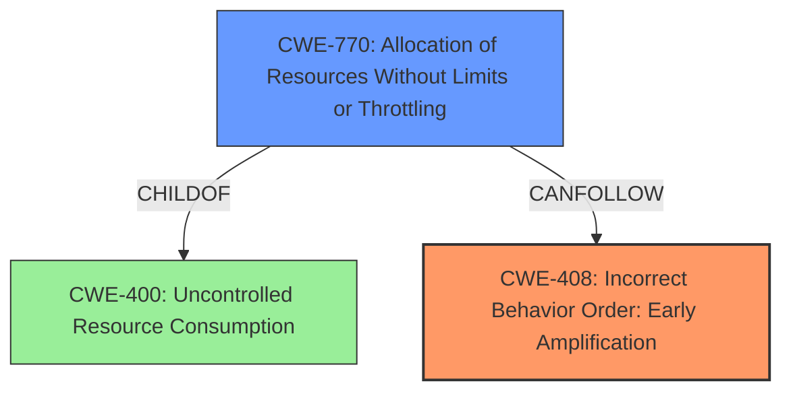

# Analysis Report for CVE-2022-2576

# Vulnerability Analysis Report: CVE-2022-2576

## Description

In Eclipse Californium version 2.0.0 to 2.7.2 and 3.0.0-3.5.0 a DTLS resumption handshake falls back to a DTLS full handshake on a parameter mismatch without using a HelloVerifyRequest. Especially, if used with certificate based cipher suites, that results in message amplification (DDoS other peers) and high CPU load (DoS own peer). The misbehavior occurs only with DTLS_VERIFY_PEERS_ON_RESUMPTION_THRESHOLD values larger than 0.

## Vulnerability Description Key Phrases

**Rootcause:** DTLS resumption handshake falls back to a DTLS full handshake on a parameter mismatch
**Impact:** ['message amplification', 'high CPU load']
**Vector:** mismatch in DTLS_VERIFY_PEERS_ON_RESUMPTION_THRESHOLD values
**Product:** Eclipse Californium
**Version:** 2.0.0 to 2.7.2 and 3.0.0-3.5.0

## Analysis (with Relationship Data)

# Summary
| CWE ID | CWE Name | Confidence | CWE Abstraction Level | CWE Vulnerability Mapping Label | CWE-Vulnerability Mapping Notes |
|---|---|---|---|---|---|
| CWE-408 | Incorrect Behavior Order: Early Amplification | 0.95 | Base | Primary | Allowed |
| CWE-770 | Allocation of Resources Without Limits or Throttling | 0.65 | Base | Secondary | Allowed |

## Evidence and Confidence

*   **Confidence Score:** 0.9
*   **Evidence Strength:** HIGH

- **Analysis and Justification:**
  - *Explanation:* The vulnerability description clearly states that the **DTLS resumption handshake falls back to a DTLS full handshake on a parameter mismatch**, specifically cipher suite mismatch, without using a HelloVerifyRequest. This behavior leads to message amplification and high CPU load, indicative of a Denial of Service (DoS) condition. CWE-408 (Incorrect Behavior Order: Early Amplification) directly aligns with this scenario as it describes a situation where "The product allows an entity to perform a legitimate but expensive operation before authentication or authorization has taken place." In this case, the expensive operation is the full handshake, which is performed before the HelloVerifyRequest can validate the client. The "CVE Reference Links Content Summary" reinforces this, highlighting the **missing HelloVerifyRequest during fallback** and the **bypass of DoS protection**. This bypass allows attackers to force the server into expensive full handshakes, consuming excessive resources. The Retriever results also strongly support CWE-408, with the highest combined score of 0.9622. MITRE mapping guidance for CWE-408 indicates that this is ALLOWED.

  - *Relationship Analysis:* CWE-408 is a base CWE. The description in the Retriever results provides, "The product allows an entity to perform a legitimate but expensive operation before authentication or authorization has taken place." This aligns directly with the vulnerability, so no further relationship analysis is required.

- **Confidence Score:**
  - Confidence: 0.95 (Strong alignment with vulnerability description, supporting CVE details, and Retriever results.)

---
- **Analysis and Justification:**
  - *Explanation:* The excessive CPU load and message amplification resulting from the flawed handshake process suggest a lack of resource management. The vulnerability allows an attacker to trigger expensive full handshakes repeatedly, potentially exhausting server resources. While CWE-400 (Uncontrolled Resource Consumption) is a broader category, CWE-770 (Allocation of Resources Without Limits or Throttling) is more specific and appropriate. The server allocates resources for the full handshake without proper validation, leading to potential resource exhaustion. While CWE-408 is the primary weakness, the uncontrolled allocation of resources is a significant contributing factor to the vulnerability's impact. The Retriever results also include CWE-770 with a non-negligible score. MITRE mapping guidance for CWE-770 indicates that this is ALLOWED.

  - *Relationship Analysis:* CWE-770 is a base CWE and a child of CWE-400 (Uncontrolled Resource Consumption). This relationship indicates that CWE-770 is a more specific instance of the broader resource consumption issue. Given that the vulnerability specifically involves the allocation of resources for handshakes without proper limits or throttling, CWE-770 is a relevant secondary weakness.

- **Confidence Score:**
  - Confidence: 0.65 (Secondary weakness, strong alignment with resource consumption aspect of the vulnerability.)

---

## Criticism of Analysis

Okay, here's a review of the provided CWE analysis, taking into account the full CWE specifications and mapping guidance:

**Overall Assessment:**

The analysis is generally sound and well-reasoned, with good justification for the primary CWE. The secondary CWE is also relevant, although perhaps not as directly impactful. The confidence scores appear appropriate.

**Detailed Review:**

**1. CWE-408: Incorrect Behavior Order: Early Amplification (Primary)**

*   **Confidence:** 0.95
*   **Abstraction Level:** Base
*   **Mapping Label:** Primary
*   **Critique:**

    *   **Justification:** The reasoning here is very strong. The vulnerability description explicitly mentions the "expensive operation" (full handshake) occurring *before* the "authentication/authorization" check (HelloVerifyRequest). This maps perfectly to the definition of CWE-408.  The CVE Reference Links Content Summary reinforces this by highlighting the "missing HelloVerifyRequest during fallback" and the "bypass of DoS protection."
    *   **Retriever Results:** The retriever results strongly support CWE-408.
    *   **Mapping Guidance:** The mapping guidance states that CWE-408 is ALLOWED and is at the Base level of abstraction, which is preferred.
    *   **Observed Examples:** The provided examples from the CWE database are not as directly applicable as the specific vulnerability, but they demonstrate the general concept of performing an expensive operation before proper authentication.
    *   **Potential Mitigations:** The general mitigations of rate limiting, authentication and authorization are applicable here.
    *   **Overall:** Excellent choice for the primary CWE.

**2. CWE-770: Allocation of Resources Without Limits or Throttling (Secondary)**

*   **Confidence:** 0.65
*   **Abstraction Level:** Base
*   **Mapping Label:** Secondary
*   **Critique:**

    *   **Justification:** The rationale is reasonable. The attack *does* lead to excessive resource allocation (CPU, memory) due to the repeated full handshakes. The connection between CWE-770 and the vulnerability is that the server allocates resources for the full handshake *without* proper validation using the HelloVerifyRequest.  This lack of throttling or limits is the key element tying it to CWE-770.
    *   **Relationship Analysis:** The analysis correctly notes the relationship between CWE-770 and the broader CWE-400. CWE-770 is a more specific instance of uncontrolled resource consumption.
    *   **Retriever Results:** The retriever results include CWE-770 with a non-negligible score, supporting this as a secondary factor.
    *   **Mapping Guidance:** The mapping guidance states that CWE-770 is ALLOWED and is at the Base level of abstraction, which is preferred.
    *   **Observed Examples:** The observed examples for CWE-770 align well with the vulnerability description.
    *   **Potential Mitigations:** The mitigations for CWE-770, such as limiting resources accessible to unprivileged users and designing throttling mechanisms, are highly relevant.
    *   **Consideration:** While the analysis makes a good case for CWE-770, it's important to acknowledge that the *root cause* is the incorrect behavior order (CWE-408). The uncontrolled resource allocation (CWE-770) is a consequence of that incorrect order. Another child of CWE-400, such as CWE-405 *Asymmetric Resource Consumption (Amplification)* could also be considered, but that is very close to CWE-408 and adds little to the analysis.

**Suggestions for Improvement:**

*   **Explicitly state the relationship between the primary and secondary CWE:** Clearly articulate that CWE-408 is the *root cause* and CWE-770 is a *contributing factor* or *consequence*. This strengthens the analysis and clarifies the relative importance of the CWEs. The current analysis mentions this, but a more forceful statement would be beneficial.
*   **Briefly discuss other potentially relevant CWEs and why they were excluded:** For example, mentioning CWE-400 and explaining why CWE-770 is a better fit (more specific) would demonstrate a more thorough analysis.
*   **Mention the impact of IP Spoofing:** Add a line mentioning that by spoofing the IP address of the client, the server can be used as an amplification attack vector to DoS other peers.

**Revised Summary Table:**

| CWE ID | CWE Name | Confidence | CWE Abstraction Level | CWE Vulnerability Mapping Label | CWE-Vulnerability Mapping Notes |
|---|---|---|---|---|---|
| CWE-408 | Incorrect Behavior Order: Early Amplification | 0.95 | Base | Primary | Allowed | Root cause of the vulnerability; the server performs the expensive full handshake before authentication. |
| CWE-770 | Allocation of Resources Without Limits or Throttling | 0.65 | Base | Secondary | Allowed | Contributing factor; the server allocates resources for full handshakes without proper throttling, exacerbating the DoS.  A consequence of CWE-408. |

**Conclusion:**

The analysis is well done. The primary CWE assignment is excellent, and the secondary CWE is appropriate and well-justified. The suggestions above are primarily for refinement and to demonstrate a more complete understanding of the vulnerability and related CWEs. The confidence levels and explanations are appropriate, demonstrating a strong grasp of the CWE specifications and mapping guidance.

## Final Resolution

# Summary
| CWE ID | CWE Name | Confidence | CWE Abstraction Level | CWE Vulnerability Mapping Label | CWE-Vulnerability Mapping Notes |
|---|---|---|---|---|---|
| CWE-408 | Incorrect Behavior Order: Early Amplification | 0.95 | Base | Primary | Allowed | Root cause of the vulnerability; the server performs the expensive full handshake before authentication. |
| CWE-770 | Allocation of Resources Without Limits or Throttling | 0.65 | Base | Secondary | Allowed | Contributing factor; the server allocates resources for full handshakes without proper throttling, exacerbating the DoS. A consequence of CWE-408. |

## Evidence and Confidence

*   **Confidence Score:** 0.9
*   **Evidence Strength:** HIGH

## Relationship Analysis
The primary CWE, CWE-408 (**Incorrect Behavior Order: Early Amplification**), is at the Base level, offering a specific description of the vulnerability's root cause. The secondary CWE, CWE-770 (**Allocation of Resources Without Limits or Throttling**), is also at the Base level and is a child of CWE-400 (**Uncontrolled Resource Consumption**), indicating that CWE-770 is a more specific instance of the broader resource consumption issue.

## Vulnerability Chain
The vulnerability chain begins with the **ROOTCAUSE** CWE-408 (**Incorrect Behavior Order: Early Amplification**), where the DTLS resumption handshake falls back to a full handshake without proper authentication. This leads to the weakness CWE-770 (**Allocation of Resources Without Limits or Throttling**), as the server allocates resources for full handshakes without limits. The final impact is a Denial of Service (DoS) due to message amplification and high CPU load.

## Summary of Analysis
The initial analysis and criticism are both sound and well-reasoned. The vulnerability description explicitly states the "expensive operation" (full handshake) occurring *before* the "authentication/authorization" check (HelloVerifyRequest), which maps perfectly to the definition of CWE-408 (**Incorrect Behavior Order: Early Amplification**). The secondary CWE, CWE-770 (**Allocation of Resources Without Limits or Throttling**), is a contributing factor to the vulnerability. The server allocates resources for full handshakes without proper throttling, exacerbating the DoS.

The graph relationships influenced the selection by confirming that CWE-408 is the **ROOTCAUSE** and CWE-770 is a consequence. Both CWEs are at the optimal level of specificity, being at the Base level of abstraction. The selected CWEs are at the optimal level of specificity because they directly address the vulnerability's root cause (CWE-408) and contributing factor (CWE-770).

*Report generated on 2025-03-17 03:54:04*
