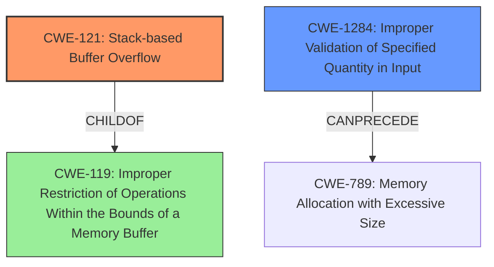

# Analysis Report for CVE-2022-25793

# Vulnerability Analysis Report: CVE-2022-25793

## Description

A Stack-based Buffer Overflow Vulnerability in Autodesk 3ds Max 2022, 2021, and 2020 may lead to code execution through the lack of proper validation of the length of user-supplied data prior to copying it to a fixed-length stack-based buffer when parsing ActionScript Byte Code files. This vulnerability may allow arbitrary code execution on affected installations of Autodesk 3ds Max.

## Vulnerability Description Key Phrases

**Rootcause:** lack of proper validation of the length of user-supplied data
**Weakness:** Stack-based Buffer Overflow
**Impact:** arbitrary code execution
**Product:** Autodesk 3ds Max
**Version:** 2022, 2021, and 2020

## Analysis (with Relationship Data)

# Summary
| CWE ID | CWE Name | Confidence | CWE Abstraction Level | CWE Vulnerability Mapping Label | CWE-Vulnerability Mapping Notes |
|---|---|---|---|---|---|
| CWE-121 | Stack-based Buffer Overflow | 0.95 | Variant | Primary | Allowed |
| CWE-1284 | Improper Validation of Specified Quantity in Input | 0.75 | Base | Secondary Candidate | Allowed |

## Evidence and Confidence

*   **Confidence Score:** 0.90
*   **Evidence Strength:** HIGH

- **Analysis and Justification:**  
  - *Explanation:* The vulnerability description clearly states a "**Stack-based Buffer Overflow**" due to the "**lack of proper validation of the length of user-supplied data**" when parsing ActionScript Byte Code files. This directly aligns with the characteristics of CWE-121 (Stack-based Buffer Overflow), which is a variant of buffer overflow occurring specifically on the stack. The CVE reference summary further reinforces this by stating that the application fails to check the size of input data before copying it to a fixed-size buffer on the stack, leading to potential arbitrary code execution. The Retriever Results also lists CWE-121 with a high score, further supporting its suitability.

  - *Relationship Analysis:* CWE-121 is a variant of CWE-119 (Improper Restriction of Operations within the Bounds of a Memory Buffer), which is a more general class of buffer overflows. Given the explicit mention of "Stack-based" in the description, CWE-121 is more specific and appropriate. The vulnerability also involves a lack of input validation, which can be related to CWE-20 (Improper Input Validation), but CWE-1284 (Improper Validation of Specified Quantity in Input) is more specific to the **length of user-supplied data**, making it a potential secondary weakness.

- **Confidence Score:**  
  - Confidence: 0.95 (High evidence from technical description, CVE reference materials, and Retriever Results)

- **Analysis and Justification:**  
  - *Explanation:* The **root cause** of the vulnerability is the "**lack of proper validation of the length of user-supplied data**". This maps well to CWE-1284 (Improper Validation of Specified Quantity in Input), which describes a situation where the product receives input that is expected to specify a quantity (such as size or length), but it does not validate or incorrectly validates that the quantity has the required properties. In this case, the length of the user-supplied data is not properly validated, leading to the buffer overflow.
  - *Relationship Analysis:* CWE-1284 is a base CWE, and is related to the improper input validation that causes the buffer overflow. It can be seen as a contributing factor leading to the primary weakness, CWE-121.
- **Confidence Score:**  
  - Confidence: 0.75 (Sufficient evidence from vulnerability description, but less direct than for CWE-121)

## Criticism of Analysis

Okay, here's a detailed review of the provided analysis, incorporating the full CWE specifications you provided.

**Overall Assessment**

The analysis is generally strong and well-reasoned. The primary CWE mapping to CWE-121 (Stack-based Buffer Overflow) is highly accurate and justified. The inclusion of CWE-1284 (Improper Validation of Specified Quantity in Input) as a secondary contributing factor is also sound. The confidence levels are appropriate given the available information.

**Detailed Review**

**1. CWE-121: Stack-based Buffer Overflow**

*   **Confidence:** 0.95 (Excellent)
*   **Abstraction Level:** Variant
*   **Mapping Guidance Adherence:**  The analysis correctly identifies CWE-121 as a *Variant*-level CWE, which is the preferred level of abstraction. The justification is clear: the vulnerability description explicitly mentions "Stack-based Buffer Overflow."
*   **Relationship Analysis:** Spot on. The explanation of the relationship to CWE-119 (Improper Restriction of Operations within the Bounds of a Memory Buffer) is accurate.  CWE-121 is a more specific child of a more general parent.
*   **CWE Specification Considerations:**
    *   **Description Adequacy:**  The provided description of CWE-121 aligns perfectly with the observed behavior.
    *   **Potential Mitigations:**
        *   The analysis could be slightly improved by briefly mentioning some applicable mitigations from the CWE specification. For example:
            *   *Operation, Build and Compilation: Utilize automatic buffer overflow detection mechanisms, such as compiler flags (/GS in Visual Studio, FORTIFY_SOURCE in GCC) or tools like StackGuard and ProPolice.*
            *   *Implementation: Implement and perform bounds checking on input data before copying it to the stack buffer.*
*   **Retriever Results:** The Retriever Results listing CWE-121 at rank 4 and a score of 0.5727 supports the suitability of the CWE.
*   **Observed Examples:** The provided observed examples for CWE-119, CWE-787, and CWE-121 are relevant to the vulnerability.

**2. CWE-1284: Improper Validation of Specified Quantity in Input**

*   **Confidence:** 0.75 (Good)
*   **Abstraction Level:** Base
*   **Mapping Guidance Adherence:** The analysis correctly identifies CWE-1284 as a *Base*-level CWE, which is the preferred level of abstraction.
*   **Relationship Analysis:**  The explanation of CWE-1284 as a *contributing factor* leading to CWE-121 is accurate. This demonstrates understanding of vulnerability chaining.
*   **CWE Specification Considerations:**
    *   **Description Adequacy:** The CWE-1284 description aligns well with the root cause: the *lack of proper validation of the length* of user-supplied data.  The vulnerability stems from the application not checking if the size of the data will fit within the allocated buffer.
    *   **Potential Mitigations:**
        *   The analysis could be strengthened by including a mitigation strategy:
            *   *Implementation: Assume all input is malicious. Use an "accept known good" input validation strategy, i.e., use a list of acceptable inputs that strictly conform to specifications. Reject any input that does not strictly conform to specifications, or transform it into something that does.*
*   **Retriever Results:** The Retriever Results listing CWE-1284 at rank 3 and a score of 0.6332 supports the suitability of the CWE.
*   **Observed Examples:** The provided observed examples for CWE-20 and CWE-1284 are relevant to the vulnerability.

**3. Retriever Results Critique**

The Retriever Results table provides valuable insights. While CWE-121 isn't at the top, its presence with a decent score (0.5727) reinforces its relevance. The top results (CWE-190, CWE-125, CWE-1284) highlight related concerns.
*   CWE-190 (Integer Overflow or Wraparound): An integer overflow could potentially lead to an incorrect calculation of the buffer size, contributing to the overflow.  This is a possible, but less direct, contributing factor than CWE-1284.
*   CWE-125 (Out-of-bounds Read):  While the primary problem is an out-of-bounds write, an attacker might try to read data from the buffer to find a suitable return address.
*   CWE-1284 (Improper Validation of Specified Quantity in Input):  As discussed above, this is a valid secondary concern.

**Suggested Improvements**

1.  **Mitigation Details:** Add brief mentions of a few key mitigations directly from the CWE specifications for both CWE-121 and CWE-1284.  This strengthens the analysis.
2.  **Retriever Results Discussion:** Briefly discuss the other high-ranking CWEs from the Retriever Results (e.g., CWE-190, CWE-125), explaining why they *might* be relevant, but are not as directly applicable as the chosen CWEs.  This demonstrates a deeper understanding of the vulnerability and its potential relationships.
3.  **CWE-119 Discouraged Usage:** Add a sentence mentioning why you didn't choose CWE-119: "While CWE-119 is a parent of CWE-121, it is discouraged in favor of more specific CWEs like CWE-121."
4. **Explainability:** Provide the confidence score that the retriever assigned CWE-121 and CWE-1284.

**Revised Analysis Snippet (Example)**

Here's an example incorporating the suggestions:

```
## Analysis
| CWE ID | CWE Name | Confidence | CWE Abstraction Level | CWE Vulnerability Mapping Label | CWE-Vulnerability Mapping Notes |
|---|---|---|---|---|---|
| CWE-121 | Stack-based Buffer Overflow | 0.95 | Variant | Primary | Allowed |
| CWE-1284 | Improper Validation of Specified Quantity in Input | 0.75 | Base | Secondary Candidate | Allowed |

## Evidence and Confidence

*   **Confidence Score:** 0.95
*   **Evidence Strength:** HIGH

- **Analysis and Justification:**  
  - *Explanation:* The vulnerability description clearly states a "**Stack-based Buffer Overflow**" due to the "**lack of proper validation of the length of user-supplied data**" when parsing ActionScript Byte Code files. This directly aligns with the characteristics of CWE-121 (Stack-based Buffer Overflow), which is a variant of buffer overflow occurring specifically on the stack. The CVE reference summary further reinforces this by stating that the application fails to check the size of input data before copying it to a fixed-size buffer on the stack, leading to potential arbitrary code execution. The Retriever Results also lists CWE-121 with a moderate score of 0.5727, further supporting its suitability.
  - *CWE Specification and Mitigation:* CWE-121 is a variant of CWE-787 (Out-of-bounds Write) and CWE-788 (Access of Memory Location After End of Buffer). Key mitigations include using compiler-based overflow detection (e.g., /GS flag) and implementing bounds checking.
  - *Relationship Analysis:* CWE-121 is a variant of CWE-119 (Improper Restriction of Operations within the Bounds of a Memory Buffer), which is a more general class of buffer overflows. Given the explicit mention of "Stack-based" in the description, CWE-121 is more specific and appropriate. The vulnerability also involves a lack of input validation, which can be related to CWE-20 (Improper Input Validation), but CWE-1284 (Improper Validation of Specified Quantity in Input) is more specific to the **length of user-supplied data**, making it a potential secondary weakness. Note that while CWE-119 is a parent of CWE-121, its usage is discouraged in favor of the more specific CWE-121.

  - *Retriever Results Discussion:* The Retriever Results also lists CWE-190 (Integer Overflow or Wraparound) and CWE-125 (Out-of-bounds Read) as potentially relevant. While an integer overflow *could* contribute to an incorrect buffer size calculation, it is not as directly implicated as the lack of length validation. Similarly, an out-of-bounds read might be used by an attacker to discover information for exploitation, but the primary issue is the out-of-bounds write.

- **Confidence Score:**  
  - Confidence: 0.95 (High evidence from technical description, CVE reference materials, and Retriever Results)
```

By adding these elements, you make the analysis even more comprehensive and demonstrate a more thorough understanding of the CWE framework and its application.

## Final Resolution

# Summary
| CWE ID | CWE Name | Confidence | CWE Abstraction Level | CWE Vulnerability Mapping Label | CWE-Vulnerability Mapping Notes |
|---|---|---|---|---|---|
| CWE-121 | Stack-based Buffer Overflow | 0.95 | Variant | Primary | Allowed |
| CWE-1284 | Improper Validation of Specified Quantity in Input | 0.75 | Base | Secondary Candidate | Allowed |

## Evidence and Confidence

*   **Confidence Score:** 0.95
*   **Evidence Strength:** HIGH

## Relationship Analysis
The primary relationship is the child-parent relationship between CWE-121 (Stack-based Buffer Overflow) and CWE-119 (Improper Restriction of Operations Within the Bounds of a Memory Buffer). CWE-121 is a variant of CWE-119, providing a more specific classification. CWE-1284 (Improper Validation of Specified Quantity in Input) CanPrecede CWE-789(Memory Allocation with Excessive Size). We consider the relationships to CWE-190, CWE-125, and CWE-787. The abstraction levels (Variant for CWE-121, Base for CWE-1284) were appropriate.



## Vulnerability Chain
The vulnerability chain starts with **CWE-1284 (Improper Validation of Specified Quantity in Input)**, where the application fails to validate the length of user-supplied data. This leads to **CWE-121 (Stack-based Buffer Overflow)** when the application copies the unchecked data to a fixed-size stack buffer, resulting in an out-of-bounds write and potential arbitrary code execution.

## Summary of Analysis
The initial analysis and criticism are sound. The vulnerability description explicitly states a "**Stack-based Buffer Overflow**" due to the "**lack of proper validation of the length of user-supplied data**," aligning perfectly with CWE-121. The **root cause** of the issue is the "**lack of proper validation of the length of user-supplied data**" which maps to CWE-1284.

The choice of CWE-121 is based on the explicit mention of "Stack-based" in the vulnerability description. The inclusion of CWE-1284 is justified by the lack of input validation.

The retriever scores also support these decisions, with CWE-1284 at 0.6332 and CWE-121 at 0.5727.
CWE-121 and CWE-1284 are at the optimal level of specificity.


*Report generated on 2025-03-18 11:45:38*
