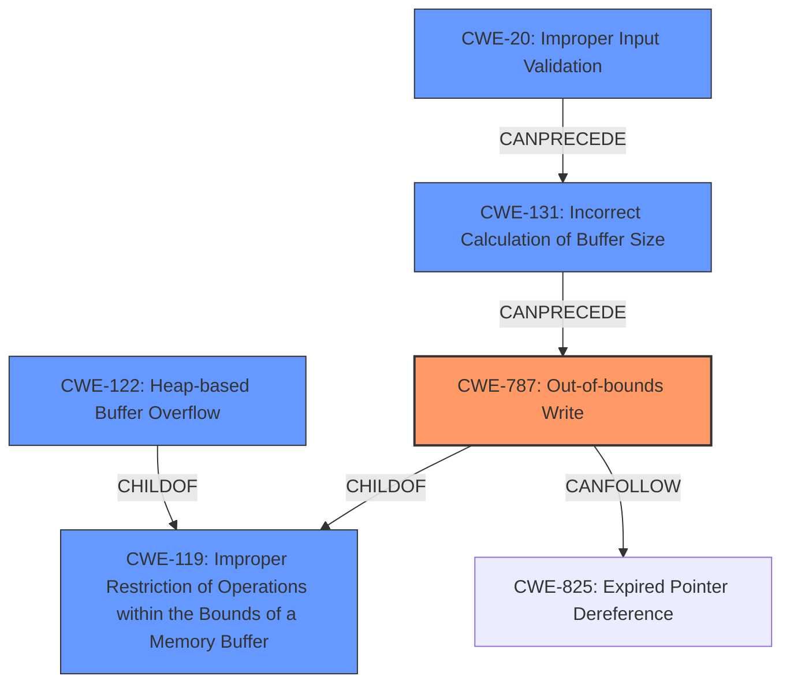

# Final Resolution for CVE-2022-25795

# Summary
| CWE ID  | CWE Name | Confidence | CWE Abstraction Level | CWE Vulnerability Mapping Label | CWE-Vulnerability Mapping Notes |
|-----------------|-------------------------------------------------------------------|-------------------|--------------------------|------------------------------------|-----------------------------------------------------------------------------------------------------------------------------------------------------------------------------------|
| CWE-787 | Out-of-bounds Write | 0.95 | Base | Allowed | The **root cause** is an out-of-bounds write, which is appropriately captured by CWE-787. |
| CWE-122 | Heap-based Buffer Overflow | 0.70 | Variant | Allowed | Although less direct, the vulnerability mentions **memory corruption**, which aligns with heap-based buffer overflows if the overflow occurs in the heap. |
| CWE-20  | Improper Input Validation  | 0.50 | Class | Allowed-with-Review | A crafted PDF might provide an invalid size parameter, leading to a buffer being allocated incorrectly, resulting in an out-of-bounds write when data exceeds the expected size. |

  - The Primary CWE should be first and noted as the Primary CWEs
  - The secondary candidate CWEs should be next and noted as secondary candidates.
  - The confidence is a confidence score 0 to 1 to rate your confidence in your assessment for that CWE.
  - The CWE Abstraction Level as one of these values: Base, Variant, Pillar, Class, Compound
  - The Mapping Notes Usage as one of these values: Allowed, Allowed-with-Review, Prohibited, Discouraged

## Evidence and Confidence

*   **Confidence Score:** 0.90
*   **Evidence Strength:** HIGH

## Relationship Analysis
The primary relationship influencing the decision is the parent-child relationship between CWE-119 (Improper Restriction of Operations within the Bounds of a Memory Buffer) and CWE-787 (**Out-of-bounds Write**). CWE-787 is a specific type of CWE-119, making it a more precise classification. CWE-122 (Heap-based Buffer Overflow) is also a child of CWE-119, representing a specific context where the out-of-bounds write occurs. The potential chain relationship starts with CWE-20 (Improper Input Validation), leading to CWE-131 (Incorrect Calculation of Buffer Size) which then results in CWE-787 (**Out-of-bounds Write**).

## Vulnerability Chain
The vulnerability chain starts with the parsing of a maliciously crafted DWG/PDF file. The crafted file contains data that leads to **improper input validation** (CWE-20) or an **incorrect calculation of buffer size** (CWE-131). This results in an **out-of-bounds write** (CWE-787), where data is written beyond the allocated buffer, leading to **memory corruption**. The consequence is potential remote code execution.

Missing Links:
The analysis does not explicitly mention the exact method of how the input is validated, making the link between the crafted file and the **out-of-bounds write** slightly weaker.

## Summary of Analysis
The initial analysis correctly identified CWE-787 (**Out-of-bounds Write**) as the primary weakness, supported by the CVE description mentioning "write beyond the allocated buffer." The inclusion of CWE-122 (Heap-based Buffer Overflow) is reasonable given the context of PDF parsing and dynamic memory allocation, making a heap overflow plausible.

The graph relationships influenced the decision by highlighting the hierarchical relationship, ensuring that the most specific CWE (CWE-787) was selected over its parent (CWE-119).
The vulnerability description makes direct reference to an **out-of-bounds write**, providing a strong basis for selecting CWE-787. The suggestion to include a potential chain starting with CWE-20 and CWE-131 adds further insight into the potential root causes leading to the vulnerability.

The selected CWEs are at the optimal level of specificity. CWE-787 is a base-level CWE, providing a clear description of the **root cause**. CWE-122 is a variant, adding context about the memory location.
CWE-20 is a class that is at a higher level.

Relevant Evidence: "a maliciously crafted PDF file can cause a dereference for a write beyond the allocated buffer while parsing the file in Autodesk AutoCAD."