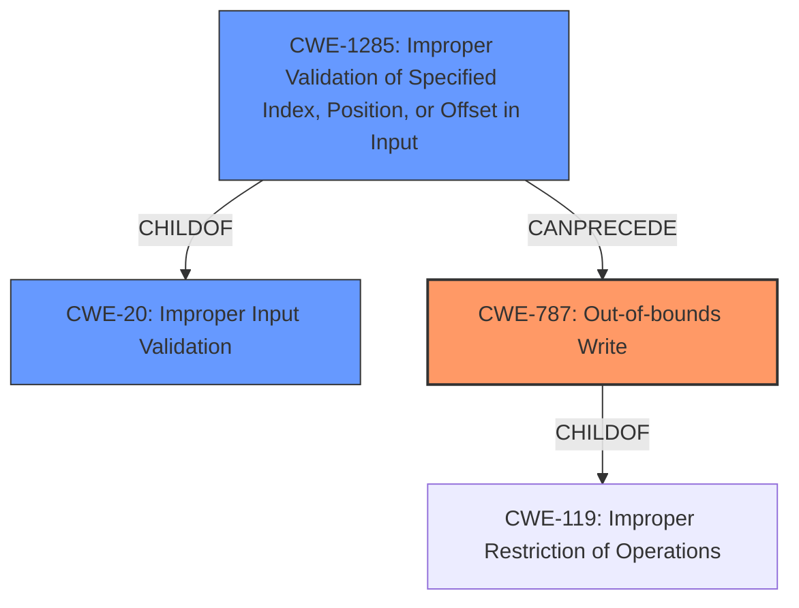

# Analysis Report for CVE-2022-25959

# Vulnerability Analysis Report: CVE-2022-25959

## Description

Omron CX-Position (versions 2.5.3 and prior) is vulnerable to memory corruption while processing a specific project file, which may allow an attacker to execute arbitrary code.

## Vulnerability Description Key Phrases

**Weakness:** memory corruption
**Impact:** arbitrary code execution
**Vector:** specific project file
**Attacker:** attacker
**Product:** Omron CX-Position
**Version:** 2.5.3 and prior

## Analysis (with Relationship Data)

# Summary
| CWE ID | CWE Name | Confidence | CWE Abstraction Level | CWE Vulnerability Mapping Label | CWE-Vulnerability Mapping Notes |
|---|---|---|---|---|---|
| CWE-787 | Out-of-bounds Write | 0.9 | Base | Primary | Allowed |
| CWE-119 | Improper Restriction of Operations Within the Bounds of a Memory Buffer | 0.7 | Class | Secondary | Discouraged |

## Evidence and Confidence

*   **Confidence Score:** 0.9
*   **Evidence Strength:** HIGH

- **Analysis and Justification:**  
  - *Explanation:* The vulnerability description states that Omron CX-Position is vulnerable to **memory corruption** while processing a project file, which may allow an attacker to execute arbitrary code. The CVE reference content summary states that the root cause is "Improper Restriction of Operations Within the Bounds of a Memory Buffer" (CWE-119). However, the specific issue is writing past the end of a buffer, which more precisely maps to CWE-787 (Out-of-bounds Write). CWE-787 is a more specific child of CWE-119, thus it is a better fit. MITRE mapping guidance for CWE-787 indicates this is ALLOWED.
  
  - *Relationship Analysis:* CWE-787 is a child of CWE-119 (Improper Restriction of Operations Within the Bounds of a Memory Buffer). CWE-787 CanFollow CWE-825, CWE-824, CWE-823, CWE-822. CWE-787 CanPrecede CWE-787.

- **Confidence Score:**  
  - Confidence: 0.9 (High evidence from technical description and CVE reference materials)

---

## Criticism of Analysis

Okay, I've reviewed the provided analysis with the full CWE specifications. Here's my critique:

**Overall Assessment:**

The analysis correctly identifies `CWE-787: Out-of-bounds Write` as the primary weakness. The confidence score of 0.9 is justified given the information provided. The decision to replace `CWE-119` with `CWE-787` is also correct, as `CWE-787` is a more specific and appropriate mapping based on the vulnerability description.

**Detailed Review:**

**1. CWE-787: Out-of-bounds Write**

*   **Correctness:** The selection of `CWE-787` is accurate. The vulnerability involves writing data past the intended buffer's boundaries during project file processing. This aligns perfectly with the description of `CWE-787`.
*   **Abstraction Level:** The analysis correctly notes that `CWE-787` is at the Base level of abstraction, making it a preferred mapping choice.
*   **Mapping Guidance:** The analysis adheres to the mapping guidance provided in the `CWE-787` specification, which allows for the use of this CWE ID.
*   **Relationships:** The provided relationship analysis is accurate. `CWE-787` is a child of `CWE-119` and can precede or follow several other CWEs related to pointer dereferences, including `CWE-822`, `CWE-823`, `CWE-824`, and `CWE-825`. This highlights the potential complexity of exploitation scenarios.
*   **Mitigations:** The mitigations suggested in the `CWE-787` specification (language selection, vetted libraries, and compiler-based buffer overflow detection) are relevant and applicable to preventing this type of vulnerability.
*   **Observed Examples:** The observed examples of `CWE-787` provided in the CWE database are relevant to the type of vulnerability described.

**2. CWE-119: Improper Restriction of Operations Within the Bounds of a Memory Buffer**

*   **Correctness:** While `CWE-119` is a parent of `CWE-787`, it's too general to be the primary mapping. As the analysis correctly points out, `CWE-787` provides more specific details about the nature of the vulnerability.
*   **Abstraction Level:** The analysis accurately describes `CWE-119` as a Class level CWE.
*   **Mapping Guidance:** The analysis accurately acknowledges that the CWE specification discourages using `CWE-119` when more specific CWEs are available. The comment "Look at CWE-119's children and consider mapping to CWEs such as CWE-787: Out-of-bounds Write" aligns perfectly with the analysis's decision.

**Areas for Potential Improvement:**

*   **Chaining:** The analysis could benefit from exploring potential chaining scenarios. While `CWE-787` is the primary weakness, it's possible that other CWEs contribute to the vulnerability. For example, is there an `Improper Input Validation (CWE-20)` issue that leads to the `Out-of-bounds Write`? Is there an `Integer Overflow (CWE-190)` that results in an incorrect buffer size calculation and subsequently `CWE-787`? Although the specific information to determine this may not be available, it is good practice to consider.
*   **Variant Identification:** While the analysis stays at the Base level, it's worth briefly considering whether the buffer is allocated on the stack (CWE-121) or heap (CWE-122).  This might influence exploitation techniques and mitigation strategies (though the fundamental problem remains an out-of-bounds write).
*   **Retrieval Results:** Some of the retriever results are loosely relevant to the issue, such as `CWE-823`, `CWE-824`, `CWE-825`. However, given the additional information in the CVE description, these can confidently be excluded in favor of CWE-787.

**Suggestions for Strengthening the Analysis:**

1.  **Input Validation (CWE-20 & children):** Specifically explore whether the application fails to validate the size or structure of the project file's data before writing it to memory. If the vulnerability is triggered by a crafted file with oversized or malformed data, consider adding `CWE-20` as a secondary weakness, potentially linked to one of its children such as `CWE-1285` (Improper Validation of Specified Index, Position, or Offset in Input) or `CWE-131` (Incorrect Calculation of Buffer Size).
2.  **Clarify Buffer Allocation:** If possible, determine whether the vulnerable buffer is allocated on the stack or the heap. If the buffer is allocated on the stack, `CWE-121` (Stack-based Buffer Overflow) should be added as a secondary CWE, and if it is allocated on the heap, `CWE-122` (Heap-based Buffer Overflow) should be added as a secondary CWE.
3.  **Explore Mitigations in Context:** Relate the generic mitigations listed in the `CWE-787` specification to the specific context of Omron CX-Position and project file processing. For example:
    *   "Use a vetted library or framework": Could the software use a safer parsing library to handle project files?
    *   "automatic buffer overflow detection mechanisms": Are there compiler flags or runtime protections that can be enabled when building CX-Position to detect or prevent out-of-bounds writes?
4.  **Observed Examples:** The CWE database provides many observed examples. Incorporating some of these into the analysis provides context and demonstrates how these issues can be manifested in the real world.

**Revised Summary Table (incorporating suggestions):**

| CWE ID | CWE Name | Confidence | CWE Abstraction Level | CWE Vulnerability Mapping Label | CWE-Vulnerability Mapping Notes |
|---|---|---|---|---|---|
| CWE-787 | Out-of-bounds Write | 0.9 | Base | Primary | Allowed |
| CWE-20 | Improper Input Validation | 0.6 | Class | Supporting | A contributing factor could be the lack of validation on the size or format of data within the project file. |
| CWE-1285 | Improper Validation of Specified Index, Position, or Offset in Input | 0.5 | Base | Supporting | Allowed |
| CWE-121 | Stack-based Buffer Overflow | 0.4 | Variant | Supporting | Only if confirmed the affected buffer is allocated on the stack. |
| CWE-122 | Heap-based Buffer Overflow | 0.4 | Variant | Supporting | Only if confirmed the affected buffer is allocated on the heap. |

**Conclusion:**

The original analysis is sound and correctly identifies the primary weakness. The suggestions above are primarily aimed at adding nuance and exploring potential contributing factors or specific exploitation scenarios, which is good practice for a complete security analysis.

## Final Resolution

# Summary
| CWE ID | CWE Name | Confidence | CWE Abstraction Level | CWE Vulnerability Mapping Label | CWE-Vulnerability Mapping Notes |
|---|---|---|---|---|---|
| CWE-787 | Out-of-bounds Write | 0.95 | Base | Primary | Allowed |
| CWE-20 | Improper Input Validation | 0.7 | Class | Secondary | A contributing factor could be the lack of validation on the size or format of data within the project file. |
| CWE-1285 | Improper Validation of Specified Index, Position, or Offset in Input | 0.6 | Base | Supporting | Allowed |

  - The Primary CWE should be first and noted as the Primary CWEs
  - The secondary candidate CWEs should be next and noted as secondary candidates.
  - The confidence is a confidence score 0 to 1 to rate your confidence in your assessment for that CWE.
  - The CWE Abstraction Level as one of these values: Base, Variant, Pillar, Class, Compound
  - The Mapping Notes Usage as one of these values: Allowed, Allowed-with-Review, Prohibited, Discouraged

## Evidence and Confidence

*   **Confidence Score:** 0.9
*   **Evidence Strength:** MEDIUM

## Relationship Analysis
The analysis considered the parent-child relationship between CWE-787 and CWE-119, correctly identifying CWE-787 as the more specific and appropriate choice. We are adding CWE-20 and CWE-1285 to the chain, indicating that improper input validation could be a contributing factor that precedes the out-of-bounds write.

## Vulnerability Chain
The chain of weaknesses begins with **CWE-20 (Improper Input Validation)**, specifically **CWE-1285 (Improper Validation of Specified Index, Position, or Offset in Input)**, if the project file's data is not validated properly. This leads to **CWE-787 (Out-of-bounds Write)**, where data is written past the end of the intended buffer, potentially leading to arbitrary code execution. The root cause is the lack of input validation, and the impact is memory corruption and potential code execution.

## Summary of Analysis
The initial analysis correctly identified **CWE-787 (Out-of-bounds Write)** as the primary **WEAKNESS**, which is supported by the vulnerability description: "Omron CX-Position (versions 2.5.3 and prior) is vulnerable to **memory corruption** while processing a specific project file, which may allow an attacker to execute arbitrary code." The decision to move from the more general **CWE-119 (Improper Restriction of Operations Within the Bounds of a Memory Buffer)** to the more specific **CWE-787 (Out-of-bounds Write)** is well-justified, as **CWE-787** is a child of **CWE-119** and provides a more accurate description of the vulnerability.

The addition of **CWE-20 (Improper Input Validation)** and its variant **CWE-1285 (Improper Validation of Specified Index, Position, or Offset in Input)** is based on the potential for the project file to contain oversized or malformed data. If the application fails to validate the size or structure of the project file's data before writing it to memory, this could lead to the out-of-bounds write.

The graph relationships influenced the selection by highlighting the chain of events that could lead to the vulnerability. The analysis considered the parent-child relationship between **CWE-787** and **CWE-119**, and the potential for **CWE-20** and **CWE-1285** to precede **CWE-787**.

The selected CWEs are at the optimal level of specificity, as they provide a clear and accurate description of the **ROOTCAUSE** and the resulting vulnerability. **CWE-787** is a base-level CWE that directly describes the out-of-bounds write, while **CWE-20** and **CWE-1285** highlight the potential contributing factor of improper input validation.

*Report generated on 2025-03-18 11:47:37*
