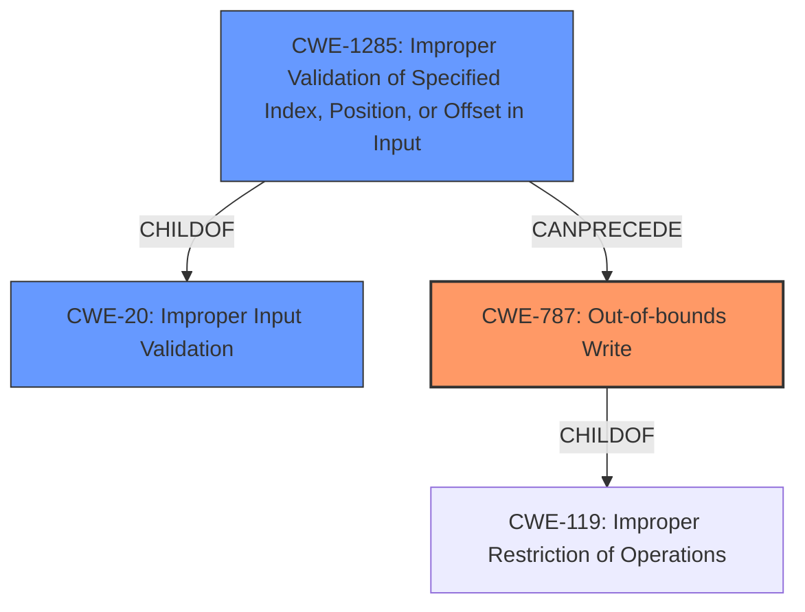

# Final Resolution for CVE-2022-25959

# Summary
| CWE ID | CWE Name | Confidence | CWE Abstraction Level | CWE Vulnerability Mapping Label | CWE-Vulnerability Mapping Notes |
|---|---|---|---|---|---|
| CWE-787 | Out-of-bounds Write | 0.95 | Base | Primary | Allowed |
| CWE-20 | Improper Input Validation | 0.7 | Class | Secondary | A contributing factor could be the lack of validation on the size or format of data within the project file. |
| CWE-1285 | Improper Validation of Specified Index, Position, or Offset in Input | 0.6 | Base | Supporting | Allowed |

  - The Primary CWE should be first and noted as the Primary CWEs
  - The secondary candidate CWEs should be next and noted as secondary candidates.
  - The confidence is a confidence score 0 to 1 to rate your confidence in your assessment for that CWE.
  - The CWE Abstraction Level as one of these values: Base, Variant, Pillar, Class, Compound
  - The Mapping Notes Usage as one of these values: Allowed, Allowed-with-Review, Prohibited, Discouraged

## Evidence and Confidence

*   **Confidence Score:** 0.9
*   **Evidence Strength:** MEDIUM

## Relationship Analysis
The analysis considered the parent-child relationship between CWE-787 and CWE-119, correctly identifying CWE-787 as the more specific and appropriate choice. We are adding CWE-20 and CWE-1285 to the chain, indicating that improper input validation could be a contributing factor that precedes the out-of-bounds write.

## Vulnerability Chain
The chain of weaknesses begins with **CWE-20 (Improper Input Validation)**, specifically **CWE-1285 (Improper Validation of Specified Index, Position, or Offset in Input)**, if the project file's data is not validated properly. This leads to **CWE-787 (Out-of-bounds Write)**, where data is written past the end of the intended buffer, potentially leading to arbitrary code execution. The root cause is the lack of input validation, and the impact is memory corruption and potential code execution.

## Summary of Analysis
The initial analysis correctly identified **CWE-787 (Out-of-bounds Write)** as the primary **WEAKNESS**, which is supported by the vulnerability description: "Omron CX-Position (versions 2.5.3 and prior) is vulnerable to **memory corruption** while processing a specific project file, which may allow an attacker to execute arbitrary code." The decision to move from the more general **CWE-119 (Improper Restriction of Operations Within the Bounds of a Memory Buffer)** to the more specific **CWE-787 (Out-of-bounds Write)** is well-justified, as **CWE-787** is a child of **CWE-119** and provides a more accurate description of the vulnerability.

The addition of **CWE-20 (Improper Input Validation)** and its variant **CWE-1285 (Improper Validation of Specified Index, Position, or Offset in Input)** is based on the potential for the project file to contain oversized or malformed data. If the application fails to validate the size or structure of the project file's data before writing it to memory, this could lead to the out-of-bounds write.

The graph relationships influenced the selection by highlighting the chain of events that could lead to the vulnerability. The analysis considered the parent-child relationship between **CWE-787** and **CWE-119**, and the potential for **CWE-20** and **CWE-1285** to precede **CWE-787**.

The selected CWEs are at the optimal level of specificity, as they provide a clear and accurate description of the **ROOTCAUSE** and the resulting vulnerability. **CWE-787** is a base-level CWE that directly describes the out-of-bounds write, while **CWE-20** and **CWE-1285** highlight the potential contributing factor of improper input validation.