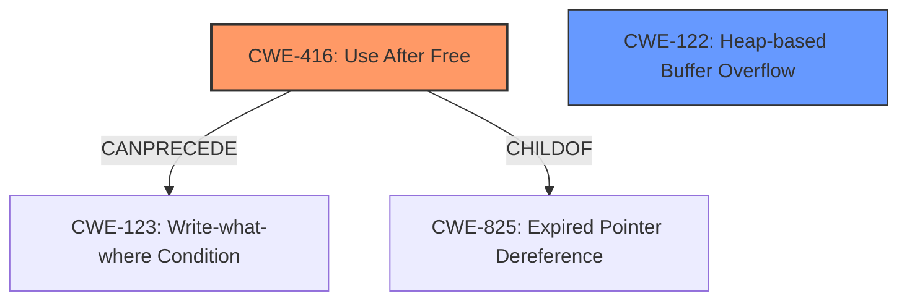

# Analysis Report for CVE-2022-2606

# Vulnerability Analysis Report: CVE-2022-2606

## Description

Use after free in Managed devices API in Google Chrome prior to 104.0.5112.79 allowed a remote attacker who convinced a user to enable a specific Enterprise policy to potentially exploit heap corruption via a crafted HTML page.

## Vulnerability Description Key Phrases

**Rootcause:** Use after free
**Weakness:** heap corruption
**Vector:** crafted HTML page
**Attacker:** remote attacker
**Product:** Google Chrome
**Version:** prior to 104.0.5112.79
**Component:** Managed devices API

## Analysis (with Relationship Data)

# Summary
| CWE ID | CWE Name | Confidence | CWE Abstraction Level | CWE Vulnerability Mapping Label | CWE-Vulnerability Mapping Notes |
|---|---|---|---|---|---|
| CWE-416 | Use After Free | 1.0 | Variant | Allowed | This is the primary CWE because the vulnerability description explicitly mentions a use-after-free condition. |
| CWE-122 | Heap-based Buffer Overflow | 0.4 | Variant | Allowed | This is a secondary candidate CWE because **heap corruption** is mentioned, which is often the result of a heap-based buffer overflow. |

## Evidence and Confidence

*   **Confidence Score:** 1.0
*   **Evidence Strength:** HIGH

- **Analysis and Justification:**
  - *Explanation:* The vulnerability is explicitly described as a **use-after-free** in the Managed devices API of Google Chrome. The "CVE Reference Links Content Summary" confirms this, stating the **root cause** as "**Use after free** in Managed devices API" and listing "Use-after-free" as a **weakness**. CWE-416 (Use After Free) directly addresses this condition, where memory is reused or referenced after it has been freed. The impact is arbitrary code execution. The "Retriever Results" also strongly support this, with CWE-416 having the highest combined score and a high graph score. The mapping guidance for CWE-416 is "Allowed". While **heap corruption** is mentioned, it is more of a consequence of the **use-after-free**, making CWE-416 the primary and most accurate mapping. CWE-122 (Heap-based Buffer Overflow) is considered a secondary candidate since the "Vulnerability Description" mentions "**heap corruption**", however this condition is usually a consequence of the **use-after-free**.
  - *Relationship Analysis:* CWE-416 is a variant. CWE-416 can precede CWE-123 (Write-what-where Condition).

- **Confidence Score:**
  - Confidence: 1.0 (Explicit description of use-after-free and supporting information from CVE reference and retriever results.)

## Criticism of Analysis

Okay, I've reviewed the provided analysis and the full CWE specifications. Here's my critique:

**Overall Assessment:**

The primary mapping to CWE-416 (Use After Free) is highly accurate and well-justified. The confidence score of 1.0 is appropriate. The secondary consideration of CWE-122 (Heap-based Buffer Overflow) is also reasonable, given the mention of "heap corruption," although it is correctly identified as a consequence rather than the root cause.

**Detailed Critique:**

**CWE-416: Use After Free**

*   **Strengths:**
    *   **Correct Identification:** The analysis correctly identifies the primary vulnerability as a Use After Free condition, aligning perfectly with the vulnerability description and the CVE Reference Links Content Summary.
    *   **Justification:** The reasoning is strong. The explanation clearly articulates why CWE-416 is the best fit, referencing the root cause analysis from the CVE data. The justification for considering CWE-122 as secondary further strengthens this point.
    *   **Evidence Strength:** The high evidence strength is justified, given the explicit mention of "use-after-free" in the description.
    *   **Relationship Analysis:** The provided relationships are correct. `CanPrecede -> CWE-123` and `ChildOf -> CWE-825` are valid.
    *   **Mitigations:** The suggested mitigations (language selection with automatic memory management, and setting pointers to NULL after freeing) are appropriate.

*   **Potential Improvements:**
    *   While the analysis mentions "arbitrary code execution" as the impact, elaborating slightly on *how* the Use After Free leads to arbitrary code execution could be beneficial.  For example, explaining that after the memory is freed, an attacker might be able to reallocate it and control its contents, leading to manipulation of program behavior, would add clarity.
    *  The Retriever Results section shows other potential CWEs that could potentially be related such as CWE-366 (Race Condition within a Thread). While the analysis is correct to focus on CWE-416 and CWE-122, acknowledging that other CWEs could be related would provide a more thorough review.

**CWE-122: Heap-based Buffer Overflow**

*   **Strengths:**
    *   **Reasonable Consideration:** Given the phrase "heap corruption," considering CWE-122 is prudent. The analysis correctly identifies it as a *potential* consequence of the Use After Free, rather than a primary cause.
    *   **Explicitly Secondary:** The analysis appropriately marks this as a secondary candidate.

*   **Potential Improvements:**
    *   The confidence score of 0.4 could be lowered further. The presence of "heap corruption" doesn't *guarantee* a heap overflow; it could be caused by other memory corruption issues. If heap corruption *always* meant heap overflow, then it would be a high score.

**Retriever Results:**

*   The analysis does a good job of leveraging the Retriever Results, particularly the high score of CWE-416.

**CWE Specifications:**

*   The inclusion of the complete CWE specifications is helpful for auditing the analysis and ensuring compliance with CWE guidelines.

**Specific Suggestions and Considerations:**

1.  **Elaborate on Impact of CWE-416:** While "arbitrary code execution" is accurate, a brief explanation of *how* a Use After Free enables it (e.g., by allowing an attacker to control reallocated memory and manipulate program flow) would be beneficial.
2.  **Acknowledge Retriever Results:** Briefly mention other potential related CWEs from the Retriever Results, even if they are deemed less relevant. This shows a thoroughness in considering all possibilities. For example, "While less directly relevant, the retriever results also suggest possibilities such as CWE-366 (Race Condition within a Thread), which could potentially play a role in the timing of the use-after-free."
3.  **Lower Confidence in CWE-122:**  Consider lowering the confidence for CWE-122, given that "heap corruption" is a symptom, not a guaranteed cause of a heap overflow.

**Revised Summary Table (Optional):**

| CWE ID | CWE Name | Confidence | CWE Abstraction Level | CWE Vulnerability Mapping Label | CWE-Vulnerability Mapping Notes |
|---|---|---|---|---|---|
| CWE-416 | Use After Free | 1.0 | Variant | Allowed | This is the primary CWE because the vulnerability description explicitly mentions a use-after-free condition. The UAF can allow the attacker to reallocate the memory and gain control over the application. |
| CWE-122 | Heap-based Buffer Overflow | 0.3 | Variant | Allowed | This is a secondary candidate CWE because **heap corruption** is mentioned, which *may* be the result of a heap-based buffer overflow. |

**In summary, the analysis is strong and correctly identifies CWE-416 as the primary weakness. The suggestions above are minor and aimed at adding further nuance and demonstrating a comprehensive review process.**

## Final Resolution

# Summary
| CWE ID | CWE Name | Confidence | CWE Abstraction Level | CWE Vulnerability Mapping Label | CWE-Vulnerability Mapping Notes |
|---|---|---|---|---|---|
| CWE-416 | Use After Free | 1.0 | Variant | Allowed | This is the **primary CWE** because the vulnerability description explicitly mentions a **use-after-free** condition. The UAF can allow the attacker to reallocate the memory and gain control over the application. |
| CWE-122 | Heap-based Buffer Overflow | 0.3 | Variant | Allowed | This is a secondary candidate CWE because **heap corruption** is mentioned, which *may* be the result of a heap-based buffer overflow. |

## Evidence and Confidence

*   **Confidence Score:** 1.0
*   **Evidence Strength:** HIGH

## Relationship Analysis
The primary relationship that impacted my decision was the direct correspondence between the vulnerability description "Use after free" and **CWE-416 (Use After Free)**. **CWE-416** is a variant, providing a specific type of memory corruption. While **CWE-122 (Heap-based Buffer Overflow)** was considered due to the mention of "**heap corruption**," it was determined to be a potential consequence rather than the root cause. The relationship `CanPrecede -> CWE-123 (Write-what-where Condition)` for **CWE-416** indicates a potential path for exploitation. The relationship `ChildOf -> CWE-825 (Expired Pointer Dereference)` for **CWE-416** was considered.

## Vulnerability Chain
The vulnerability chain begins with the **root cause**: a **use-after-free** condition (**CWE-416**). This allows an attacker to reallocate freed memory and potentially control its contents. This control can then lead to **heap corruption**, and potentially a "**Write-what-where Condition**" (**CWE-123**), culminating in arbitrary code execution. The missing link, as pointed out in the criticism, is a more detailed explanation of how the **use-after-free** leads to arbitrary code execution.

## Summary of Analysis
The initial analysis correctly identified **CWE-416 (Use After Free)** as the primary **weakness**. The analysis and criticism both agree on this point, with the vulnerability description explicitly stating "Use after free". The confidence score remains at 1.0, reflecting the strength of the evidence.

The criticism suggested lowering the confidence score for **CWE-122 (Heap-based Buffer Overflow)**, which I have done (lowered to 0.3). The criticism is valid in pointing out that **heap corruption** is a symptom and doesn't guarantee a **heap overflow**.

The graph relationships influenced the decision by highlighting the potential for further exploitation following the **use-after-free**, specifically through **CWE-123 (Write-what-where Condition)**.

The selected CWEs are at the optimal level of specificity. **CWE-416** is a variant that directly addresses the vulnerability. While broader CWEs exist (e.g., **CWE-119 (Improper Restriction of Operations within the Bounds of a Memory Buffer)**), **CWE-416** provides a more precise description of the **weakness**.

*Report generated on 2025-03-18 11:49:33*
