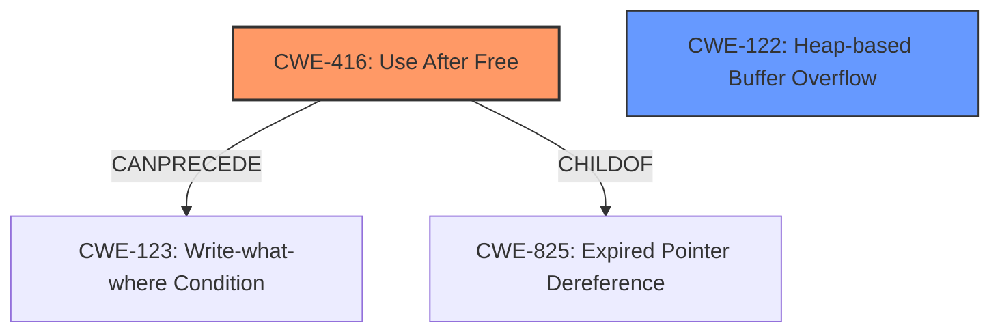

# Final Resolution for CVE-2022-2606

# Summary
| CWE ID | CWE Name | Confidence | CWE Abstraction Level | CWE Vulnerability Mapping Label | CWE-Vulnerability Mapping Notes |
|---|---|---|---|---|---|
| CWE-416 | Use After Free | 1.0 | Variant | Allowed | This is the **primary CWE** because the vulnerability description explicitly mentions a **use-after-free** condition. The UAF can allow the attacker to reallocate the memory and gain control over the application. |
| CWE-122 | Heap-based Buffer Overflow | 0.3 | Variant | Allowed | This is a secondary candidate CWE because **heap corruption** is mentioned, which *may* be the result of a heap-based buffer overflow. |

## Evidence and Confidence

*   **Confidence Score:** 1.0
*   **Evidence Strength:** HIGH

## Relationship Analysis
The primary relationship that impacted my decision was the direct correspondence between the vulnerability description "Use after free" and **CWE-416 (Use After Free)**. **CWE-416** is a variant, providing a specific type of memory corruption. While **CWE-122 (Heap-based Buffer Overflow)** was considered due to the mention of "**heap corruption**," it was determined to be a potential consequence rather than the root cause. The relationship `CanPrecede -> CWE-123 (Write-what-where Condition)` for **CWE-416** indicates a potential path for exploitation. The relationship `ChildOf -> CWE-825 (Expired Pointer Dereference)` for **CWE-416** was considered.

## Vulnerability Chain
The vulnerability chain begins with the **root cause**: a **use-after-free** condition (**CWE-416**). This allows an attacker to reallocate freed memory and potentially control its contents. This control can then lead to **heap corruption**, and potentially a "**Write-what-where Condition**" (**CWE-123**), culminating in arbitrary code execution. The missing link, as pointed out in the criticism, is a more detailed explanation of how the **use-after-free** leads to arbitrary code execution.

## Summary of Analysis
The initial analysis correctly identified **CWE-416 (Use After Free)** as the primary **weakness**. The analysis and criticism both agree on this point, with the vulnerability description explicitly stating "Use after free". The confidence score remains at 1.0, reflecting the strength of the evidence.

The criticism suggested lowering the confidence score for **CWE-122 (Heap-based Buffer Overflow)**, which I have done (lowered to 0.3). The criticism is valid in pointing out that **heap corruption** is a symptom and doesn't guarantee a **heap overflow**.

The graph relationships influenced the decision by highlighting the potential for further exploitation following the **use-after-free**, specifically through **CWE-123 (Write-what-where Condition)**.

The selected CWEs are at the optimal level of specificity. **CWE-416** is a variant that directly addresses the vulnerability. While broader CWEs exist (e.g., **CWE-119 (Improper Restriction of Operations within the Bounds of a Memory Buffer)**), **CWE-416** provides a more precise description of the **weakness**.