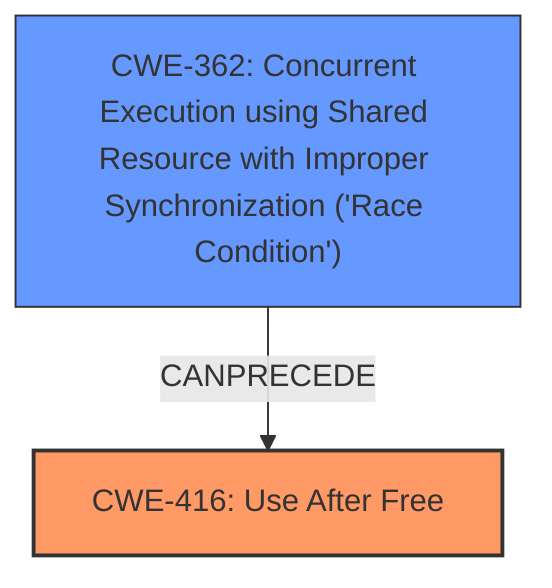

# Final Resolution for CVE-2022-2607

# Summary
| CWE ID | CWE Name | Confidence | CWE Abstraction Level | CWE Vulnerability Mapping Label | CWE-Vulnerability Mapping Notes |
|---|---|---|---|---|---|
| CWE-416 | Use After Free | 0.9 | Variant | Primary | Allowed |
| CWE-362 | Concurrent Execution using Shared Resource with Improper Synchronization ('Race Condition') | 0.6 | Class | Secondary | Allowed-with-Review |

## Evidence and Confidence

*   **Confidence Score:** 0.8
*   **Evidence Strength:** MEDIUM

## Relationship Analysis
The primary relationship influencing the decision is that CWE-416 **Use After Free** can often be preceded by **CWE-362** Concurrent Execution using Shared Resource with Improper Synchronization ('Race Condition'). While the vulnerability description explicitly mentions "use after free," the "specific user interactions" triggering the vulnerability suggest a potential race condition leading to the UAF. The abstraction levels influenced the decision to keep CWE-416 as the primary because it is a Variant, which is more specific than the Class level CWE-362.

## Vulnerability Chain
The vulnerability chain begins with a potential **CWE-362** Concurrent Execution using Shared Resource with Improper Synchronization ('Race Condition'), where multiple threads or processes access the same memory resource without proper synchronization. This leads to a **CWE-416** Use After Free when one thread frees the memory while another thread is still accessing it. The final impact is potential heap corruption due to the use of freed memory, which can lead to arbitrary code execution.

## Summary of Analysis
The initial analysis correctly identified **CWE-416** Use After Free as the primary **WEAKNESS**. The vulnerability description explicitly mentions "use after free," providing strong evidence for this classification.

The criticism highlighted the potential for other contributing factors, specifically a race condition (**CWE-362** Concurrent Execution using Shared Resource with Improper Synchronization ('Race Condition')), suggested by the "specific user interactions" required to trigger the vulnerability. While not explicitly stated, a race condition is a plausible precursor to a use-after-free, where improper synchronization allows memory to be freed while another thread is still using it.

The graph relationships confirm that **CWE-362** CanPrecede **CWE-416**, reinforcing the idea of a potential race condition leading to the UAF. Given the available evidence, I'm adding **CWE-362** as a secondary CWE with a confidence score of 0.6. The abstraction levels also impacted the decision. Since **CWE-416** is a Variant and **CWE-362** is a Class, **CWE-416** is more specific and better suited as the primary CWE.

The inclusion of **CWE-362** accounts for the potential race condition and provides a more complete picture of the vulnerability. The final classification reflects the optimal level of specificity based on available evidence and relationship analysis.