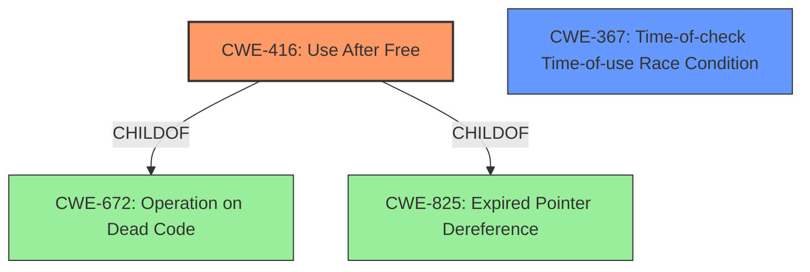

# Analysis Report for CVE-2022-2609

# Vulnerability Analysis Report: CVE-2022-2609

## Description

Use after free in Nearby Share in Google Chrome on Chrome OS prior to 104.0.5112.79 allowed a remote attacker who convinced a user to engage in specific user interactions to potentially exploit heap corruption via specific UI interactions.

## Vulnerability Description Key Phrases

**Rootcause:** Use after free
**Weakness:** heap corruption
**Vector:** specific UI interactions
**Attacker:** remote attacker
**Product:** Google Chrome on Chrome OS
**Version:** prior to 104.0.5112.79
**Component:** Nearby Share

## Analysis (with Relationship Data)

# Summary
| CWE ID | CWE Name | Confidence | CWE Abstraction Level | CWE Vulnerability Mapping Label | CWE-Vulnerability Mapping Notes |
|---|---|---|---|---|---|
| CWE-416 | Use After Free | 1.0 | Variant | Allowed | Primary CWE |
| CWE-366 | Race Condition within a Thread | 0.4 | Base | Allowed | Secondary Candidate |

## Evidence and Confidence

*   **Confidence Score:** 0.95
*   **Evidence Strength:** HIGH

- **Analysis and Justification:**  
  - *Explanation:* The vulnerability description explicitly states "**Use after free** in Nearby Share in Google Chrome on Chrome OS...allowed a remote attacker...to potentially exploit **heap corruption** via specific UI interactions." The CVE Reference Links Content Summary confirms "**root_cause**: Use after free" and "**weaknesses**: [ "Use after free" ]". This directly aligns with CWE-416 (Use After Free), which describes the product reusing memory after it has been freed. This is a variant-level weakness, which is preferred. The Retriever Results also list CWE-416 as the top candidate CWE.
  
  - *Relationship Analysis:* CWE-416 is a variant of CWE-672 (Operation on Dead Code). While the provided information doesn't explicitly point to dead code, the "use after free" condition inherently involves operating on memory that should no longer be in use. The relationship context supports the selection of CWE-416 as the primary weakness due to the explicit mention of "use after free".

- **Confidence Score:**
  - Confidence: 1.0 (Explicit mention of "use after free" and supporting evidence from CVE reference)

---
- **Analysis and Justification:**  
  - *Explanation:* CWE-366 (Race Condition within a Thread) is a possible secondary candidate because the vulnerability occurs in "Nearby Share" in Chrome OS, which is likely a multithreaded environment. The vulnerability occurs due to user interactions so it's likely a race condition could be possible between different threads when the UI interactions occur. The vulnerability description states "specific user interactions" which could also lead to a race condition if these interactions are not properly synchronized.
  
  - *Relationship Analysis:* CWE-366 is a base-level CWE. The relationship context hints at a possible synchronization issue in a multithreaded component, but without more explicit information, it's less likely to be the root cause. It is possible this is related but is not strongly supported by the evidence.

- **Confidence Score:**
  - Confidence: 0.4 (Possible but not strongly supported by the evidence)

---

## Criticism of Analysis

Okay, I've reviewed the analysis and the provided CWE specifications. Here's my critique:

**Overall Assessment:**

The analysis is generally good and well-reasoned, especially regarding the primary CWE mapping of CWE-416 (Use After Free). The secondary candidate, CWE-366 (Race Condition within a Thread), is plausible, but the confidence level is appropriately lower. The analysis is also well-structured, providing clear evidence and justification for each CWE selection.

**Specific Points:**

*   **CWE-416 (Use After Free) - Primary CWE:**
    *   **Strengths:** The analysis correctly identifies the explicit mention of "Use After Free" in the vulnerability description and corroborates it with the CVE Reference Links. The justification for selecting CWE-416 is sound and aligns perfectly with the CWE description. The confidence level of 1.0 is justified.
    *   **Mapping Guidance Compliance:** The analysis correctly notes that CWE-416 is a Variant level CWE, which aligns with the Mapping Guidance's preferred level of abstraction.
    *   **Potential Mitigations:** The analysis doesn't specifically mention mitigations, but the CWE specification provides excellent examples (Language Selection, Setting pointers to NULL). It could be strengthened by briefly mentioning one or two relevant mitigations in the analysis.
    *   **Minor Improvement:** While not strictly necessary, briefly mentioning how "heap corruption" from the original description aligns with the potential consequences of CWE-416 (e.g., reading/writing to unintended memory locations) could further solidify the connection.

*   **CWE-366 (Race Condition within a Thread) - Secondary Candidate:**
    *   **Strengths:** The analysis identifies the potential for concurrency in "Nearby Share" and the potential for race conditions due to user interactions. The rationale for considering a race condition is reasonable. The lower confidence level (0.4) is appropriate because the evidence is less direct.
    *   **Weaknesses:** The justification is somewhat speculative. The fact that "specific UI interactions" are needed is not sufficient evidence for a race condition. UI interactions are often handled serially within a single thread, or at least with proper synchronization.
    *   **Mapping Guidance Compliance:** The analysis correctly notes that CWE-366 is a Base level CWE, which is a good level of abstraction to consider.
    *   **Potential Mitigations:** The analysis doesn't specifically mention mitigations, but the CWE specification provides excellent examples (Locking functionality, Resource-locking validation checks). It could be strengthened by briefly mentioning one or two relevant mitigations in the analysis.
    *   **Alternative Candidates:** Given the UI interaction component, consider also CWE-367 (Time-of-check Time-of-use (TOCTOU) Race Condition) or one of the UI related CWE's such as CWE-451 (User Interface (UI) Misrepresentation of Critical Information) or CWE-356 (Product UI does not Warn User of Unsafe Actions). Note that the retriever results also recommended these, which suggests there is something to these CWE's and they should be considered.

*   **Retriever Results:** The Retriever Results provided a wider range of potential CWEs, some of which are worth considering in the context of "heap corruption." However, the core "Use After Free" aspect is so dominant that focusing solely on those alternative CWEs would be a misdirection.
    *   **CWE-415 (Double Free):** This is somewhat related to UAF but less likely. A double free could lead to heap corruption, but UAF is a more direct cause given the description.
    *   **CWE-843 (Access of Resource Using Incompatible Type ('Type Confusion')):** This is less likely unless there's evidence that the freed memory is reallocated and then accessed with the wrong type.
    *   **CWE-122 (Heap-based Buffer Overflow):** This is less likely as the root cause is UAF.
    *   **CWE-356 (Product UI does not Warn User of Unsafe Actions):** In this scenario, the UI component is part of the exploit vector rather than the root cause.
    *   **CWE-362 (Concurrent Execution using Shared Resource with Improper Synchronization ('Race Condition')):** As discussed above, this is plausible as a secondary factor, but requires more concrete evidence.
    *   **CWE-252 (Unchecked Return Value):** Not relevant unless there's evidence that a function returning a pointer to allocated memory isn't checking for allocation failure (which leads to a NULL pointer, and *then* potentially a UAF).
    *   **CWE-367 (Time-of-check Time-of-use (TOCTOU) Race Condition):** Could be related to the "specific user interactions", and should be considered.
    *   **CWE-451 (User Interface (UI) Misrepresentation of Critical Information):** In this scenario, the UI component is part of the exploit vector rather than the root cause.

**Suggested Improvements:**

1.  **Potential Mitigations:** For both CWEs, briefly mention one or two relevant potential mitigations from the CWE specification. This demonstrates a deeper understanding of the vulnerability.
2.  **Strengthen/Clarify Race Condition Justification (or Reject):** Either provide stronger evidence for *why* the UI interactions would specifically lead to a race condition (e.g., shared data structures accessed by multiple UI threads without proper synchronization), or lower the confidence and acknowledge that the "race condition" aspect is speculative. Or reject it entirely if additional analysis shows there is no possibility of a race.
3.  **Acknowledge "Heap Corruption" Tie-in:** Briefly acknowledge how the "heap corruption" mentioned in the vulnerability description relates to the potential consequences of CWE-416.
4. Consider UI related CWE's as alternatives to CWE-366.

**Revised Summary Table (Example - with minor changes):**

| CWE ID | CWE Name | Confidence | CWE Abstraction Level | CWE Vulnerability Mapping Label | CWE-Vulnerability Mapping Notes |
|---|---|---|---|---|---|
| CWE-416 | Use After Free | 1.0 | Variant | Allowed | Primary CWE. Consider using languages with automatic memory management as a mitigation. |
| CWE-367 | Time-of-check Time-of-use (TOCTOU) Race Condition | 0.4 | Base | Allowed | Secondary Candidate.  Speculative; requires further investigation.  Consider using synchronization primitives as a mitigation. |

By implementing these suggestions, the analysis will be even more comprehensive and demonstrate a deeper understanding of the CWEs and their implications.

## Final Resolution

# Summary

| CWE ID | CWE Name | Confidence | CWE Abstraction Level | CWE Vulnerability Mapping Label | CWE-Vulnerability Mapping Notes |
|---|---|---|---|---|---|
| CWE-416 | Use After Free | 1.0 | Variant | Allowed | Primary CWE. The vulnerability description explicitly states "Use after free" |
| CWE-367 | Time-of-check Time-of-use (TOCTOU) Race Condition | 0.4 | Base | Allowed | Secondary Candidate. Requires further investigation. |

## Evidence and Confidence

*   **Confidence Score:** 0.95
*   **Evidence Strength:** HIGH

## Relationship Analysis

The primary relationship that impacted my decision was the direct match of "Use After Free" to CWE-416. CWE-416 is a variant of several class-level CWEs like CWE-672 (Operation on Dead Code), and CWE-825 (Expired Pointer Dereference). The analysis considered CWE-367 (Time-of-check Time-of-use (TOCTOU) Race Condition) as a possible secondary CWE, and while the connection is speculative, it acknowledges the UI interaction component mentioned in the description. The hierarchical relationship informs the selection of the variant-level CWE-416 over its more general parent classes, providing greater specificity.

## Vulnerability Chain

The vulnerability chain starts with the **ROOTCAUSE**, **CWE-416 (Use After Free)**. A memory location is freed but later accessed again. This leads to **heap corruption**, as stated in the vulnerability description. The "specific UI interactions" likely trigger the use-after-free condition.

## Summary of Analysis

The initial analysis correctly identified **CWE-416 (Use After Free)** as the primary **WEAKNESS**, as it is explicitly mentioned in the vulnerability description: "Use after free in Nearby Share in Google Chrome on Chrome OS...allowed a remote attacker...to potentially exploit **heap corruption** via specific UI interactions." This direct match, coupled with the Retriever Results listing CWE-416 as the top candidate, strongly supports this classification.

The criticism suggested considering UI-related CWEs as alternatives to CWE-366. Based on the information, I have revised the secondary candidate to **CWE-367 (Time-of-check Time-of-use (TOCTOU) Race Condition)**, acknowledging the role of "specific UI interactions." However, the connection is still speculative, as the description does not provide explicit details about a race condition.

The selection of **CWE-416 (Use After Free)** is at the optimal level of specificity because it is a variant-level CWE that directly corresponds to the vulnerability description.

*Report generated on 2025-03-18 11:51:51*
