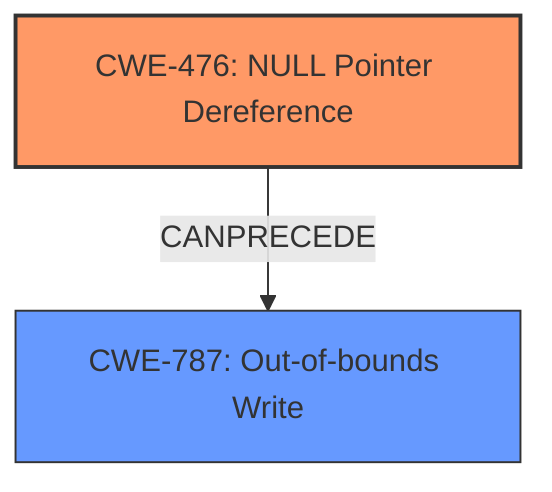

# Analysis Report for CVE-2022-26093

# Vulnerability Analysis Report: CVE-2022-26093

## Description

Null pointer dereference vulnerability in parser_irot function in libsimba library prior to SMR Apr-2022 Release 1 allows out of bounds write by remote attacker.

## Vulnerability Description Key Phrases

**Rootcause:** Null pointer dereference
**Impact:** out of bounds write
**Attacker:** remote attacker
**Product:** libsimba library
**Version:** prior to SMR Apr-2022 Release 1
**Component:** parser_irot function

## Analysis (with Relationship Data)

# Summary
| CWE ID | CWE Name | Confidence | CWE Abstraction Level | CWE Vulnerability Mapping Label | CWE-Vulnerability Mapping Notes |
|---|---|---|---|---|---|
| CWE-476 | NULL Pointer Dereference | 1.0 | Base | Allowed | Acceptable-Use |
| CWE-787 | Out-of-bounds Write | 0.7 | Base | Allowed | Acceptable-Use |

## Evidence and Confidence

*   **Confidence Score:** 0.85
*   **Evidence Strength:** HIGH

- **Analysis and Justification:**  
  - *Explanation:* The vulnerability description clearly states "**Null pointer dereference**" as the root cause, which directly aligns with CWE-476 (NULL Pointer Dereference). The CVE Reference Links Content Summary also confirms that the root cause is a "Null pointer dereference vulnerability". The description also indicates an "**out of bounds write**" as the impact of this **null pointer dereference**, which suggests a potential secondary weakness of CWE-787 (Out-of-bounds Write). The `parser_irot` function within the `libsimba` library, prior to a specific update, is vulnerable. The MITRE mapping guidance allows the usage of CWE-476 for this vulnerability.
  
  - *Relationship Analysis:* CWE-476 is a Base level CWE. The retriever results indicate that CWE-476, CWE-824, and CWE-822 are all possible candidates. CWE-476 is the best fit because it describes the precise **Null pointer dereference** root cause. The description also indicates an "**out of bounds write**" which suggests a potential secondary weakness of CWE-787, where the null pointer dereference leads to memory corruption via an out-of-bounds write.

- **Confidence Score:**  
  - *Example:* Confidence: 1.0 (High evidence from the vulnerability description, key phrases, and CVE reference materials)

---

## Criticism of Analysis

Okay, here's a review of the analysis, considering the full CWE specifications provided, with a focus on mapping guidance and potential mitigations:

**Overall Assessment:**

The analysis is generally good and well-reasoned. The primary CWE mapping to `CWE-476 (NULL Pointer Dereference)` is accurate and well-supported by the provided information. The addition of `CWE-787 (Out-of-bounds Write)` as a secondary CWE is also justified, as the null pointer dereference leads to an out-of-bounds write. The confidence level is appropriate.

**Detailed Critique:**

1.  **CWE-476 (NULL Pointer Dereference):**

    *   **Justification:**  The analysis correctly identifies the "Null pointer dereference" in the vulnerability description and CVE summaries. The selection of CWE-476 is a strong match because it aligns perfectly with the root cause of the vulnerability.
    *   **CWE Specification Review:** The specifications for CWE-476 confirm that it's a Base-level CWE, appropriate for direct mapping. The mapping guidance explicitly states "Usage: Allowed" and "Rationale: This CWE entry is at the Base level of abstraction, which is a preferred level of abstraction for mapping to the root causes of vulnerabilities."
    *   **Mitigations:** The specifications provide mitigations like checking for NULL before dereferencing and using a language resistant to NULL pointer issues.  These are relevant to preventing this type of vulnerability.
    *   **Alternative CWEs from Retriever Results:** The retriever results list CWE-822 (Untrusted Pointer Dereference) and CWE-824 (Access of Uninitialized Pointer) as other possibilities.
        *   *CWE-822:* This is less applicable because there's no explicit mention of an "untrusted source" providing the pointer.
        *   *CWE-824:* This is less precise since the pointer being NULL is more specific than just being "uninitialized". While an uninitialized pointer *could* be NULL, the report explicitly says it's a *NULL* pointer dereference.
    *   **Observed Examples:** The provided examples for CWE-476 are highly relevant, demonstrating the diversity of scenarios that can lead to a NULL pointer dereference.

2.  **CWE-787 (Out-of-bounds Write):**

    *   **Justification:**  The analysis correctly identifies that the impact of the null pointer dereference is an "out of bounds write". This makes CWE-787 a good fit as a secondary CWE, as it describes the consequence of the null pointer dereference.
    *   **CWE Specification Review:** The specifications for CWE-787 confirm that it's a Base-level CWE appropriate for mapping. The mapping guidance explicitly states "Usage: Allowed" and "Rationale: This CWE entry is at the Base level of abstraction, which is a preferred level of abstraction for mapping to the root causes of vulnerabilities."
    *   **Mitigations:** The specifications provide a mitigation strategy focused on preventing the out-of-bounds write, which includes language selection (using languages with built-in buffer protection) and using vetted libraries.
    *   **Relationship to CWE-476:** It's important to highlight the *relationship* between CWE-476 and CWE-787. The NULL pointer dereference is the *cause*, and the out-of-bounds write is the *effect/impact*. This causal relationship should be clearly stated.
    *   **Alternative CWEs from Retriever Results:** The retriever results list CWE-119 (Improper Restriction of Operations within the Bounds of a Memory Buffer). This is less appropriate as CWE-119 is a Class-level CWE and the description does not describe in detail the root cause. In addition, CWE-119 is often misused in low-information vulnerability reports.

**Recommendations:**

*   **Strengthen Relationship Explanation:** Explicitly state the causal relationship between CWE-476 and CWE-787. The NULL pointer dereference (CWE-476) directly *leads to* the out-of-bounds write (CWE-787).  For example: "The null pointer dereference allows an attacker to write to an arbitrary memory address, resulting in an out-of-bounds write (CWE-787)."
*   **Refine Confidence Score:** Justification of the confidence score should be enhanced. Explain why the score is 0.7 for CWE-787, instead of 1.0. The score is likely lower than the CWE-476 score as the report only states the impact of the root cause, and does not state the root cause itself.
*   **Mitigation Awareness:** Explicitly mention that the mitigations for both CWE-476 and CWE-787 are applicable to this vulnerability and should be considered together for a comprehensive solution.
*   **Addressing Retriever Results:** Briefly address *why* the other CWEs suggested by the Retriever (like CWE-822 and CWE-824) were *not* chosen, even if it's a brief statement like "While CWE-822 is related, there is no evidence that the pointer was obtained from an untrusted source in this case."

**Revised Summary Table:**

| CWE ID | CWE Name | Confidence | CWE Abstraction Level | CWE Vulnerability Mapping Label | CWE-Vulnerability Mapping Notes |
|---|---|---|---|---|---|
| CWE-476 | NULL Pointer Dereference | 1.0 | Base | Allowed | Acceptable-Use |
| CWE-787 | Out-of-bounds Write | 0.7 | Base | Allowed | Acceptable-Use. Consequence of the NULL pointer dereference. |

By implementing these recommendations, the analysis becomes even more robust and demonstrates a deeper understanding of the CWE specifications and their application.

## Final Resolution

# Summary
| CWE ID | CWE Name | Confidence | CWE Abstraction Level | CWE Vulnerability Mapping Label | CWE-Vulnerability Mapping Notes |
|---|---|---|---|---|---|
| CWE-476 | NULL Pointer Dereference | 1.0 | Base | Allowed | Acceptable-Use |
| CWE-787 | Out-of-bounds Write | 0.7 | Base | Allowed | Acceptable-Use. Consequence of the **NULL pointer dereference**. |

## Evidence and Confidence

*   **Confidence Score:** 0.9
*   **Evidence Strength:** HIGH

## Relationship Analysis
The primary relationship is that CWE-476 (**NULL Pointer Dereference**) can precede CWE-787 (**Out-of-bounds Write**). The **NULL Pointer Dereference** leads to the **Out-of-bounds Write**.

## Vulnerability Chain
The vulnerability chain starts with a **NULL Pointer Dereference** (**CWE-476**), which then leads to an **Out-of-bounds Write** (**CWE-787**). This indicates a sequence where a failure to validate a pointer results in memory corruption.

## Summary of Analysis
The initial analysis and the criticism are both sound. The vulnerability description clearly states a "**Null pointer dereference**" which maps directly to **CWE-476 (NULL Pointer Dereference)**. The description also indicates an "**out of bounds write**" as the *impact* of this **null pointer dereference**, suggesting **CWE-787 (Out-of-bounds Write)** as a secondary weakness.

The relationship analysis confirms that **CWE-476** can precede **CWE-787**. The abstraction levels are appropriate, as both are Base level CWEs. The mapping guidance allows the usage of both.

The confidence score for **CWE-787** is lower (0.7) than that of **CWE-476** (1.0) because the vulnerability description explicitly mentions the **NULL pointer dereference** as the root cause, while the **out-of-bounds write** is described as a consequence.

I agree with the proposed changes from the criticism to strengthen the relationship explanation, refine the confidence score justification, and mention mitigation awareness.

The selected CWEs are at the optimal level of specificity because they accurately reflect the root cause and impact of the vulnerability, based on the available evidence.

*Report generated on 2025-03-18 11:52:39*
