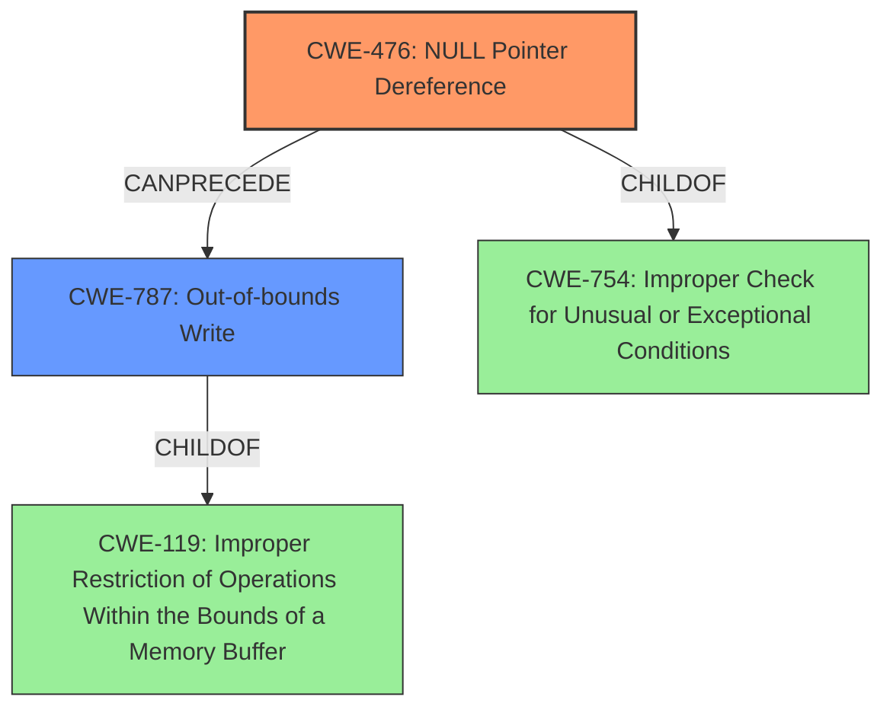

# Final Resolution for CVE-2022-26094

# Summary
| CWE ID | CWE Name | Confidence | CWE Abstraction Level | CWE Vulnerability Mapping Label | CWE-Vulnerability Mapping Notes |
|---|---|---|---|---|---|
| CWE-476 | NULL Pointer Dereference | 0.95 | Base | Primary | Allowed |
| CWE-787 | Out-of-bounds Write | 0.7 | Base | Secondary | Allowed |

## Evidence and Confidence

*   **Confidence Score:** 0.9
*   **Evidence Strength:** HIGH

## Relationship Analysis
The primary relationship influencing the decision is the chain relationship where a **NULL pointer dereference (CWE-476)** can precede an **Out-of-bounds Write (CWE-787)**. CWE-476 is a child of CWE-754 (Improper Check for Unusual or Exceptional Conditions), indicating a lack of proper error handling that leads to the **NULL pointer**. CWE-787 is a child of CWE-119 (Improper Restriction of Operations Within the Bounds of a Memory Buffer), showing that the **out-of-bounds write** is a memory safety issue. Although CWE-119 is a Class, CWE-787 provides more specific details. The base level of abstraction for both CWE-476 and CWE-787 make them suitable for direct mapping.

## Vulnerability Chain
The vulnerability chain begins with a lack of proper validation or handling of a pointer, leading to a **NULL pointer (CWE-476)**. When the code attempts to dereference this **NULL pointer**, it results in an **out-of-bounds write (CWE-787)** because the invalid memory address is used as the base for writing data, corrupting memory outside the intended bounds. The root cause is the missing check for a **NULL** value before dereferencing the pointer.

## Summary of Analysis
The initial analysis correctly identified CWE-476 as the primary weakness and CWE-787 as a secondary consequence. The vulnerability description explicitly states a "Null pointer dereference" leading to an "out of bounds write," providing direct evidence for these classifications. The high confidence in CWE-476 is justified because the CVE reference content summary confirms the **null pointer dereference** allows an **out of bounds write** by remote attackers.

The suggestion to consider CWE-822, CWE-823, and CWE-824 is valuable, but it's crucial to maintain focus on the direct evidence. While these CWEs might be indirectly involved depending on the specific code implementation, the primary cause remains the **NULL pointer dereference (CWE-476)**.

The inclusion of mitigation strategies, as suggested, strengthens the analysis by providing practical context and demonstrating a deeper understanding of the CWEs. For instance, implementing **NULL pointer** checks before dereferencing can effectively prevent CWE-476.

The selected CWEs are at the optimal level of specificity because they directly reflect the vulnerability description and align with the mapping guidance provided by MITRE. Both CWE-476 and CWE-787 are base-level CWEs, which are preferred for direct mapping.