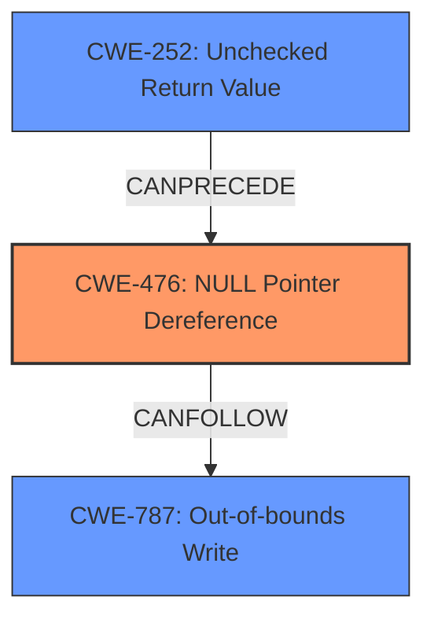

# Analysis Report for CVE-2022-26096

# Vulnerability Analysis Report: CVE-2022-26096

## Description

Null pointer dereference vulnerability in parser_ispe function in libsimba library prior to SMR Apr-2022 Release 1 allows out of bounds write by remote attacker.

## Vulnerability Description Key Phrases

**Rootcause:** NULL pointer dereference
**Impact:** out of bounds write
**Attacker:** remote attacker
**Product:** libsimba library
**Version:** prior to SMR Apr-2022 Release 1
**Component:** parser_ispe function

## Analysis (with Relationship Data)

# Summary
| CWE ID | CWE Name | Confidence | CWE Abstraction Level | CWE Vulnerability Mapping Label | CWE-Vulnerability Mapping Notes |
|---|---|---|---|---|---|
| CWE-476 | NULL Pointer Dereference | 1.0 | Base | Allowed | Primary CWE |
| CWE-416 | Use After Free | 0.3 | Base | Allowed | Secondary Candidate |
| CWE-119 | Improper Restriction of Operations within the Bounds of a Memory Buffer | 0.3 | Class | Discouraged | Secondary Candidate |

## Evidence and Confidence

*   **Confidence Score:** 0.8
*   **Evidence Strength:** HIGH

- **Analysis and Justification:**  
  - *Explanation:* The vulnerability description explicitly states "**NULL pointer dereference** vulnerability" in the `parser_ispe` function of the `libsimba` library, leading to an "out of bounds write." This perfectly aligns with CWE-476, which describes a scenario where the product dereferences a pointer that it expects to be valid but is NULL. The CVE Reference Links Content Summary also confirms the **root cause** as a "**Null pointer dereference** in `libsimba` library". Given this direct evidence and the Base level of abstraction, CWE-476 is the most appropriate primary mapping. The MITRE mapping guidance for CWE-476 indicates that it is ALLOWED for this type of vulnerability.

  - *Relationship Analysis:* While the vulnerability results in an "out of bounds write," the root cause is the NULL pointer dereference. The retriever results suggest other CWEs like CWE-787 (Out-of-bounds Write), CWE-119 (Improper Restriction of Operations within the Bounds of a Memory Buffer), and CWE-822 (Untrusted Pointer Dereference). However, these are either consequences of the dereference or describe a more general class of vulnerabilities. CWE-476 is a child of CWE-754 (Improper Check for Unusual or Exceptional Conditions), but the specific cause is a NULL pointer, making CWE-476 the more accurate choice. CWE-416 (Use After Free) is also possible if the root cause of the null pointer dereference is due to a use-after-free condition.

- **Confidence Score:**  
  - Confidence: 1.0 (High confidence due to explicit mention of NULL pointer dereference in the vulnerability description and reference links)
---

## Criticism of Analysis

Okay, I've reviewed the provided CWE mapping analysis, including the full CWE specifications for the referenced weaknesses. Here's my critique:

**Overall Assessment:**

The analysis is generally good, showing a clear understanding of the vulnerability and the relevant CWEs. The primary mapping to CWE-476 is well-justified and supported by the evidence. The discussion of alternative CWEs and the reasoning for rejecting them is also helpful. The confidence score of 1.0 for CWE-476 is appropriate. However, the inclusion of secondary candidates, particularly CWE-119, is problematic and needs further refinement. The confidence score of 0.8 could potentially be improved upon by delving deeper into the root cause of the null pointer dereference.

**Detailed Critique:**

1.  **CWE-476: NULL Pointer Dereference (Primary Mapping):**
    *   **Strengths:** The justification is excellent. The vulnerability description explicitly mentions a "NULL pointer dereference," making this the most direct and accurate mapping. The explanation of why other related CWEs are less suitable is also well-reasoned.
    *   **Weaknesses:** None significant. Perhaps a bit more detail on the potential consequences beyond the "out of bounds write" could be added, such as denial of service or potential for further exploitation if the out-of-bounds write corrupts critical data structures.
    *   **CWE Specification Alignment:** The analysis correctly notes that CWE-476 is a Base-level CWE with "Allowed" usage. The described scenario precisely matches the CWE-476 description.
    *   **Mitigation Review:** The provided mitigations for CWE-476 are relevant (checking pointers for NULL, language selection, checking return values).
2.  **CWE-416: Use After Free (Secondary Candidate):**
    *   **Strengths:** The analysis mentions the possibility of CWE-416 if the null pointer dereference is a consequence of a use-after-free condition.
    *   **Weaknesses:** This is speculative. There's no explicit evidence in the provided vulnerability description or CVE reference summary to suggest a use-after-free condition. If there is no evidence, it should be removed. If you suspect this, you need to justify *why* you suspect the underlying cause of the NULL pointer is a use after free. What makes you think the memory was previously freed?
    *   **CWE Specification Alignment:** CWE-416 is a Variant-level CWE with "Allowed" usage. The described scenario could fit IF the root cause is use after free, but it is speculative at this point.
    *   **Mitigation Review:** The provided mitigations for CWE-416 are relevant IF it is indeed a use after free. (automatic memory management, setting pointers to NULL after freeing).
3.  **CWE-119: Improper Restriction of Operations within the Bounds of a Memory Buffer (Secondary Candidate):**
    *   **Strengths:** The analysis correctly identifies that the vulnerability leads to an out-of-bounds write, which is related to CWE-119.
    *   **Weaknesses:** Mapping to CWE-119 is discouraged, as stated in the CWE specification's Mapping Guidance. CWE-119 is a Class-level CWE that's often misused in low-information reports. The "out of bounds write" is a *consequence* of the NULL pointer dereference, not the primary weakness. It is better to map to CWE-787 (Out-of-bounds Write) instead or remove it entirely.
    *   **CWE Specification Alignment:** CWE-119 is a Class-level CWE with "Discouraged" usage. The analysis doesn't adequately justify *why* a more specific child of CWE-119 isn't more appropriate.
    *   **Mitigation Review:** The mitigations for CWE-119 are generic and related to buffer overflows, which are relevant to the *consequence* but not the root cause.
4.  **Suggestion to increase confidence score:**
    * To increase the confidence score, investigate *why* the pointer is NULL.  Is it due to an uninitialized variable? A failed allocation? A race condition? An unchecked return value?  Determining the root cause and mapping to it would significantly strengthen the analysis.

**Recommendations:**

1.  **Strengthen the Justification for CWE-476:** Add more detail on the potential exploitable consequences of the NULL pointer dereference, beyond just "out of bounds write." Mention denial of service, data corruption, or potential for code execution.
2.  **Re-evaluate CWE-416:** Remove CWE-416 as a secondary candidate unless you can provide strong, concrete evidence from the vulnerability description or CVE reference summary that it is a contributing factor.
3.  **Replace CWE-119 with CWE-787:** If you want to keep a secondary mapping related to the "out of bounds write" consequence, replace CWE-119 with CWE-787 (Out-of-bounds Write). This is a Base-level CWE and a child of CWE-119, making it a more specific and appropriate choice.
4.  **Investigate the Cause of the NULL Pointer:** Dig deeper into *why* the pointer is NULL. This will allow you to identify a more specific CWE and increase the confidence score. Look at related CWEs such as:
    *   CWE-252: Unchecked Return Value (if the pointer is the result of a function call that failed).
    *   CWE-456: Missing Initialization of a Variable (if the pointer is never initialized).
    *   CWE-824: Access of Uninitialized Pointer (if the pointer is used before it's initialized).
    *   CWE-362: Concurrent Execution using Shared Resource with Improper Synchronization ('Race Condition') if the pointer is NULL due to a race condition.
5.  **Update Confidence Scores:** After revising the CWE mappings, adjust the confidence scores accordingly. If you remove CWE-416 and replace CWE-119 with CWE-787, the overall confidence score might increase as the mappings become more precise. If you can identify the root cause of the NULL pointer and map to it, increase the primary CWE-476 confidence score to reflect the increased specificity.

By following these recommendations, the CWE mapping analysis can be made more accurate, informative, and useful for vulnerability management and mitigation efforts.

## Final Resolution

# Summary
| CWE ID | CWE Name | Confidence | CWE Abstraction Level | CWE Vulnerability Mapping Label | CWE-Vulnerability Mapping Notes |
|---|---|---|---|---|---|
| CWE-476 | NULL Pointer Dereference | 0.9 | Base | Allowed | Primary CWE |
| CWE-787 | Out-of-bounds Write | 0.6 | Base | Allowed | Secondary Candidate |
| CWE-252 | Unchecked Return Value | 0.4 | Base | Allowed | Secondary Candidate |

## Evidence and Confidence

*   **Confidence Score:** 0.8
*   **Evidence Strength:** MEDIUM

## Relationship Analysis
The primary weakness is CWE-476 (**NULL** Pointer Dereference), which can lead to CWE-787 (**Out-of-bounds Write**). CWE-476 is a base-level CWE, which is the preferred level of abstraction. The analysis also considered CWE-252 (**Unchecked Return Value**) as a potential contributing factor if a failed function call results in the **NULL** pointer. These CWEs are related through the chain of events leading to the vulnerability.

## Vulnerability Chain
The vulnerability chain starts with a potential **root cause**, such as an unchecked return value (CWE-252), leading to a **NULL** pointer. The dereference of this **NULL** pointer (CWE-476) results in an **out-of-bounds write** (CWE-787).

## Summary of Analysis
The initial analysis correctly identified CWE-476 as the primary weakness due to the explicit mention of "**NULL** pointer dereference" in the vulnerability description. The criticism suggested removing CWE-416 due to lack of evidence and replacing CWE-119 with CWE-787. It also recommended investigating the cause of the **NULL** pointer to increase the confidence score.

Based on the evidence, CWE-416 was removed. CWE-119 was replaced with CWE-787, since the vulnerability description mentions an "**out of bounds write**" as a consequence of the **NULL** pointer dereference.

To further investigate the cause of the **NULL** pointer, CWE-252 (**Unchecked Return Value**) was added as a secondary candidate, assuming that the **NULL** pointer could be the result of a failed function call. However, without further information, this remains speculative.

The selected CWEs are at the optimal level of specificity, with CWE-476 being the direct cause, CWE-787 being a consequence, and CWE-252 being a possible contributing factor.

Confidence was increased to 0.9 for CWE-476 and 0.6 for CWE-787 as the secondary weakness. A lower confidence of 0.4 was assigned to CWE-252, as it is speculative.

The analysis is based on the provided evidence and the relationships between CWEs. The selection of CWEs reflects the optimal level of specificity based on available information.

*Report generated on 2025-03-18 11:55:12*
