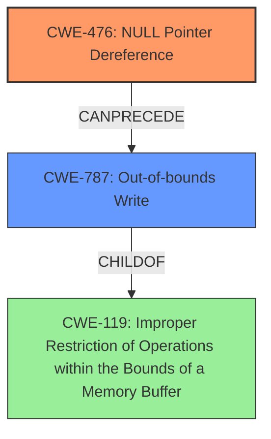

# Analysis Report for CVE-2022-26097

# Vulnerability Analysis Report: CVE-2022-26097

## Description

Null pointer dereference vulnerability in parser_unknown_property function in libsimba library prior to SMR Apr-2022 Release 1 allows out of bounds write by remote attacker.

## Vulnerability Description Key Phrases

**Rootcause:** Null pointer dereference
**Weakness:** out of bounds write
**Attacker:** remote attacker
**Product:** libsimba library
**Version:** prior to SMR Apr-2022 Release 1
**Component:** parser_unknown_property function

## Analysis (with Relationship Data)

# Summary
| CWE ID | CWE Name | Confidence | CWE Abstraction Level | CWE Vulnerability Mapping Label | CWE-Vulnerability Mapping Notes |
|---|---|---|---|---|---|
| CWE-476 | NULL Pointer Dereference | 1.0 | Base | Primary | Allowed |
| CWE-787 | Out-of-bounds Write | 0.7 | Base | Secondary | Allowed |

## Evidence and Confidence

*   **Confidence Score:** 0.85
*   **Evidence Strength:** HIGH

- **Analysis and Justification:**
  - *Explanation:* The vulnerability description explicitly states a "**Null pointer dereference**" in the `parser_unknown_property` function, which directly corresponds to CWE-476 (NULL Pointer Dereference). The CVE Reference Links Content Summary confirms this, stating "Root Cause: Null pointer dereference vulnerability in some parser functions of the libsimba library" and "Weaknesses/Vulnerabilities: Null pointer dereference." The same summary also mentions that the impact of this dereference allows an "**out of bounds write**," suggesting that the null pointer dereference leads to CWE-787 (Out-of-bounds Write). Given the directness of the null pointer dereference, CWE-476 is selected as the primary weakness. CWE-787 is listed as a secondary weakness because it is a consequence of the primary weakness.
  
  - *Relationship Analysis:* CWE-476 (NULL Pointer Dereference) is a Base level CWE, which is appropriate for mapping the root cause of this vulnerability. CWE-787 (Out-of-bounds Write) is a child of CWE-119 (Improper Restriction of Operations within the Bounds of a Memory Buffer). CWE-476 can precede CWE-787 as a null pointer dereference can lead to memory corruption, including out-of-bounds writes.

- **Confidence Score:**
  - Confidence: 1.0 (High confidence due to direct evidence in the vulnerability description and CVE reference.)

---

## Criticism of Analysis

Okay, here's a review of the provided CWE analysis, incorporating the full CWE specifications:

**Overall Assessment:**

The analysis correctly identifies the primary and secondary CWEs. The justification is sound, and the confidence level is appropriate. The use of the CVE details to support the selection of CWE-476 as the primary weakness is strong. However, a few minor areas can be improved for clarity and precision, particularly around the relationship between CWE-476 and CWE-787.

**Detailed Review:**

*   **CWE-476: NULL Pointer Dereference (Primary)**

    *   **Assessment:** Correct.  The vulnerability description explicitly mentions "Null pointer dereference." The CVE summary confirms this.
    *   **Justification:** The justification is clear and well-supported by the provided information.
    *   **Mapping Guidance:**  The analysis follows the guidance of using a Base level CWE when available. The "Usage: Allowed" and "Rationale: This CWE entry is at the Base level of abstraction..." are all appropriate.
    *   **Potential Mitigations:**  The analysis implicitly acknowledges the relevance of Mitigation 1 ("If all pointers that could have been modified are checked for NULL before use, nearly all NULL pointer dereferences can be prevented.") by adding proper validation of input data.

*   **CWE-787: Out-of-bounds Write (Secondary)**

    *   **Assessment:** Correct, but could be refined. The analysis correctly identifies that the null pointer dereference *leads* to an out-of-bounds write.  However, it's important to emphasize the causal relationship.
    *   **Justification:** The justification should explicitly state that CWE-787 is a *consequence* of the CWE-476, not a separate, independent issue. The analysis correctly mentions that it is a consequence, but should be explicitly stated in the beginning of the explanation.
    *   **Mapping Guidance:**  The analysis follows the guidance of using a Base level CWE when available. The "Usage: Allowed" and "Rationale: This CWE entry is at the Base level of abstraction..." are all appropriate.
    *   **Potential Mitigations:**  The fix, "adding proper validation of input data", is less directly tied to the mitigations for CWE-787. The best mitigation for CWE-787 here would be, if it is determined that the null pointer dereference is avoidable via proper bounds checking, then that should be implemented. This would more explicitly address the secondary weakness, especially within the context of the primary weakness.

*   **Confidence Score:**

    *   The confidence of 1.0 is appropriate given the explicit mention of both the null pointer dereference and the out-of-bounds write in the vulnerability description and CVE summary.

**Suggested Improvements:**

1.  **CWE-787 Justification Clarity:**  Rephrase the justification for CWE-787 to more strongly emphasize its *dependent* relationship with CWE-476.  For example: "The primary vulnerability, a null pointer dereference (CWE-476), *results* in an out-of-bounds write (CWE-787).  The null pointer dereference allows an attacker to potentially overwrite memory outside the intended boundaries."
2.  **Relationship Analysis:** The existing relationship analysis is good. Consider adding how CWE-476 can lead to CWE-823, Use of Out-of-range Pointer Offset. This can occur if the null pointer is then used in pointer arithmetic without being checked for validity, potentially accessing arbitrary memory locations.
3.  **Consider Alternative Pointer-related CWEs:**
    *   While CWE-787 is correct, it's worth briefly considering (and then dismissing with justification) other pointer-related CWEs from the Retriever Results, particularly those with higher scores:
        *   **CWE-822 (Untrusted Pointer Dereference):** *If* the root cause analysis reveals that the parser is using data from the input stream to *calculate* the address being written to, rather than just the data being written, then CWE-822 might be a more precise fit for the *out-of-bounds write* portion of the vulnerability. However, based on the description, this is unlikely, as it is a null pointer dereference that leads to the out of bounds write.
        *   **CWE-824 (Access of Uninitialized Pointer):** Similarly, *if* the pointer being dereferenced is uninitialized rather than explicitly set to NULL, then CWE-824 would be more applicable. The current analysis is correct in that it is a null pointer dereference, so this is not applicable, but should still be evaluated.
4.  **Mitigations:**  In the CWE-787 section, explicitly address the input validation mitigation from the CVE description. For example: "The fix involves adding input validation to *prevent the conditions that lead to the null pointer dereference*, thereby mitigating the risk of the resulting out-of-bounds write."
5.  **CWE-119 Discussion:** While the Analysis to Review does not use CWE-119, I would suggest adding the following sentence to the Analysis and Justification section: "CWE-119, Improper Restriction of Operations within the Bounds of a Memory Buffer, is a common parent of CWE-787. However, the more specific CWE-787 is used instead, as its description is more exact."

**Revised Summary (incorporating suggestions):**

| CWE ID | CWE Name | Confidence | CWE Abstraction Level | CWE Vulnerability Mapping Label | CWE-Vulnerability Mapping Notes |
|---|---|---|---|---|---|
| CWE-476 | NULL Pointer Dereference | 1.0 | Base | Primary | Allowed |
| CWE-787 | Out-of-bounds Write | 0.7 | Base | Secondary | Allowed |

## Evidence and Confidence

*   **Confidence Score:** 0.85
*   **Evidence Strength:** HIGH

- **Analysis and Justification:**
  - *Explanation:* The vulnerability description explicitly states a "**Null pointer dereference**" in the `parser_unknown_property` function, which directly corresponds to CWE-476 (NULL Pointer Dereference). The CVE Reference Links Content Summary confirms this, stating "Root Cause: Null pointer dereference vulnerability in some parser functions of the libsimba library" and "Weaknesses/Vulnerabilities: Null pointer dereference." The primary vulnerability, a null pointer dereference (CWE-476), *results* in an out-of-bounds write (CWE-787). The null pointer dereference allows an attacker to potentially overwrite memory outside the intended boundaries. CWE-787 is listed as a secondary weakness because it is a consequence of the primary weakness. The fix involves adding input validation to *prevent the conditions that lead to the null pointer dereference*, thereby mitigating the risk of the resulting out-of-bounds write. CWE-119, Improper Restriction of Operations within the Bounds of a Memory Buffer, is a common parent of CWE-787. However, the more specific CWE-787 is used instead, as its description is more exact.
  
  - *Relationship Analysis:* CWE-476 (NULL Pointer Dereference) is a Base level CWE, which is appropriate for mapping the root cause of this vulnerability. CWE-787 (Out-of-bounds Write) is a child of CWE-119 (Improper Restriction of Operations within the Bounds of a Memory Buffer). CWE-476 can precede CWE-787 as a null pointer dereference can lead to memory corruption, including out-of-bounds writes. CWE-476 can also lead to CWE-823, Use of Out-of-range Pointer Offset, if the null pointer is then used in pointer arithmetic without being checked for validity, potentially accessing arbitrary memory locations.

- **Confidence Score:**
  - Confidence: 1.0 (High confidence due to direct evidence in the vulnerability description and CVE reference.)

By incorporating these suggestions, the analysis becomes even more precise and demonstrates a deeper understanding of the relationships between the CWEs involved. The use of the CWE specifications allows for an increased level of assurance that the correct CWEs have been selected.

## Final Resolution

# Summary
| CWE ID | CWE Name | Confidence | CWE Abstraction Level | CWE Vulnerability Mapping Label | CWE-Vulnerability Mapping Notes |
|---|---|---|---|---|---|
| CWE-476 | NULL Pointer Dereference | 1.0 | Base | Primary | Allowed |
| CWE-787 | Out-of-bounds Write | 0.7 | Base | Secondary | Allowed |

## Evidence and Confidence

*   **Confidence Score:** 0.9
*   **Evidence Strength:** HIGH

## Relationship Analysis
The primary relationship is that **CWE-476 (NULL Pointer Dereference)** can precede **CWE-787 (Out-of-bounds Write)**. This means a null pointer dereference can lead to an out-of-bounds write if the code attempts to write data through the null pointer. **CWE-787** is a child of **CWE-119 (Improper Restriction of Operations within the Bounds of a Memory Buffer)**. This indicates that the out-of-bounds write is a specific type of buffer overflow. No peer relationships significantly impact the classification. The abstraction levels (Base for both **CWE-476** and **CWE-787**) are appropriate for identifying specific causes and consequences.

## Vulnerability Chain
The vulnerability chain starts with a **NULL pointer dereference (CWE-476)** in the `parser_unknown_property` function. This **ROOTCAUSE** leads to the consequence of an **out-of-bounds write (CWE-787)**. The **WEAKNESS** allows a remote attacker to overwrite memory outside the intended boundaries.

## Summary of Analysis
The initial analysis and criticism both align well with the provided information. The vulnerability description explicitly mentions a "Null pointer dereference" and "out of bounds write". The CVE summary also supports this: "Root Cause: Null pointer dereference vulnerability in some parser functions of the libsimba library" and "Weaknesses/Vulnerabilities: Null pointer dereference."

The graph relationships confirm that **CWE-476** can logically lead to **CWE-787**, and that **CWE-787** is a specific type of buffer overflow (**CWE-119**). The selected CWEs are at the optimal level of specificity because they directly reflect the described **WEAKNESSES** and their immediate consequences. **CWE-476** accurately describes the **ROOTCAUSE**, and **CWE-787** describes the direct impact.

I agree with the assessment that **CWE-476** is the primary **WEAKNESS** and **CWE-787** is a secondary **WEAKNESS**. The evidence strongly supports this classification, and the relationships between the CWEs clarify the vulnerability chain.

*Report generated on 2025-03-18 11:56:09*
