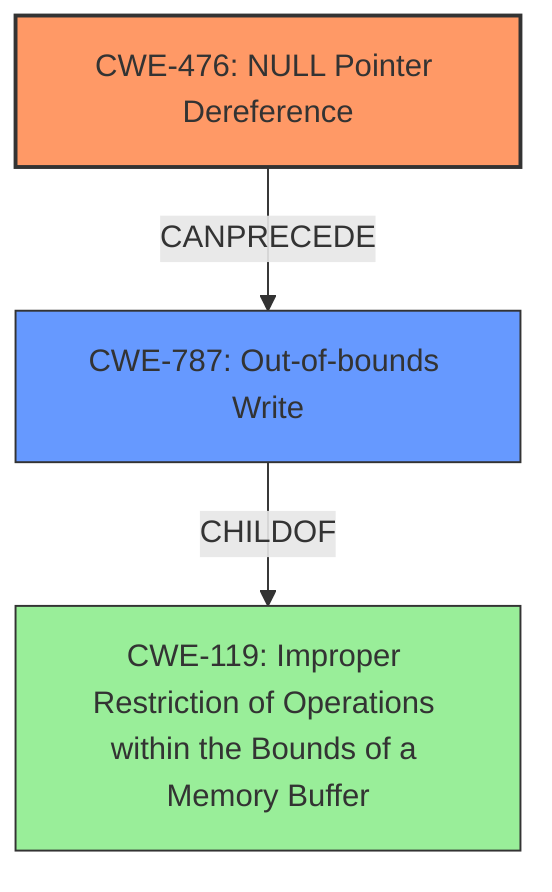

# Final Resolution for CVE-2022-26097

# Summary
| CWE ID | CWE Name | Confidence | CWE Abstraction Level | CWE Vulnerability Mapping Label | CWE-Vulnerability Mapping Notes |
|---|---|---|---|---|---|
| CWE-476 | NULL Pointer Dereference | 1.0 | Base | Primary | Allowed |
| CWE-787 | Out-of-bounds Write | 0.7 | Base | Secondary | Allowed |

## Evidence and Confidence

*   **Confidence Score:** 0.9
*   **Evidence Strength:** HIGH

## Relationship Analysis
The primary relationship is that **CWE-476 (NULL Pointer Dereference)** can precede **CWE-787 (Out-of-bounds Write)**. This means a null pointer dereference can lead to an out-of-bounds write if the code attempts to write data through the null pointer. **CWE-787** is a child of **CWE-119 (Improper Restriction of Operations within the Bounds of a Memory Buffer)**. This indicates that the out-of-bounds write is a specific type of buffer overflow. No peer relationships significantly impact the classification. The abstraction levels (Base for both **CWE-476** and **CWE-787**) are appropriate for identifying specific causes and consequences.

## Vulnerability Chain
The vulnerability chain starts with a **NULL pointer dereference (CWE-476)** in the `parser_unknown_property` function. This **ROOTCAUSE** leads to the consequence of an **out-of-bounds write (CWE-787)**. The **WEAKNESS** allows a remote attacker to overwrite memory outside the intended boundaries.

## Summary of Analysis
The initial analysis and criticism both align well with the provided information. The vulnerability description explicitly mentions a "Null pointer dereference" and "out of bounds write". The CVE summary also supports this: "Root Cause: Null pointer dereference vulnerability in some parser functions of the libsimba library" and "Weaknesses/Vulnerabilities: Null pointer dereference."

The graph relationships confirm that **CWE-476** can logically lead to **CWE-787**, and that **CWE-787** is a specific type of buffer overflow (**CWE-119**). The selected CWEs are at the optimal level of specificity because they directly reflect the described **WEAKNESSES** and their immediate consequences. **CWE-476** accurately describes the **ROOTCAUSE**, and **CWE-787** describes the direct impact.

I agree with the assessment that **CWE-476** is the primary **WEAKNESS** and **CWE-787** is a secondary **WEAKNESS**. The evidence strongly supports this classification, and the relationships between the CWEs clarify the vulnerability chain.