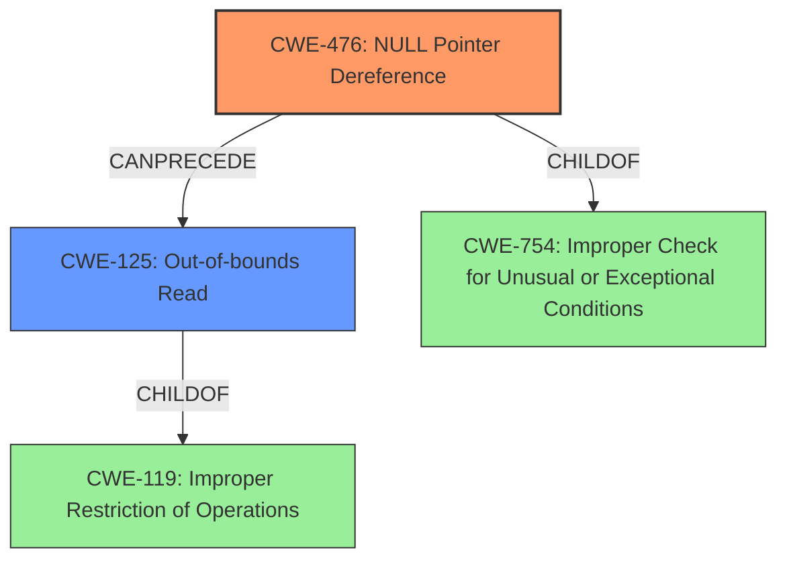

# Final Resolution for CVE-2022-26099

# Summary
| CWE ID | CWE Name | Confidence | CWE Abstraction Level | CWE Vulnerability Mapping Label | CWE-Vulnerability Mapping Notes |
|---|---|---|---|---|---|
| CWE-476 | **NULL Pointer Dereference** | 1.0 | Base | Allowed | Primary CWE |
| CWE-125 | **Out-of-bounds Read** | 0.4 | Base | Allowed | Secondary Candidate |

## Evidence and Confidence

*   **Confidence Score:** 0.95
*   **Evidence Strength:** HIGH

## Relationship Analysis
The primary relationship influencing the decision is the chain relationship where the **CWE-476 (NULL Pointer Dereference)** directly leads to **CWE-125 (Out-of-bounds Read)**. **CWE-476** is a child of **CWE-754 (Improper Check for Unusual or Exceptional Conditions)**, but **CWE-476** is more specific and directly reflects the vulnerability description. **CWE-125** is a child of **CWE-119 (Improper Restriction of Operations within the Bounds of a Memory Buffer)**, and its inclusion captures the impact of the **null pointer dereference**.

## Vulnerability Chain
The vulnerability chain starts with a **NULL Pointer Dereference (CWE-476)**. The product attempts to dereference a pointer that is unexpectedly NULL. This leads directly to an **Out-of-bounds Read (CWE-125)** because the program attempts to access memory at an invalid address, resulting in the program reading data from outside the intended buffer.

## Summary of Analysis
The initial analysis and criticism both align well. The vulnerability description explicitly mentions "**Null pointer dereference** vulnerability," which strongly supports the selection of **CWE-476**. The description also states that this **null pointer dereference** leads to an "out of bounds read", which is why **CWE-125** is a secondary candidate. The graph relationships reinforce this by showing how **CWE-476** can directly precede **CWE-125**. Both CWEs are at the Base level of abstraction, as recommended by MITRE's mapping guidance. The final decision is based on the evidence from the vulnerability description and is supported by the retriever results, making the selected CWEs the most appropriate and specific. The suggested addition of mitigations strengthens the analysis, demonstrating a more complete understanding of the vulnerability and potential solutions.

*   Evidence: "Null pointer dereference vulnerability in parser_infe function of libsimba library prior to SMR Apr-2022 Release 1 allows out of bounds read by remote attackers."