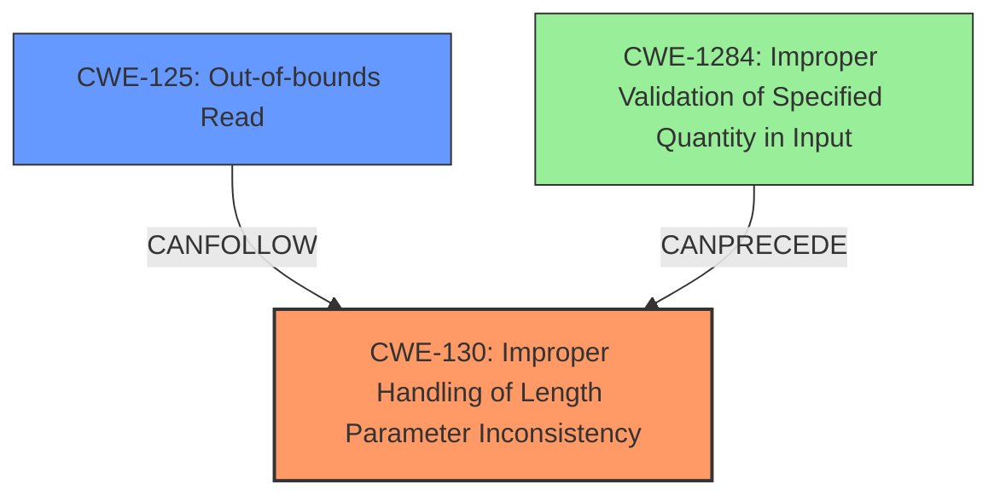

# Analysis Report for CVE-2022-26127

# Vulnerability Analysis Report: CVE-2022-26127

## Description

A buffer overflow vulnerability exists in FRRouting through 8.1.0 due to missing a check on the input packet length in the babel_packet_examin function in babeld/message.c.

## Vulnerability Description Key Phrases

**Weakness:** buffer overflow
**Product:** FRRouting
**Version:** through 8.1.0
**Component:** babeld/message.c

## Analysis (with Relationship Data)

# Summary
| CWE ID  | CWE Name                                                               | Confidence | CWE Abstraction Level | CWE Vulnerability Mapping Label | CWE-Vulnerability Mapping Notes |
| ------- | ---------------------------------------------------------------------- | ---------- | --------------------- | ------------------------------- | ----------------------------- |
| CWE-130 | Improper Handling of Length Parameter Inconsistency                    | 0.95       | Base                  | Primary                         | Allowed                       |
| CWE-125 | Buffer Over-read                                                       | 0.75       | Base                  | Secondary                       | Allowed                       |

## Evidence and Confidence

*   **Confidence Score:** 0.85
*   **Evidence Strength:** HIGH

- **Analysis and Justification:**
  - *Explanation:* The vulnerability is a **buffer overflow** due to a missing check on the input packet length. Specifically, the code in `babel_packet_examin` in `babeld/message.c` does not validate if `packetlen` is large enough to accommodate `bodylen` plus the header size (4 bytes). This leads to out-of-bounds reads when `packetlen` is less than `bodylen + 4`. This matches CWE-130 (Improper Handling of Length Parameter Inconsistency) because the code isn't correctly handling the length field. Furthermore, when the packet length is insufficient the code attempts to read beyond the bounds which leads to CWE-125 (Buffer Over-read). The primary weakness is the improper handling of the length parameter.
  - *Relationship Analysis:* CWE-130 is a Base level CWE. CWE-125 is related as a consequence of the length inconsistency.

- **Confidence Score:**
  - *Example:* Confidence: 0.95 (High confidence due to clear technical details and CVE reference materials)

## Criticism of Analysis

Okay, here's a review of the provided analysis, incorporating the full CWE specifications and focusing on the mapping guidance and potential mitigations:

**Overall Assessment:**

The analysis is generally good and identifies the core issues well. The mapping to CWE-130 as the primary weakness is accurate and well-justified. The inclusion of CWE-125 as a secondary weakness is also appropriate, as it represents the direct consequence of the inconsistent length handling.

**Detailed Critique:**

*   **Vulnerability Description:** The description is clear and concise. The key phrases effectively highlight the essential aspects of the vulnerability.

*   **CWE for similar CVE Descriptions:** The initial selection of CWE-1284 is not as precise as CWE-130, although it touches upon the idea of improper input validation. The ranking of CWEs from the Retriever results is helpful in suggesting more appropriate mappings.

*   **Root Cause of Vulnerability:** The explanation of the root cause is accurate. The missing check on `packetlen` against `bodylen + 4` is the core issue.

*   **Weaknesses/Vulnerabilities Present:** The identification of both the *buffer overflow* and the *missing input validation* is correct. However, buffer overflow is more of a *result* than a weakness itself. It should be phrased as a consequence of missing input validation, or the Improper Handling of Length Parameter Inconsistency.

*   **Impact of Exploitation:** The potential for Remote Code Execution (RCE) and Denial of Service (DoS) is accurately stated.

*   **Attack Vectors:** The description of the attack vectors is clear and helpful.

*   **Required Attacker Capabilities/Position:** The attacker requirements are well-defined.

*   **Confidence and Evidence:** The high confidence score (0.95) is justifiable, given the clear technical details and CVE reference materials.

**Review of CWE Mappings:**

*   **CWE-130: Improper Handling of Length Parameter Inconsistency (Primary):**
    *   **Mapping Guidance:** The analysis correctly identifies that CWE-130 is a Base level CWE, which is a preferred level of abstraction. The rationale provided for selecting CWE-130 is sound. The description accurately explains how the code fails to handle the length field consistently, leading to the vulnerability. The usage "Allowed" is correct.
    *   **Potential Mitigations:**
        *   *Mitigation 1:* *"When processing structured incoming data containing a size field followed by raw data, ensure that you identify and resolve any inconsistencies between the size field and the actual size of the data."* - This is directly relevant to the fix for CVE-2022-26127, where the added check `if (packetlen < bodylen + 4)` resolves this inconsistency.
        *   *Mitigation 3:* *"Validate that the length of the user-supplied data is consistent with the buffer size."* This is precisely what is missing in the vulnerable code.

*   **CWE-125: Out-of-bounds Read (Secondary):**
    *   **Mapping Guidance:** The analysis correctly identifies CWE-125 as a consequence of CWE-130. When the length parameter is inconsistent, the code attempts to read beyond the bounds of the buffer. The usage "Allowed" is correct.
    *   **Potential Mitigations:**
        *   *Mitigation 1 (Input Validation):* "Assume all input is malicious... ensure that you validate and ensure correct calculations for any length argument, buffer size calculation, or offset."  This is a direct mitigation for this vulnerability.
        *   *Mitigation 2 (Language Selection):* The choice of language *could* be relevant, although it's less practical. Using a language with automatic bounds checking could prevent this type of vulnerability.

**Minor Improvements and Alternative CWE Considerations:**

*   **CWE-120: Buffer Copy without Checking Size of Input ('Classic Buffer Overflow'):** This is related, but less precise than CWE-130 and CWE-125. This vulnerability doesn't involve an explicit *copy* operation without checking the size. Rather, it involves an *access* operation based on an inconsistent length value.

*   **CWE-119: Improper Restriction of Operations within the Bounds of a Memory Buffer:** This is a very general CWE, and its mapping guidance says it's "Discouraged" because lower-level CWEs are preferred. CWE-130 and CWE-125 are more specific and therefore more appropriate.

*   **Re-evaluate CWE-1284: Improper Validation of Specified Quantity in Input:** Although not as precise as CWE-130, CWE-1284 might be worth revisiting as a *supporting* CWE. The root cause *does* involve a failure to validate the specified `bodylen` quantity. If you were creating a full composite view, this might be included, but it is not the core problem.

**Revised Summary Table:**

| CWE ID  | CWE Name                                                               | Confidence | CWE Abstraction Level | CWE Vulnerability Mapping Label | CWE-Vulnerability Mapping Notes |
| ------- | ---------------------------------------------------------------------- | ---------- | --------------------- | ------------------------------- | ----------------------------- |
| CWE-130 | Improper Handling of Length Parameter Inconsistency                    | 0.95       | Base                  | Primary                         | Allowed                       |
| CWE-125 | Buffer Over-read                                                       | 0.75       | Base                  | Secondary                       | Allowed                       |
| CWE-1284 | Improper Validation of Specified Quantity in Input                  | 0.50       | Base                  | Supporting                       | Allowed                       |

**Conclusion:**

The analysis is strong and provides a solid understanding of the vulnerability. The choice of CWE-130 as the primary weakness is well-justified, and the addition of CWE-125 as a consequence is appropriate. Focusing on the mitigations provided by the CWE specifications would strengthen the overall assessment.

## Final Resolution

# Summary
| CWE ID   | CWE Name                                                                     | Confidence | CWE Abstraction Level | CWE Vulnerability Mapping Label | CWE-Vulnerability Mapping Notes |
| :------- | :--------------------------------------------------------------------------- | :--------- | :--------------------- | :------------------------------ | :----------------------------- |
| CWE-130  | **Improper Handling of Length Parameter Inconsistency**                      | 0.95       | Base                  | Primary                         | Allowed                       |
| CWE-125  | **Out-of-bounds Read**                                                       | 0.75       | Base                  | Secondary                       | Allowed                       |
| CWE-1284 | **Improper Validation of Specified Quantity in Input**                       | 0.50       | Base                  | Supporting                      | Allowed                       |

## Evidence and Confidence

*   **Confidence Score:** 0.90
*   **Evidence Strength:** HIGH

## Relationship Analysis
The primary **weakness** is CWE-130 (**Improper Handling of Length Parameter Inconsistency**) because the input packet length is not checked against the expected body length plus header size. This leads directly to CWE-125 (**Out-of-bounds Read**) when the packet length is insufficient. CWE-1284 (**Improper Validation of Specified Quantity in Input**) is a weaker, but still relevant, classification because it reflects the lack of validation on the input `bodylen`. The analysis considered the parent-child relationships, but selected CWEs at the base level for optimal specificity.

## Vulnerability Chain
The vulnerability chain starts with the missing length check in the `babel_packet_examin` function (**ROOTCAUSE**: CWE-130). This allows the `bodylen` to be larger than the available data in `packetlen`. When the code attempts to read `bodylen + 4` bytes from the packet, it reads beyond the bounds of the buffer (**WEAKNESS**: CWE-125). This **buffer over-read** can lead to a crash (Denial of Service) or potentially Remote Code Execution if the over-read data is used in a subsequent operation.

## Summary of Analysis
The initial analysis and criticism both correctly identify CWE-130 as the primary issue. The vulnerability description "A **buffer overflow** vulnerability exists in FRRouting through 8.1.0 due to missing a check on the input packet length in the babel_packet_examin function in babeld/message.c" directly supports this. The code in `babel_packet_examin` in `babeld/message.c` does not validate if `packetlen` is large enough to accommodate `bodylen` plus the header size (4 bytes).

The graph relationships confirm that CWE-130 is the **root cause**, leading to CWE-125 as a consequence. The mitigations described in the CWE entries further support these classifications. For example, CWE-130's mitigation "Validate that the length of the user-supplied data is consistent with the buffer size" directly addresses the missing check in the vulnerable code.

The selected CWEs are at the optimal level of specificity because they directly describe the **root cause** (CWE-130) and the immediate consequence (CWE-125) of the vulnerability. While CWE-119 (**Improper Restriction of Operations within the Bounds of a Memory Buffer**) is a parent of both CWE-130 and CWE-125, it is too general and doesn't provide sufficient detail about the specific flaw. Similarly, while **buffer overflow** is mentioned in the vulnerability description, it's a symptom of the underlying **weakness** (CWE-130) and not the root **cause** itself.

Therefore, the final determination is to classify this vulnerability as primarily CWE-130 with CWE-125 as a secondary weakness contributing to the vulnerability chain.

*Report generated on 2025-03-16 10:43:46*
