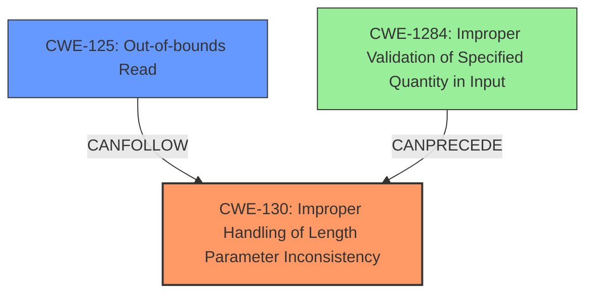

# Final Resolution for CVE-2022-26127

# Summary
| CWE ID   | CWE Name                                                                     | Confidence | CWE Abstraction Level | CWE Vulnerability Mapping Label | CWE-Vulnerability Mapping Notes |
| :------- | :--------------------------------------------------------------------------- | :--------- | :--------------------- | :------------------------------ | :----------------------------- |
| CWE-130  | **Improper Handling of Length Parameter Inconsistency**                      | 0.95       | Base                  | Primary                         | Allowed                       |
| CWE-125  | **Out-of-bounds Read**                                                       | 0.75       | Base                  | Secondary                       | Allowed                       |
| CWE-1284 | **Improper Validation of Specified Quantity in Input**                       | 0.50       | Base                  | Supporting                      | Allowed                       |

## Evidence and Confidence

*   **Confidence Score:** 0.90
*   **Evidence Strength:** HIGH

## Relationship Analysis
The primary **weakness** is CWE-130 (**Improper Handling of Length Parameter Inconsistency**) because the input packet length is not checked against the expected body length plus header size. This leads directly to CWE-125 (**Out-of-bounds Read**) when the packet length is insufficient. CWE-1284 (**Improper Validation of Specified Quantity in Input**) is a weaker, but still relevant, classification because it reflects the lack of validation on the input `bodylen`. The analysis considered the parent-child relationships, but selected CWEs at the base level for optimal specificity.

## Vulnerability Chain
The vulnerability chain starts with the missing length check in the `babel_packet_examin` function (**ROOTCAUSE**: CWE-130). This allows the `bodylen` to be larger than the available data in `packetlen`. When the code attempts to read `bodylen + 4` bytes from the packet, it reads beyond the bounds of the buffer (**WEAKNESS**: CWE-125). This **buffer over-read** can lead to a crash (Denial of Service) or potentially Remote Code Execution if the over-read data is used in a subsequent operation.

## Summary of Analysis
The initial analysis and criticism both correctly identify CWE-130 as the primary issue. The vulnerability description "A **buffer overflow** vulnerability exists in FRRouting through 8.1.0 due to missing a check on the input packet length in the babel_packet_examin function in babeld/message.c" directly supports this. The code in `babel_packet_examin` in `babeld/message.c` does not validate if `packetlen` is large enough to accommodate `bodylen` plus the header size (4 bytes).

The graph relationships confirm that CWE-130 is the **root cause**, leading to CWE-125 as a consequence. The mitigations described in the CWE entries further support these classifications. For example, CWE-130's mitigation "Validate that the length of the user-supplied data is consistent with the buffer size" directly addresses the missing check in the vulnerable code.

The selected CWEs are at the optimal level of specificity because they directly describe the **root cause** (CWE-130) and the immediate consequence (CWE-125) of the vulnerability. While CWE-119 (**Improper Restriction of Operations within the Bounds of a Memory Buffer**) is a parent of both CWE-130 and CWE-125, it is too general and doesn't provide sufficient detail about the specific flaw. Similarly, while **buffer overflow** is mentioned in the vulnerability description, it's a symptom of the underlying **weakness** (CWE-130) and not the root **cause** itself.

Therefore, the final determination is to classify this vulnerability as primarily CWE-130 with CWE-125 as a secondary weakness contributing to the vulnerability chain.