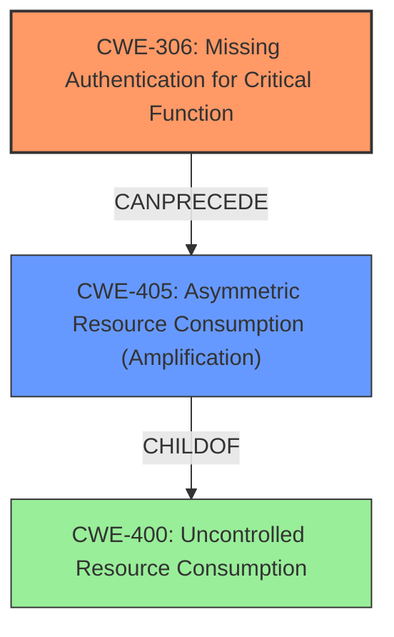

# Final Resolution for CVE-2022-26143

# Summary
| CWE ID | CWE Name | Confidence | CWE Abstraction Level | CWE Vulnerability Mapping Label | CWE-Vulnerability Mapping Notes |
|---|---|---|---|---|---|
| **CWE-306** | **Missing Authentication for Critical Function** | 0.95 | Base | Allowed | Primary CWE |
| **CWE-405** | **Asymmetric Resource Consumption (Amplification)** | 0.70 | Base | Allowed | Secondary Candidate |

## Evidence and Confidence

*   **Confidence Score:** 0.95
*   **Evidence Strength:** HIGH

## Relationship Analysis
The primary CWE is **CWE-306** [**Missing Authentication for Critical Function**], which is a Base level CWE, preferred for its specificity. **CWE-405** [**Asymmetric Resource Consumption (Amplification)**] is also a Base level CWE, and represents the amplification aspect of the denial-of-service attack, which is a consequence of the missing authentication. **CWE-200** [**Information Exposure**] was considered but discarded as the exposure of sensitive information is not the primary driver of the vulnerability.

## Vulnerability Chain
The vulnerability chain starts with **CWE-306** [**Missing Authentication for Critical Function**], which allows unauthenticated access to a system test facility. This leads to **CWE-405** [**Asymmetric Resource Consumption (Amplification)**], where attackers can amplify their traffic, causing a denial of service.

## Summary of Analysis
The initial analysis correctly identified **CWE-306** [**Missing Authentication for Critical Function**] as the primary weakness. The criticism suggested removing **CWE-200** [**Information Exposure**], which I agree with. I also agree with the suggestion of adding **CWE-405** [**Asymmetric Resource Consumption (Amplification)**] to more accurately describe the denial-of-service aspect.

The vulnerability description states, "Unauthenticated Access: The system test facility, which was not designed for public access, was exposed to the internet without authentication requirements." This directly supports the classification of **CWE-306** [**Missing Authentication for Critical Function**] as the primary weakness. The fact that a single spoofed packet can trigger the attack further reinforces the absence of authentication.

The relationship analysis confirms that **CWE-306** [**Missing Authentication for Critical Function**] is the most specific and appropriate representation of the **root cause**. **CWE-405** [**Asymmetric Resource Consumption (Amplification)**] is added as a secondary CWE to capture the amplification aspect of the denial-of-service attack.

The selected CWEs are at the optimal level of specificity because they accurately represent the **root cause** (missing authentication) and a key consequence (resource amplification) of the vulnerability.