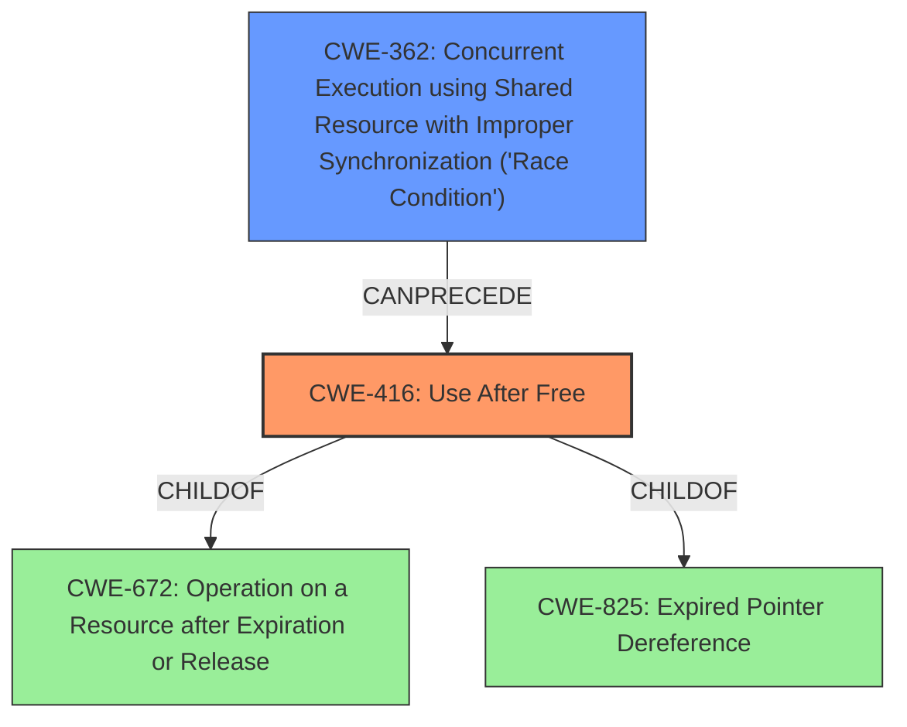

# Analysis Report for CVE-2022-2617

# Vulnerability Analysis Report: CVE-2022-2617

## Description

Use after free in Extensions API in Google Chrome prior to 104.0.5112.79 allowed an attacker who convinced a user to install a malicious extension to potentially exploit heap corruption via specific UI interactions.

## Vulnerability Description Key Phrases

**Rootcause:** use after free
**Impact:** heap corruption
**Vector:** specific UI interactions
**Attacker:** attacker
**Product:** Google Chrome
**Version:** prior to 104.0.5112.79
**Component:** Extensions API

## Analysis (with Relationship Data)

# Summary
| CWE ID | CWE Name | Confidence | CWE Abstraction Level | CWE Vulnerability Mapping Label | CWE-Vulnerability Mapping Notes |
|---|---|---|---|---|---|
| CWE-416 | Use After Free | 1.0 | Variant | Allowed | Primary CWE |

## Evidence and Confidence

*   **Confidence Score:** 1.0
*   **Evidence Strength:** HIGH

- **Analysis and Justification:**  
  - *Explanation:* The vulnerability description explicitly states a "**use after free**" condition within the Extensions API of Google Chrome. The "**rootcause**" is identified as "**use after free**" and the impact is "**heap corruption**". The CVE Reference Links Content Summary confirms the "**use after free**" in the Extensions API as the root cause, potentially leading to remote code execution. CWE-416 (Use After Free) is a Variant-level CWE that directly addresses this vulnerability. The MITRE mapping guidance indicates that CWE-416 is ALLOWED for use-after-free vulnerabilities.
  
  - *Relationship Analysis:* While there are other CWEs related to concurrency or memory management, CWE-416 is the most specific and appropriate given the explicit mention of "use after free." The provided relationships for CWE-416 show connections to other memory management issues but do not change the primary mapping decision.

- **Confidence Score:**  
  - *Example:* Confidence: 1.0 (Direct evidence from the vulnerability description and CVE reference materials)

## Criticism of Analysis

Okay, here's a review of the provided analysis, incorporating the full CWE specifications:

**Overall Assessment:**

The primary CWE mapping to CWE-416 (Use After Free) is accurate and well-justified. The analysis correctly identifies the core problem described in the vulnerability and backs it up with evidence from the vulnerability description and CVE reference materials. The high confidence score (1.0) is appropriate given the explicit mention of "use after free" in the source data. The analysis also acknowledges other related CWEs, particularly concurrency issues, which can often lead to UAF conditions.

**Detailed Review:**

**1. Primary CWE Match: CWE-416 (Use After Free)**

*   **Accuracy:** The mapping to CWE-416 is correct. The vulnerability description clearly states a use-after-free condition, and the provided CVE reference links content summary confirms this as the root cause. The extended description of CWE-416 perfectly aligns with the vulnerability: "The product reuses or references memory after it has been freed."
*   **Abstraction Level:**  The abstraction level (Variant) is appropriate. CWE-416 is a Variant, which is a good level of specificity for root cause analysis, as noted in the CWE specification's Mapping Guidance.
*   **Mapping Guidance Adherence:** The analysis adheres to the CWE specification's mapping guidance, which states that CWE-416 is "Allowed" and appropriate for use-after-free vulnerabilities. The analysis clearly states the "Acceptable-Use" reason.
*   **Relationships:** The analysis could be slightly improved by explicitly mentioning the relationships of CWE-416 to its parent CWEs (CWE-825: Expired Pointer Dereference and CWE-672: Operation on a Resource after Expiration or Release). This would demonstrate a deeper understanding of the context of the vulnerability.
*   **Mitigations:** The analysis does not explicitly discuss mitigations, but it could be strengthened by mentioning potential mitigations from the CWE-416 specification. These include:
    *   **Language Selection:** Using a language with automatic memory management (e.g., Java, Go, Rust).
    *   **Setting pointers to NULL after freeing:** This is a common, though not foolproof, defense.
*   **Observed Examples:** The analysis includes observed examples of CWE-416, strengthening the assessment.

**2. Top Combined Results Analysis (from Retriever Results):**

Here's a breakdown of the top combined results and their relevance to the primary CWE:

*   **CWE-366 (Race Condition within a Thread) and CWE-362 (Concurrent Execution using Shared Resource with Improper Synchronization ('Race Condition')):** These are relevant because race conditions can often lead to use-after-free vulnerabilities.  If multiple threads are accessing and potentially freeing the same memory, a race condition could result in one thread freeing the memory while another thread is still using it.  The analysis acknowledges this relationship.  It may be helpful to add a sentence or two discussing *how* a race condition might lead to the UAF in this specific scenario. Specifically, the "specific UI interactions" could involve concurrent events that trigger the UAF.
    *   **Mitigation Considerations:**  If concurrency is involved, consider mitigations for race conditions, such as using mutexes, locks, or atomic operations to synchronize access to the shared resource.
*   **CWE-415 (Double Free):** This is related to use-after-free as it represents another form of memory corruption. Double freeing a pointer can lead to UAF scenarios.
*   **CWE-356 (Product UI does not Warn User of Unsafe Actions):** This is less directly related but potentially relevant. The vulnerability description mentions "specific UI interactions." If the UI doesn't properly warn the user about the potential dangers of installing a malicious extension, it could increase the likelihood of the user falling victim to the attack.
    *   **Mitigation Considerations:** User education and clear warnings about the risks associated with installing extensions from untrusted sources can mitigate this aspect.
*   **CWE-843 (Access of Resource Using Incompatible Type ('Type Confusion')):** This is less directly related, but potentially relevant. Type confusion can sometimes indirectly cause memory management issues, such as use-after-free. This would require a specific mechanism for incorrect type usage to trigger memory corruption after a free.
*   **CWE-122 (Heap-based Buffer Overflow):** While the primary issue is UAF, heap corruption can be a *consequence* of a UAF. If the memory is reallocated and overwritten after being freed, it could lead to a heap overflow if the writing code doesn't respect the boundaries of the reallocated memory.
*   **CWE-367 (Time-of-check Time-of-use (TOCTOU) Race Condition):** This is a specific type of race condition that may be relevant, especially if the UI interactions involve checking some state before performing an action that leads to memory freeing.

**3. Suggestions for Improvement:**

*   **Elaborate on Concurrency:** Given the Retriever Results' emphasis on concurrency-related CWEs, add a brief explanation of how a race condition could specifically lead to the use-after-free in the Extensions API.  What specific scenario with "specific UI interactions" could trigger this race?
*   **Mention Potential Mitigations:**  Include a section discussing potential mitigations for CWE-416, drawing from the CWE specification (language selection, setting pointers to NULL, etc.) and the mitigations relevant to the potentially contributing CWEs (e.g., synchronization primitives for race conditions).
*   **Relationships to Parent CWEs:** Briefly mention the relationships between CWE-416 and its parent CWEs (CWE-825 and CWE-672).
*   **Acknowledge UI Interaction Influence:** Briefly discuss how the "specific UI interactions" could contribute to the exploitation of the UAF, potentially through user error or lack of warning.

**Revised Summary Table (with Mitigation Considerations):**

| CWE ID | CWE Name | Confidence | CWE Abstraction Level | CWE Vulnerability Mapping Label | CWE-Vulnerability Mapping Notes | Mitigation Considerations |
|---|---|---|---|---|---|---|
| CWE-416 | Use After Free | 1.0 | Variant | Allowed | Primary CWE | Language selection (automatic memory management), setting pointers to NULL after free, consider memory safety tools. |
| CWE-362 | Concurrent Execution using Shared Resource with Improper Synchronization ('Race Condition') | 0.6 | Class | Allowed-with-Review | Potential contributing factor due to "specific UI interactions" triggering concurrent events | Mutexes, locks, atomic operations for synchronization, consider thread-safe data structures. |
| CWE-356 | Product UI does not Warn User of Unsafe Actions | 0.4 | Base | Allowed | User interface could contribute to exploitation | User education, clear warnings about installing extensions. |

**Conclusion:**

The analysis is a solid starting point. The mapping to CWE-416 is accurate and well-supported. By adding a few more details regarding potential concurrency and mitigations, and by explicitly mentioning the relationship to parent CWEs, the analysis can be further strengthened and provide a more comprehensive understanding of the vulnerability.

## Final Resolution

# Summary
| CWE ID | CWE Name | Confidence | CWE Abstraction Level | CWE Vulnerability Mapping Label | CWE-Vulnerability Mapping Notes |
|---|---|---|---|---|---|
| CWE-416 | Use After Free | 1.0 | Variant | Allowed | Primary CWE |
| CWE-362 | Concurrent Execution using Shared Resource with Improper Synchronization ('Race Condition') | 0.6 | Class | Allowed-with-Review | Secondary Candidate |

## Evidence and Confidence

*   **Confidence Score:** 0.9
*   **Evidence Strength:** MEDIUM

## Relationship Analysis
The primary relationship impacting the decision is the potential for concurrency to lead to the **use after free** condition. While **CWE-416 (Use After Free)** is the direct result, **CWE-362 (Concurrent Execution using Shared Resource with Improper Synchronization ('Race Condition'))** can be a contributing factor. **CWE-416** is a variant of **CWE-672 (Operation on a Resource after Expiration or Release)** and **CWE-825 (Expired Pointer Dereference)**.

## Vulnerability Chain
The vulnerability chain starts with a potential **race condition** (**CWE-362**) during specific UI interactions in a malicious extension. This leads to memory being freed while still in use, resulting in a **use after free** vulnerability (**CWE-416**). The final impact is **heap corruption**.

## Summary of Analysis
The initial analysis correctly identified **CWE-416 (Use After Free)** as the primary **weakness**. The criticism highlighted the potential role of concurrency, specifically **CWE-362 (Concurrent Execution using Shared Resource with Improper Synchronization ('Race Condition'))**, in triggering the **use after free**. The vulnerability description mentions "specific UI interactions," which could plausibly involve concurrent events.

Evidence: "Use after free in Extensions API in Google Chrome prior to 104.0.5112.79 allowed an attacker who convinced a user to install a malicious extension to potentially exploit heap corruption via specific UI interactions."

The inclusion of **CWE-362** is based on the "specific UI interactions" potentially leading to a race condition. While there's no explicit mention of threads or processes, the nature of UI interactions suggests that concurrent event handling could be a factor.

The final decision is to include **CWE-362** as a secondary candidate because it is a reasonable hypothesis given the information provided. The abstraction levels are appropriate: **CWE-416** is a variant, providing specificity, while **CWE-362** is a class, representing a broader category of concurrency issues.

*Report generated on 2025-03-18 11:59:17*
