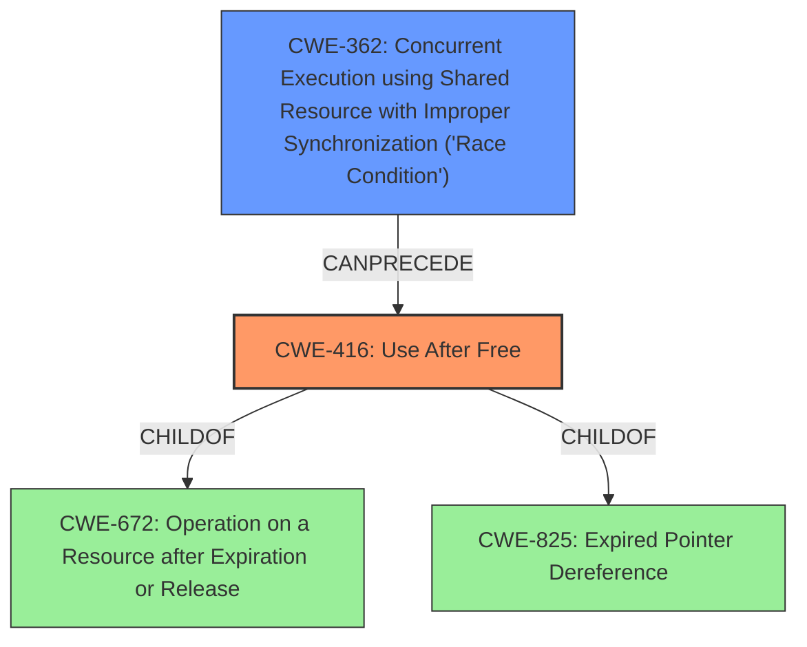

# Final Resolution for CVE-2022-2617

# Summary
| CWE ID | CWE Name | Confidence | CWE Abstraction Level | CWE Vulnerability Mapping Label | CWE-Vulnerability Mapping Notes |
|---|---|---|---|---|---|
| CWE-416 | Use After Free | 1.0 | Variant | Allowed | Primary CWE |
| CWE-362 | Concurrent Execution using Shared Resource with Improper Synchronization ('Race Condition') | 0.6 | Class | Allowed-with-Review | Secondary Candidate |

## Evidence and Confidence

*   **Confidence Score:** 0.9
*   **Evidence Strength:** MEDIUM

## Relationship Analysis
The primary relationship impacting the decision is the potential for concurrency to lead to the **use after free** condition. While **CWE-416 (Use After Free)** is the direct result, **CWE-362 (Concurrent Execution using Shared Resource with Improper Synchronization ('Race Condition'))** can be a contributing factor. **CWE-416** is a variant of **CWE-672 (Operation on a Resource after Expiration or Release)** and **CWE-825 (Expired Pointer Dereference)**.

## Vulnerability Chain
The vulnerability chain starts with a potential **race condition** (**CWE-362**) during specific UI interactions in a malicious extension. This leads to memory being freed while still in use, resulting in a **use after free** vulnerability (**CWE-416**). The final impact is **heap corruption**.

## Summary of Analysis
The initial analysis correctly identified **CWE-416 (Use After Free)** as the primary **weakness**. The criticism highlighted the potential role of concurrency, specifically **CWE-362 (Concurrent Execution using Shared Resource with Improper Synchronization ('Race Condition'))**, in triggering the **use after free**. The vulnerability description mentions "specific UI interactions," which could plausibly involve concurrent events.

Evidence: "Use after free in Extensions API in Google Chrome prior to 104.0.5112.79 allowed an attacker who convinced a user to install a malicious extension to potentially exploit heap corruption via specific UI interactions."

The inclusion of **CWE-362** is based on the "specific UI interactions" potentially leading to a race condition. While there's no explicit mention of threads or processes, the nature of UI interactions suggests that concurrent event handling could be a factor.

The final decision is to include **CWE-362** as a secondary candidate because it is a reasonable hypothesis given the information provided. The abstraction levels are appropriate: **CWE-416** is a variant, providing specificity, while **CWE-362** is a class, representing a broader category of concurrency issues.