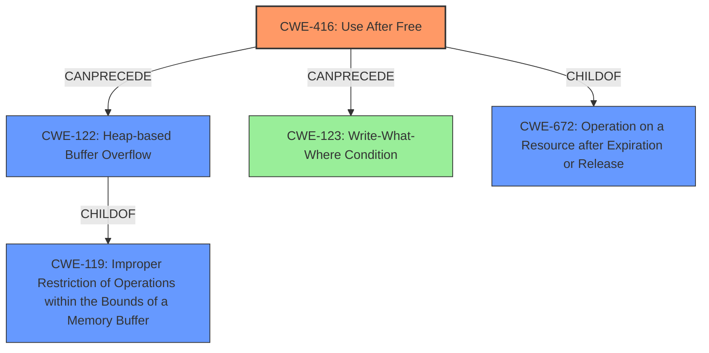

# Final Resolution for CVE-2022-2621

# Summary
| CWE ID | CWE Name | Confidence | CWE Abstraction Level | CWE Vulnerability Mapping Label | CWE-Vulnerability Mapping Notes |
|---|---|---|---|---|---|
| CWE-416 | Use After Free | 0.95 | Variant | Allowed | Primary CWE |
| CWE-122 | Heap-based Buffer Overflow | 0.4 | Variant | Allowed | Secondary Candidate CWE (potential consequence of **heap corruption**). Other types of **heap corruption** are also possible. Exploitation may trigger `CWE-123`. |
| CWE-123 | Write-What-Where Condition | 0.3 | Base | Allowed | Tertiary Candidate CWE (potential exploitation consequence) |

## Evidence and Confidence

*   **Confidence Score:** 0.9
*   **Evidence Strength:** HIGH

## Relationship Analysis
The primary relationship influencing the decision is the parent-child relationship between CWE-672 (Operation on a Resource after Expiration or Release) and CWE-416 (**Use After Free**). CWE-416 is a variant of CWE-672, providing a more specific classification. The possibility of a heap-based buffer overflow (CWE-122) is considered a potential consequence of the **heap corruption** resulting from the **use-after-free**, creating a chain relationship. Also, `CWE-123` is a potential consequence if exploitation is considered.

## Vulnerability Chain
The vulnerability chain starts with a **use-after-free** (CWE-416) in the Extensions component of Google Chrome. This occurs when memory is accessed after it has been freed. This **use-after-free** leads to **heap corruption**. The **heap corruption** *may* lead to a heap-based buffer overflow (CWE-122). If exploited, this may result in a 'Write-What-Where' condition, also known as `CWE-123`.

## Summary of Analysis
The initial analysis and criticism both converge on identifying **CWE-416 (Use After Free)** as the primary **rootcause**. This decision is strongly supported by the vulnerability description, which explicitly states "Use after free." The mention of "**heap corruption**" allows for the consideration of CWE-122 (Heap-based Buffer Overflow) as a secondary consequence, although with lower confidence.

The decision to classify CWE-416 as the primary weakness is based on direct evidence from the vulnerability description: "Use after free in Extensions in Google Chrome prior to 104.0.5112.79 allowed an attacker...". This statement directly aligns with the description of CWE-416.

The graph relationships confirm that CWE-416 is a variant of CWE-672, indicating an appropriate level of specificity. While other CWEs like CWE-122 (Heap-based Buffer Overflow) and `CWE-123` (Write-What-Where Condition) are potential consequences, they are not explicitly stated in the vulnerability description, making them secondary considerations.