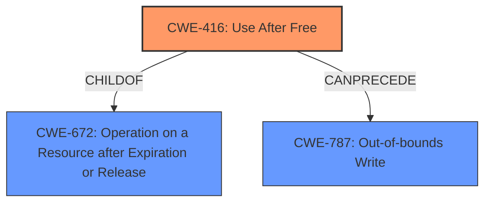

# Final Resolution for CVE-2022-2623

# Summary
| CWE ID | CWE Name | Confidence | CWE Abstraction Level | CWE Vulnerability Mapping Label | CWE-Vulnerability Mapping Notes |
|---|---|---|---|---|---|
| CWE-416 | Use After Free | 0.95 | Variant | Allowed | The vulnerability description clearly states "**Use after free**" as the root cause. The CVE Reference Links Content Summary also confirms "**Use after free**" as a weakness. The CWE-416 is at the Variant level of abstraction, which is a preferred level of abstraction for mapping to the root causes of vulnerabilities. |
| CWE-787 | Out-of-bounds Write | 0.5 | Base | Allowed | The vulnerability description indicates "**heap corruption**". Heap corruption can often lead to an out-of-bounds write scenario, where memory is overwritten beyond the allocated buffer. While the primary cause is UAF, the resulting heap corruption *potentially* suggests a CWE-787. However, other heap corruption outcomes are also possible. |

## Evidence and Confidence

*   **Confidence Score:** 0.9
*   **Evidence Strength:** HIGH

## Relationship Analysis
The primary relationship impacting the decision is the parent-child relationship between CWE-672 (Operation on a Resource after Expiration or Release) and CWE-416 (**Use After Free**). CWE-416 is a variant of CWE-672, making it more specific and appropriate for this vulnerability. CWE-787 (**Out-of-bounds Write**) is considered a potential consequence of the **heap corruption** resulting from the **use-after-free**, establishing a chain relationship where CWE-416 can precede CWE-787. The abstraction levels guided the selection, favoring the variant level CWE-416 for its precision, while acknowledging the base level CWE-787 as a possible outcome.

## Vulnerability Chain
The vulnerability chain starts with the **use-after-free** (**CWE-416**). A memory location is freed but later accessed. This invalid memory access leads to **heap corruption**. The **heap corruption** can *potentially* lead to an **out-of-bounds write** (**CWE-787**). The impact is potential exploitation of the process due to memory corruption via UI interactions.

## Summary of Analysis
The analysis is based on the vulnerability description, which explicitly states "**Use after free**" as the root cause. The CVE reference link content summary also confirms "**Use after free**" as the weakness.
The vulnerability description says: "Use after free in Offline in Google Chrome on Android prior to 104.0.5112.79 allowed a remote attacker who convinced a user to engage in specific user interactions to potentially exploit heap corruption via specific UI interactions."
The graph relationships influenced the selection by highlighting the parent-child relationship between CWE-672 and CWE-416, ensuring the most specific CWE is chosen. The potential chain relationship between CWE-416 and CWE-787 is also considered.

The selected CWEs are at the optimal level of specificity because CWE-416 is a variant that directly matches the "use-after-free" condition, while CWE-787 is a base-level CWE that represents a potential consequence. CWE-362 and the other top retrievers are not a good fit, because the vulnerability is described as a UAF, which happens regardless of concurrency.