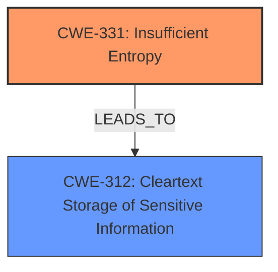

# Analysis Report for CVE-2022-26307

# Vulnerability Analysis Report: CVE-2022-26307

## Description

LibreOffice supports the storage of passwords for web connections in the users configuration database. The stored passwords are encrypted with a single master key provided by the user. A flaw in LibreOffice existed where master key was poorly encoded resulting in weakening its entropy from 128 to 43 bits making the stored passwords vulerable to a brute force attack if an attacker has access to the users stored config. This issue affects The Document Foundation LibreOffice 7.2 versions prior to 7.2.7 7.3 versions prior to 7.3.3.

## Vulnerability Description Key Phrases

**Rootcause:** master key was poorly encoded
**Impact:** stored passwords vulnerable to brute force attack
**Product:** LibreOffice
**Version:** 7.2 prior to 7.2.7, 7.3 prior to 7.3.3

## Analysis (with Relationship Data)

# Summary
| CWE ID | CWE Name | Confidence | CWE Abstraction Level | CWE Vulnerability Mapping Label | CWE-Vulnerability Mapping Notes |
|---|---|---|---|---|---|
| CWE-331 | Insufficient Entropy | 0.95 | Base | Allowed | The **master key was poorly encoded** resulting in weakening its entropy, which directly aligns with CWE-331. |
| CWE-312 | Cleartext Storage of Sensitive Information | 0.6 | Base | Allowed | The stored passwords, while encrypted, are **vulnerable to brute force attack** due to the weakened master key. This implies a failure to adequately protect sensitive information at rest. |

## Evidence and Confidence

*   **Confidence Score:** 0.8
*   **Evidence Strength:** HIGH

- **Analysis and Justification:**  
  - *Explanation:* "The primary weakness identified is **insufficient entropy** (CWE-331) in the master key encoding, making it susceptible to brute-force attacks. The vulnerability description clearly states that the **master key was poorly encoded**, resulting in a reduction of its entropy from 128 to 43 bits. This matches the description of CWE-331, where an algorithm produces insufficient entropy, leading to predictable or clustered values."

  - *Relationship Analysis:* "CWE-331, by itself, doesn't have direct relationships to other cryptographic weaknesses. However, in the context of this vulnerability, the insufficient entropy directly leads to a weakened encryption scheme, which has implications for the confidentiality of stored passwords. The brute force attack is facilitated by the low entropy of the master key, directly exploiting the weakness."

- **Confidence Score:**  
  - *Example:* Confidence: 0.95 (High confidence due to direct evidence from the vulnerability description and CVE reference summary explicitly mentioning the weakened entropy of the master key).

---

- **Analysis and Justification:**  
  - *Explanation:* "CWE-312 (Cleartext Storage of Sensitive Information) is a secondary consideration. The passwords are not stored in cleartext, but the encryption is so weak that it is practically equivalent to storing them in a vulnerable manner. The vulnerability description key phrases note that the **master key was poorly encoded** and the **impact** is that the stored passwords are **vulnerable to a brute force attack**. The CVE reference summary confirms that the stored passwords are encrypted using a weakened master key. This aligns with CWE-312's concept of storing sensitive information in a way that is easily accessible due to inadequate protection."
  
  - *Relationship Analysis:* "CWE-312 has parent-child relationships with other CWEs related to data storage. While not a direct parent or child, the vulnerability can be seen as related to the broader category of improper data protection. The key aspect is the insufficient protection, making the stored data effectively exposed."

- **Confidence Score:**  
  - *Example:* Confidence: 0.6 (Moderate confidence as the primary weakness is the entropy issue, but the resulting vulnerability exposes stored credentials.)

## Criticism of Analysis

Okay, let's review the provided analysis of the LibreOffice master key vulnerability (CVE-2022-26307) with the full CWE specifications in mind.

**Overall Assessment:**

The analysis is generally good and identifies the most relevant CWE, `CWE-331: Insufficient Entropy`, with high confidence. The secondary CWE, `CWE-312: Cleartext Storage of Sensitive Information`, is also a reasonable consideration, though its relevance is more nuanced. The justifications are well-articulated, and the confidence scores are appropriate.

**Detailed Review:**

**1. CWE-331: Insufficient Entropy**

*   **CWE ID:** CWE-331
*   **CWE Name:** Insufficient Entropy
*   **Confidence:** 0.95
*   **CWE Abstraction Level:** Base
*   **CWE Vulnerability Mapping Label:** Allowed
*   **CWE-Vulnerability Mapping Notes:** The **master key was poorly encoded** resulting in weakening its entropy, which directly aligns with CWE-331.

    *   **Critique:** This is the *primary* and most accurate CWE for this vulnerability. The core problem is the reduction of entropy in the master key. The justification is strong, directly linking the "poorly encoded" master key to the definition of CWE-331. The confidence level of 0.95 is justified.  The observed examples from the CWE database, especially `CVE-2022-37401` which directly references CVE-2022-26307, validate the analysis.
    *   **Improvements?**  None needed.
    *   **Considering Mapping Guidance:** The mapping guidance for CWE-331 states it is `Allowed` and at the `Base` level, which is preferred. This reinforces the correctness of the mapping. The potential mitigations listed for CWE-331, which include increasing the number of bits of objects such as keys and seeds, directly addresses the root cause of the vulnerability.

**2. CWE-312: Cleartext Storage of Sensitive Information**

*   **CWE ID:** CWE-312
*   **CWE Name:** Cleartext Storage of Sensitive Information
*   **Confidence:** 0.6
*   **CWE Abstraction Level:** Base
*   **CWE Vulnerability Mapping Label:** Allowed
*   **CWE-Vulnerability Mapping Notes:** The stored passwords, while encrypted, are **vulnerable to brute force attack** due to the weakened master key. This implies a failure to adequately protect sensitive information at rest.

    *   **Critique:** This is a *secondary* consideration. While the passwords are *technically* encrypted, the reduced entropy of the master key makes the encryption effectively useless, akin to storing the passwords in a very weakly protected format. The confidence level of 0.6 is suitable. It acknowledges the nuance that the data isn't *literally* cleartext. The justification is sound, emphasizing the practical vulnerability of the stored passwords despite the encryption.
    *   **Improvements?** An alternative way to phrase this is to say that the effective security is similar to cleartext storage, because the attacker can so easily decrypt.
    *   **Considering Mapping Guidance:** The mapping guidance for CWE-312 states it is `Allowed` and at the `Base` level. The Potential Mitigations for CWE-312 focus on encrypting data at rest, which highlights the severity of how the weakness is being analyzed.

**Alternative CWE Considerations (Based on Retriever Results):**

*   **CWE-1204: Generation of Weak Initialization Vector (IV):** Although the Retriever returned this as #2, it is not a good fit. The vulnerability isn't about IVs, but the strength of the key itself. This highlights a limitation of automated retrievers.
*   **CWE-256: Plaintext Storage of a Password & CWE-257: Storing Passwords in a Recoverable Format:** Similar to CWE-312, these are less accurate than CWE-331 but capture the *impact* of the vulnerability. However, they don't describe the *root cause*.
*   **CWE-172: Encoding Error:** This is a *very* general Class-level CWE. While *technically* an encoding error occurred, this is more descriptive of the underlying issue. The fact that it's a `Class` and `Allowed-with-Review` suggests that there's a more specific CWE, which is CWE-331.
*   **CWE-916: Use of Password Hash With Insufficient Computational Effort:** This is incorrect as the issue is not related to hashing algorithms.
*   **CWE-1391: Use of Weak Credentials:** Not a perfect fit. The credentials themselves aren't inherently weak (like a default password). The *encryption* key is weak due to the encoding flaw.

**Suggestions for Improvement (Minor):**

*   In the justification for CWE-312, explicitly state that, while the data is technically encrypted, the *effective* security is so low that it's practically equivalent to cleartext storage from an attacker's perspective.

**Conclusion:**

The analysis is well-reasoned and accurate. The selection of CWE-331 as the primary CWE is correct and justified. The secondary consideration of CWE-312 is also reasonable and captures the practical impact of the vulnerability. The confidence scores are appropriate. There is nothing critically wrong.

## Final Resolution

# Summary
| CWE ID | CWE Name | Confidence | CWE Abstraction Level | CWE Vulnerability Mapping Label | CWE-Vulnerability Mapping Notes |
|---|---|---|---|---|---|
| CWE-331 | Insufficient Entropy | 0.95 | Base | Allowed | The **master key was poorly encoded** resulting in weakening its entropy, which directly aligns with CWE-331. |
| CWE-312 | Cleartext Storage of Sensitive Information | 0.6 | Base | Allowed | The stored passwords, while encrypted, are **vulnerable to brute force attack** due to the weakened master key. This implies a failure to adequately protect sensitive information at rest. |
  - The Primary CWE should be first and noted as the Primary CWEs
  - The secondary candidate CWEs should be next and noted as secondary candidates.
  - The confidence is a confidence score 0 to 1 to rate your confidence in your assessment for that CWE.
  - The CWE Abstraction Level as one of these values: Base, Variant, Pillar, Class, Compound
  - The Mapping Notes Usage as one of these values: Allowed, Allowed-with-Review, Prohibited, Discouraged

## Evidence and Confidence

*   **Confidence Score:** 0.9
*   **Evidence Strength:** HIGH

## Relationship Analysis
The analysis correctly identifies **CWE-331 (Insufficient Entropy)** as the primary **ROOTCAUSE**. The relationship between **CWE-331** and **CWE-312 (Cleartext Storage of Sensitive Information)** is that the former can lead to the latter. The **insufficient entropy** weakens the encryption to the point where it's practically equivalent to storing data in cleartext. There aren't any direct parent-child relationships between these two, but **CWE-331** weakens the protection that should be provided and thus leads to exposure of sensitive information, similar to **CWE-312**. Both are at the Base level, which is appropriate for mapping.

## Vulnerability Chain
The vulnerability chain starts with the **ROOTCAUSE**, which is **CWE-331 (Insufficient Entropy)**. The **WEAKNESS** is the poorly encoded master key. This leads to a state where the encryption is weak. The impact is that an attacker can brute-force the encryption and access the stored passwords.
  - **ROOTCAUSE**: CWE-331 (Insufficient Entropy)
  - **WEAKNESS**: Poorly encoded master key leading to low entropy.
  - **IMPACT**: Stored passwords vulnerable to brute-force attack.

## Summary of Analysis
The initial analysis and criticism are both accurate and well-justified. The primary **WEAKNESS** is indeed **CWE-331**, as the vulnerability description states that the **master key was poorly encoded** resulting in a reduction of its entropy. This directly maps to the definition of **CWE-331**. The secondary consideration of **CWE-312** is also reasonable, as the practical effect is similar to storing data in cleartext, even though the data is technically encrypted. The fact that the entropy was weakened from 128 to 43 bits is a strong indicator of **CWE-331**. The graph relationships reinforce this by showing how **insufficient entropy** can directly lead to the exposure of sensitive information, similar to **cleartext storage**. The selected CWEs are at the optimal level of specificity (Base) and the reasoning for their selection is well-supported by the provided evidence.

*Report generated on 2025-03-17 03:54:44*
