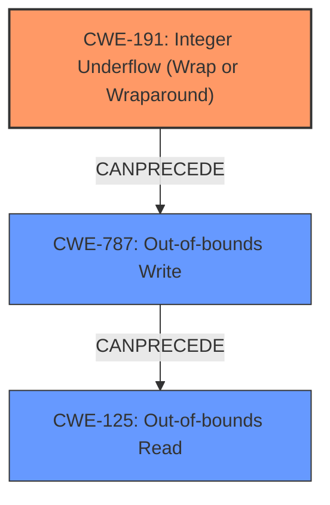

# Final Resolution for CVE-2022-2639

# Summary
| CWE ID | CWE Name | Confidence | CWE Abstraction Level | CWE Vulnerability Mapping Label | CWE-Vulnerability Mapping Notes |
|---|---|---|---|---|---|
| CWE-191 | Integer Underflow (Wrap or Wraparound) | 0.95 | Base | Allowed | Primary CWE |
| CWE-787 | Out-of-bounds Write | 0.8 | Base | Allowed | Secondary Candidate |
| CWE-125 | Out-of-bounds Read | 0.5 | Base | Allowed | Secondary Candidate |

## Evidence and Confidence

*   **Confidence Score:** 0.9
*   **Evidence Strength:** MEDIUM

## Relationship Analysis
The primary relationship influencing the classification is the chain from **CWE-191** (**Integer Underflow**) leading to **CWE-787** (**Out-of-bounds Write**). While **CWE-125** (**Out-of-bounds Read**) is a potential consequence, the evidence for it is weak. The abstraction levels of Base for both **CWE-191** and **CWE-787** are appropriate for identifying the root cause and the immediate impact. The parent-child relationships suggest that we are at an optimal level of specificity.

## Vulnerability Chain
The vulnerability chain starts with an **integer underflow (CWE-191)** in the `reserve_sfa_size()` function when calculating the size for memory allocation. This **incorrect size calculation** leads to allocating less memory than required. Consequently, when copying new actions, the code writes past the intended buffer, resulting in an **out-of-bounds write (CWE-787)**. The potential for an **out-of-bounds read (CWE-125)** arises from the memory corruption caused by the out-of-bounds write, but the evidence for this is weaker.

## Summary of Analysis
The initial analysis correctly identifies **CWE-191** as the primary cause due to the **integer underflow** in the `reserve_sfa_size()` function, as stated: "The CVE reference summary provides more detail, stating an integer underflow occurs when `next_offset` is close to `MAX_ACTIONS_BUFSIZE` and a new action with `req_size` is added, the code allocates `MAX_ACTIONS_BUFSIZE` bytes incrementing `actions_len` by `req_size` leading to `actions_len` exceeding the allocated buffer size." The criticism correctly points out that **CWE-787** is a consequence of **CWE-191**. The analysis also aligns with the vulnerability description mentioning the `reserve_sfa_size()` function failing to return `-EMSGSIZE` as expected, which leads to the out-of-bounds write.

The decision to retain **CWE-191** and **CWE-787** is based on the clear chain of events described in the vulnerability report. The confidence score for **CWE-191** has been slightly increased to 0.95 due to its direct involvement as the root cause. The confidence score for **CWE-787** is at 0.8 due to its immediate impact. **CWE-125** is retained but its confidence is decreased to 0.5 due to the lack of explicit evidence for an out-of-bounds read.

The removal of **CWE-190** is justified because the vulnerability description clearly points to an underflow, not an overflow, making **CWE-191** the more accurate classification. The use of Base level CWEs ensures the classification remains specific to the root cause and its immediate consequence.