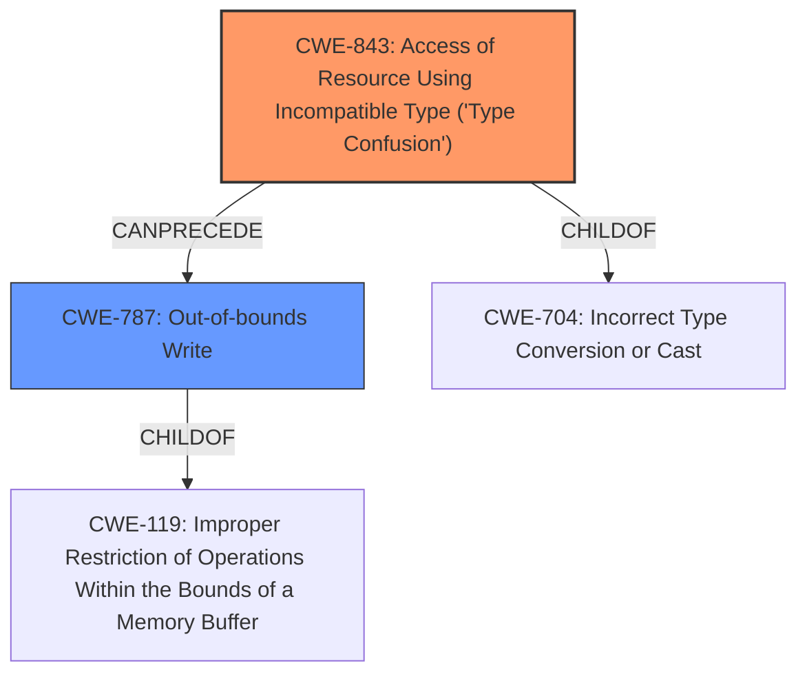

# Analysis Report for CVE-2022-26433

# Vulnerability Analysis Report: CVE-2022-26433

## Description

In mailbox, there is a possible out of bounds write due to type confusion. This could lead to local escalation of privilege with System execution privileges needed. User interaction is not needed for exploitation. Patch ID ALPS07138400 Issue ID ALPS07138400.

## Vulnerability Description Key Phrases

**Rootcause:** type confusion
**Weakness:** out of bounds write
**Impact:** local escalation of privilege
**Component:** mailbox

## Analysis (with Relationship Data)

# Summary
| CWE ID | CWE Name | Confidence | CWE Abstraction Level | CWE Vulnerability Mapping Label | CWE-Vulnerability Mapping Notes |
|---|---|---|---|---|---|
| CWE-843 | Access of Resource Using Incompatible Type ('**Type Confusion**') | 0.8 | Base | Allowed | Primary CWE |
| CWE-787 | Out-of-bounds Write | 0.7 | Base | Allowed | Secondary Candidate |

## Evidence and Confidence

*   **Confidence Score:** 0.75
*   **Evidence Strength:** HIGH

- **Analysis and Justification:**  
  - *Explanation:* The vulnerability description explicitly mentions "**type confusion**" as the root cause, leading to an **out of bounds write**. CWE-843 (Access of Resource Using Incompatible Type ('**Type Confusion**')) directly addresses the root cause of **type confusion** where a resource is accessed using an incompatible type. The vulnerability description key phrases and the CVE reference links content summary both highlight this. CWE-787 (Out-of-bounds Write) describes the resulting **out of bounds write**, making it a secondary weakness. The retriever results also list CWE-843 as a highly relevant CWE.
  
  - *Relationship Analysis:* CWE-843 is a child of CWE-704 (Incorrect Type Conversion or Cast). While CWE-704 is broader, CWE-843 specifically describes the **type confusion** scenario mentioned in the vulnerability. CWE-787 (Out-of-bounds Write) results from the **type confusion**. CWE-843 can precede CWE-787.

- **Confidence Score:**  
  - Confidence: 0.8 (High confidence due to explicit mention of "**type confusion**" and resulting **out of bounds write** in the vulnerability description and CVE reference materials)

## Criticism of Analysis

Okay, let's review the provided analysis with the full CWE specifications in mind.

**Overall Assessment:**

The analysis correctly identifies CWE-843 (Access of Resource Using Incompatible Type ('Type Confusion')) as the primary CWE and CWE-787 (Out-of-bounds Write) as a secondary candidate. The confidence scores assigned are reasonable. The justification is well-articulated, explaining the relationship between the root cause (type confusion) and the resulting weakness (out-of-bounds write).

**Specific Critique:**

1.  **CWE-843 as Primary:**

    *   **Strengths:** The choice of CWE-843 as the primary CWE is appropriate. The vulnerability description explicitly states "type confusion," which aligns directly with the name and description of CWE-843. The extended description of CWE-843 also mentions that type confusion can lead to out-of-bounds memory access, which is the observed consequence in this case.  The CanPrecede relationship to CWE-119 (and its child CWE-787) in the CWE spec supports this. The retriever results also ranked this CWE high.
    *   **Mapping Guidance Consideration**: The mapping guidance for CWE-843 states "This CWE entry is at the Base level of abstraction, which is a preferred level of abstraction for mapping to the root causes of vulnerabilities."  The analysis appropriately maps to this Base level CWE.
    *   **Weaknesses/Improvements**: While the analysis is solid, it could benefit from explicitly mentioning the "CanPrecede -> CWE-119" relationship documented in CWE-843's relationships, further solidifying the choice.
2.  **CWE-787 as Secondary:**

    *   **Strengths:**  Identifying CWE-787 as a secondary candidate is also correct. The vulnerability description explicitly mentions an "out of bounds write," and CWE-787 directly addresses this. It is a direct consequence of the type confusion.
    *   **Mapping Guidance Consideration:** The mapping guidance for CWE-787 states "This CWE entry is at the Base level of abstraction, which is a preferred level of abstraction for mapping to the root causes of vulnerabilities."  The analysis appropriately maps to this Base level CWE.
    *   **Weaknesses/Improvements**: The analysis could be strengthened by elaborating on how CWE-787 directly manifests in the code. For instance, providing a hypothetical example of how the type confusion leads to an incorrect buffer size calculation or an incorrect index used for writing to memory would be beneficial (although this level of detail might not be possible without source code access).

3.  **Alternative CWEs Considered (from Retriever Results):**

    *   **CWE-131 (Incorrect Calculation of Buffer Size):** While not the primary issue, if the type confusion *directly* leads to an incorrect calculation of the buffer size before the out-of-bounds write, then CWE-131 could also be considered as a tertiary CWE in the chain. The current analysis is correct in *not* choosing it as primary, as the *cause* is type confusion.
    *   **CWE-190/191 (Integer Overflow/Underflow):** Similarly, if the type confusion leads to an integer overflow or underflow during a buffer size calculation or offset calculation, these CWEs could be considered as tertiary issues.
    *   **CWE-125 (Out-of-bounds Read):** This isn't directly specified in the description. It's possible an OOB read could happen as a *consequence* of the OOB write, but without more information, it's not appropriate to include.
    *   **CWE-416 (Use After Free):** This is unlikely to be relevant as a type confusion doesn't imply that memory has been freed and reallocated.
    *   **CWE-908 (Use of Uninitialized Resource):** This is less likely than CWE-131/190/191 but if the type confusion results in the use of an uninitialized resource that's later used in the buffer, then it's a possibility.
4.  **CWE-704 (Incorrect Type Conversion or Cast):**

    *   The analysis mentions that CWE-843 is a child of CWE-704, but it's preferred to map to the Base level CWE of 843 since it is more specific.  This is appropriate.

**Recommendations for Improvement:**

*   **Elaborate on the "CanPrecede" relationship:** Explicitly mention the "CanPrecede -> CWE-119" relationship in the CWE-843 justification.
*   **Hypothetical Example (if possible):** If possible, provide a brief, hypothetical example of how the type confusion leads to the out-of-bounds write (e.g., "a variable intended to be a short is misinterpreted as an int, leading to a larger-than-expected offset").
*   **Consider potential tertiary CWEs:** If the type confusion *directly* led to incorrect buffer size calculation, mentioning CWE-131 or CWE-190/191 as a tertiary CWE (with low confidence) could add value.

**Revised Summary Table**

| CWE ID | CWE Name | Confidence | CWE Abstraction Level | CWE Vulnerability Mapping Label | CWE-Vulnerability Mapping Notes |
|---|---|---|---|---|---|
| CWE-843 | Access of Resource Using Incompatible Type ('**Type Confusion**') | 0.8 | Base | Allowed | Primary CWE.  Type confusion directly mentioned in vulnerability description. CanPrecede -> CWE-119. |
| CWE-787 | Out-of-bounds Write | 0.7 | Base | Allowed | Secondary Candidate. Direct consequence of type confusion. |
| CWE-131 | Incorrect Calculation of Buffer Size | 0.3 | Base | Allowed | Possible Tertiary CWE. If the type confusion *directly* leads to incorrect buffer size calculation |

**Conclusion:**

The analysis is well-reasoned and generally accurate. The suggested improvements would enhance the analysis by making the relationships between the CWEs more explicit and by considering potential cascading effects of the primary weakness.

## Final Resolution

# Summary
| CWE ID | CWE Name | Confidence | CWE Abstraction Level | CWE Vulnerability Mapping Label | CWE-Vulnerability Mapping Notes |
|---|---|---|---|---|---|
| CWE-843 | Access of Resource Using Incompatible Type ('**Type Confusion**') | 0.8 | Base | Allowed | Primary CWE.  **Type confusion** directly mentioned in vulnerability description. CanPrecede -> CWE-119. |
| CWE-787 | Out-of-bounds Write | 0.7 | Base | Allowed | Secondary Candidate. Direct consequence of **type confusion**. |

## Evidence and Confidence

*   **Confidence Score:** 0.8
*   **Evidence Strength:** HIGH

## Relationship Analysis
The primary relationship impacting the decision is the parent-child relationship where CWE-843 (Access of Resource Using Incompatible Type ('**Type Confusion**')) is a specific type of CWE-704 (Incorrect Type Conversion or Cast), but CWE-843 is more specific and maps directly to the vulnerability description. Also, CWE-843 can precede CWE-787 (Out-of-bounds Write), indicating a potential vulnerability chain where **type confusion** leads to an **out-of-bounds write**.

## Vulnerability Chain
The vulnerability chain starts with **CWE-843 (Type Confusion)**, where a resource is accessed using an incompatible type. This **type confusion** then leads to **CWE-787 (Out-of-bounds Write)**, where data is written beyond the intended buffer boundaries. The root cause is the incompatible type access, and the impact is an **out-of-bounds write**, leading to potential escalation of privilege.

## Summary of Analysis
The initial analysis correctly identified CWE-843 as the primary **weakness** and CWE-787 as a secondary candidate. The vulnerability description explicitly mentions "**type confusion**" as the root cause, which strongly aligns with CWE-843. The resulting **out-of-bounds write** is well-represented by CWE-787.

The graph relationships further support this classification. CWE-843 is a more specific type of **incorrect type conversion**, and it can directly precede an **out-of-bounds write**, solidifying the vulnerability chain.

The decision to classify CWE-843 as the primary **weakness** is based on the explicit mention of "**type confusion**" in the vulnerability description: "In mailbox, there is a possible out of bounds write due to **type confusion**." This evidence, combined with the understanding of CWE relationships, leads to a high confidence in the final classification.

The selected CWEs are at the optimal level of specificity. CWE-843 is a base-level CWE that directly describes the **type confusion** **rootcause**. CWE-787 is also a base-level CWE that describes the resulting **out-of-bounds write**.

*Report generated on 2025-03-18 12:03:29*
