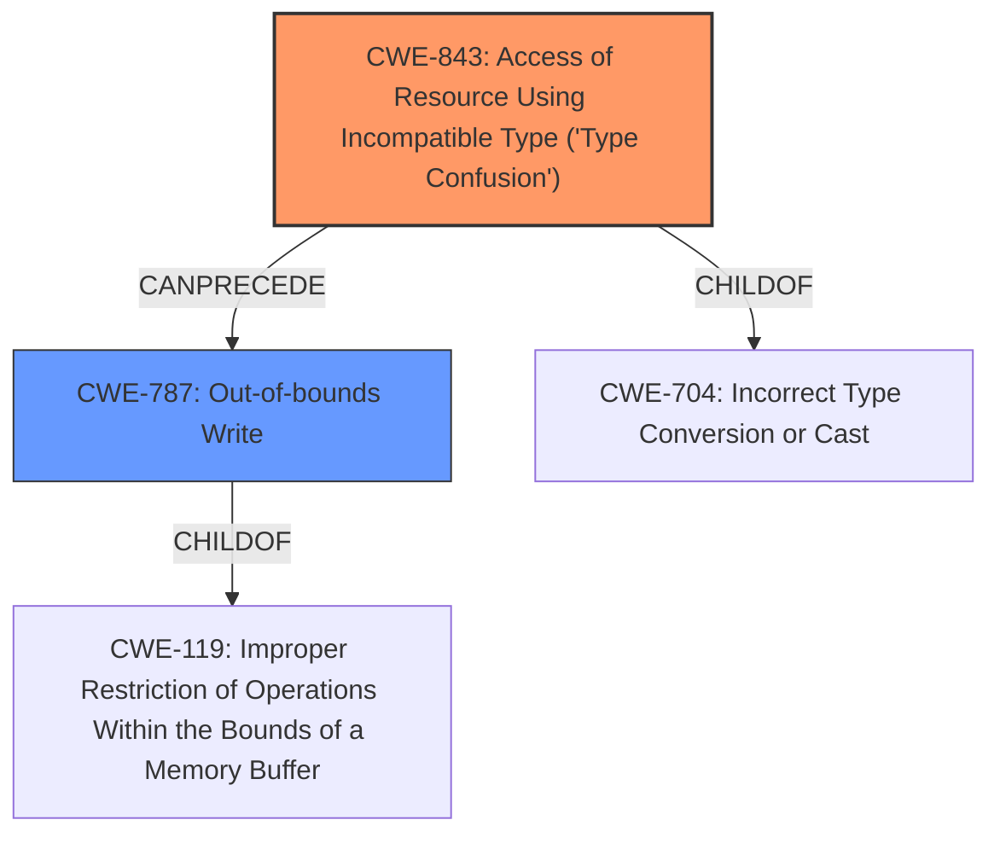

# Final Resolution for CVE-2022-26433

# Summary
| CWE ID | CWE Name | Confidence | CWE Abstraction Level | CWE Vulnerability Mapping Label | CWE-Vulnerability Mapping Notes |
|---|---|---|---|---|---|
| CWE-843 | Access of Resource Using Incompatible Type ('**Type Confusion**') | 0.8 | Base | Allowed | Primary CWE.  **Type confusion** directly mentioned in vulnerability description. CanPrecede -> CWE-119. |
| CWE-787 | Out-of-bounds Write | 0.7 | Base | Allowed | Secondary Candidate. Direct consequence of **type confusion**. |

## Evidence and Confidence

*   **Confidence Score:** 0.8
*   **Evidence Strength:** HIGH

## Relationship Analysis
The primary relationship impacting the decision is the parent-child relationship where CWE-843 (Access of Resource Using Incompatible Type ('**Type Confusion**')) is a specific type of CWE-704 (Incorrect Type Conversion or Cast), but CWE-843 is more specific and maps directly to the vulnerability description. Also, CWE-843 can precede CWE-787 (Out-of-bounds Write), indicating a potential vulnerability chain where **type confusion** leads to an **out-of-bounds write**.

## Vulnerability Chain
The vulnerability chain starts with **CWE-843 (Type Confusion)**, where a resource is accessed using an incompatible type. This **type confusion** then leads to **CWE-787 (Out-of-bounds Write)**, where data is written beyond the intended buffer boundaries. The root cause is the incompatible type access, and the impact is an **out-of-bounds write**, leading to potential escalation of privilege.

## Summary of Analysis
The initial analysis correctly identified CWE-843 as the primary **weakness** and CWE-787 as a secondary candidate. The vulnerability description explicitly mentions "**type confusion**" as the root cause, which strongly aligns with CWE-843. The resulting **out-of-bounds write** is well-represented by CWE-787.

The graph relationships further support this classification. CWE-843 is a more specific type of **incorrect type conversion**, and it can directly precede an **out-of-bounds write**, solidifying the vulnerability chain.

The decision to classify CWE-843 as the primary **weakness** is based on the explicit mention of "**type confusion**" in the vulnerability description: "In mailbox, there is a possible out of bounds write due to **type confusion**." This evidence, combined with the understanding of CWE relationships, leads to a high confidence in the final classification.

The selected CWEs are at the optimal level of specificity. CWE-843 is a base-level CWE that directly describes the **type confusion** **rootcause**. CWE-787 is also a base-level CWE that describes the resulting **out-of-bounds write**.