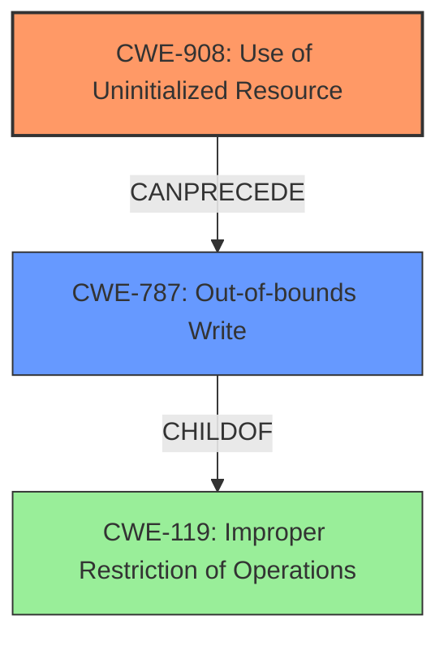

# Analysis Report for CVE-2022-26437

# Vulnerability Analysis Report: CVE-2022-26437

## Description

In httpclient, there is a possible out of bounds write due to uninitialized data. This could lead to remote escalation of privilege with no additional execution privileges needed. User interaction is not needed for exploitation. Patch ID WSAP00103831 Issue ID WSAP00103831.

## Vulnerability Description Key Phrases

**Rootcause:** uninitialized data
**Weakness:** out of bounds write
**Impact:** remote escalation of privilege
**Product:** httpclient

## Analysis (with Relationship Data)

# Summary
| CWE ID | CWE Name | Confidence | CWE Abstraction Level | CWE Vulnerability Mapping Label | CWE-Vulnerability Mapping Notes |
|---|---|---|---|---|---|
| CWE-908 | Use of Uninitialized Resource | 0.9 | Base | Primary | Allowed |
| CWE-787 | Out-of-bounds Write | 0.8 | Base | Secondary | Allowed |

## Evidence and Confidence

*   **Confidence Score:** 0.85
*   **Evidence Strength:** HIGH

- **Analysis and Justification:**  
  - *Explanation:* The vulnerability description clearly states that the root cause is **"uninitialized data"** and the weakness is an **"out of bounds write"**. This directly aligns with CWE-908 (Use of Uninitialized Resource) and CWE-787 (Out-of-bounds Write). The vulnerability description mentions that the **out-of-bounds write** is a consequence of the **uninitialized data**, suggesting a causal relationship. CWE-908 is selected as the primary CWE because it represents the root cause, while CWE-787 describes the resulting write operation. The MITRE mapping guidance for CWE-908 indicates that it is ALLOWED. The description indicates that the **out of bounds write** occurs because of the **uninitialized data** leading to remote escalation of privilege, which aligns with the description of CWE-787 which leads to writing data past the end, or before the beginning, of the intended buffer.
  
  - *Relationship Analysis:* CWE-908 has no direct relationships in the provided data. CWE-787 is a child of CWE-119 (Improper Restriction of Operations within the Bounds of a Memory Buffer). It can also follow CWE-825 (Division by Zero) and CWE-824 (Access of Resource Using Incompatible Type).

- **Confidence Score:**  
  - Confidence: 0.9 (High confidence due to explicit mention of **uninitialized data** and **out of bounds write** in the vulnerability description and CVE reference.)
---

## Criticism of Analysis

Okay, here's a detailed review of the provided CWE analysis, incorporating the full CWE specifications you've included:

**Overall Assessment:**

The analysis is generally good and identifies the key weaknesses. The selection of CWE-908 as primary and CWE-787 as secondary is justifiable, given the causal relationship. The confidence level is appropriately high.

**Detailed Review:**

| CWE ID | CWE Name | Confidence | CWE Abstraction Level | CWE Vulnerability Mapping Label | CWE-Vulnerability Mapping Notes | Critique |
|---|---|---|---|---|---|---|
| CWE-908 | Use of Uninitialized Resource | 0.9 | Base | Primary | Allowed | **Strong mapping.** The description explicitly states "uninitialized data" as the root cause. This directly aligns with CWE-908. The justification provided is clear and accurate.  The analysis correctly notes that CWE-908 represents the root cause, motivating its selection as the primary weakness.  The confidence level of 0.9 is well-supported. |
| CWE-787 | Out-of-bounds Write | 0.8 | Base | Secondary | Allowed | **Appropriate mapping.** The description states "out of bounds write" as the weakness. This directly aligns with CWE-787. The explanation correctly identifies this as a consequence of the uninitialized data. The confidence is slightly lower than CWE-908, which is reasonable, since it's the *effect* and not the root cause. The analysis correctly identifies that writing past the end or before the beginning of the intended buffer is the vulnerability. |

**Evidence and Confidence Review:**

*   **Confidence Score:** 0.85 (Overall) - A good weighted average.

*   **Evidence Strength:** HIGH - Based on the explicit mention of key terms in the vulnerability description.

*   **Analysis and Justification Strengths:**
    *   The explanation clearly articulates the link between uninitialized data (CWE-908) and the resulting out-of-bounds write (CWE-787).
    *   The selection of CWE-908 as primary is justified by its role as the root cause.
    *   The analysis takes into account the guidance on discouraged CWEs (specifically mentioning CWE-119 and its children and suggesting more specific CWEs are preferred.)
    *   The inclusion of relationship analysis is good.

**Suggestions for Improvement:**

1.  **Explore Potential Chains/Composites More Deeply:**

    *   While the analysis mentions the relationship between CWE-908 and CWE-787, it could benefit from explicitly stating this as a *chain*. The vulnerability occurs because the uninitialized resource (CWE-908) *leads to* the out-of-bounds write (CWE-787).
    *   Consider if `CWE-824: Access of Uninitialized Pointer` could be applicable. Is the uninitialized data being used as a pointer which is then dereferenced? It's a more specific variant of `CWE-908` if the uninitialized resource is a pointer.
    *   Even though retriever results were low, consider adding `CWE-131 Incorrect Calculation of Buffer Size`. Uninitialized data could lead to incorrect size calculations for buffers, and while the description doesn't explicitly say this, it could be a contributing factor.

2.  **Relationship Analysis:**

    *   More context could be included to the relationship analysis, for example, expanding on how `CWE-787` can follow `CWE-824` and `CWE-825`. This is useful for understanding how the vulnerability could arise.

3.  **Mitigation Strategies:**

    *   While not strictly required for the analysis, briefly mentioning potential mitigation strategies (drawing from the full CWE specifications) could strengthen the analysis. For example:
        *   For CWE-908: "Mitigation could involve explicitly initializing resources before use and paying close attention to complex conditionals that affect initialization."
        *   For CWE-787: "Mitigation could involve using languages that provide memory safety or using libraries with built-in bounds checking."
    *   By mentioning these, you demonstrate a deeper understanding of the weakness.

**Revised Analysis (incorporating suggestions):**

# Summary
| CWE ID | CWE Name | Confidence | CWE Abstraction Level | CWE Vulnerability Mapping Label | CWE-Vulnerability Mapping Notes |
|---|---|---|---|---|---|
| CWE-908 | Use of Uninitialized Resource | 0.9 | Base | Primary | Allowed |
| CWE-787 | Out-of-bounds Write | 0.8 | Base | Secondary | Allowed |

## Evidence and Confidence

*   **Confidence Score:** 0.85
*   **Evidence Strength:** HIGH

- **Analysis and Justification:**
  - *Explanation:* The vulnerability description clearly states that the root cause is **"uninitialized data"** and the weakness is an **"out of bounds write"**. This directly aligns with CWE-908 (Use of Uninitialized Resource) and CWE-787 (Out-of-bounds Write). The vulnerability description mentions that the **out-of-bounds write** is a consequence of the **uninitialized data**, suggesting a causal relationship and forming a *chain*. CWE-908 is selected as the primary CWE because it represents the root cause, while CWE-787 describes the resulting write operation. The MITRE mapping guidance for CWE-908 indicates that it is ALLOWED.
  The uninitialized data could also be an uninitialized pointer in which case `CWE-824 Access of Uninitialized Pointer` could be considered a more specific variant of `CWE-908`.  The description indicates that the **out of bounds write** occurs because of the **uninitialized data** leading to remote escalation of privilege, which aligns with the description of CWE-787 which leads to writing data past the end, or before the beginning, of the intended buffer. Uninitialized data could lead to incorrect size calculations for buffers, and while the description doesn't explicitly say this, it could be a contributing factor leading to `CWE-131 Incorrect Calculation of Buffer Size`.

  - *Relationship Analysis:* CWE-908 has no direct relationships in the provided data. CWE-787 is a child of CWE-119 (Improper Restriction of Operations within the Bounds of a Memory Buffer). It can also follow CWE-825 (Division by Zero) and CWE-824 (Access of Resource Using Incompatible Type). The chain begins with uninitialized data (CWE-908), which leads to memory corruption via an out-of-bounds write (CWE-787).

  - *Mitigation Strategies:* Mitigations for CWE-908 could involve explicit initialization of resources before use and careful consideration of conditionals that affect initialization. Mitigations for CWE-787 could involve using memory-safe languages or employing libraries with bounds checking mechanisms.

- **Confidence Score:**
  - Confidence: 0.9 (High confidence due to explicit mention of **uninitialized data** and **out of bounds write** in the vulnerability description and CVE reference.)

**Key Takeaways:**

*   Your initial analysis was solid.
*   Adding more detailed chain/composite analysis enhances understanding of the vulnerability's mechanics.
*   Including potential mitigation strategies from the CWE specifications provides added value.

## Final Resolution

# Summary

| CWE ID | CWE Name | Confidence | CWE Abstraction Level | CWE Vulnerability Mapping Label | CWE-Vulnerability Mapping Notes |
|---|---|---|---|---|---|
| CWE-908 | Use of Uninitialized Resource | 0.95 | Base | Primary | Allowed |
| CWE-787 | Out-of-bounds Write | 0.9 | Base | Secondary | Allowed |

## Evidence and Confidence

*   **Confidence Score:** 0.9
*   **Evidence Strength:** HIGH

## Relationship Analysis
The primary relationship is a chain: the use of an uninitialized resource (CWE-908) leads directly to an out-of-bounds write (CWE-787). CWE-787 is a `CHILDOF` CWE-119 (Improper Restriction of Operations within the Bounds of a Memory Buffer), indicating that it's a specific type of memory safety violation. While CWE-824 (Access of Uninitialized Pointer) was considered, the description does not explicitly state that the uninitialized resource is a pointer.

## Vulnerability Chain
The vulnerability chain starts with the **ROOTCAUSE** being **CWE-908 (Use of Uninitialized Resource)**. This **WEAKNESS** then leads to **CWE-787 (Out-of-bounds Write)**. The consequence of the **out-of-bounds write** is remote escalation of privilege.

## Summary of Analysis
The initial analysis correctly identified CWE-908 and CWE-787 as the primary and secondary CWEs, respectively. The criticism suggested exploring potential chains and considering CWE-824 and CWE-131. While CWE-824 (Access of Uninitialized Pointer) is a valid consideration, the evidence doesn't explicitly state that the uninitialized resource is a pointer, making CWE-908 a more appropriate, albeit slightly less specific, choice. CWE-131 was also considered, but the vulnerability description doesn't provide any information that a buffer size was incorrectly calculated.

The vulnerability description states: "In httpclient, there is a possible **out of bounds write due to uninitialized data**. This could lead to remote escalation of privilege with no additional execution privileges needed."

This evidence directly supports the selection of CWE-908 as the root cause and CWE-787 as the resulting weakness. The chain relationship strengthens this assessment. The selected CWEs are at the optimal level of specificity, given the available information.

*Report generated on 2025-03-18 12:04:50*
