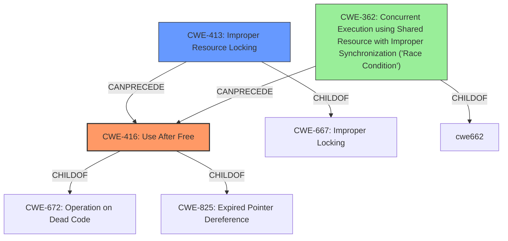

# Analysis Report for CVE-2022-26452

# Vulnerability Analysis Report: CVE-2022-26452

## Description

In isp, there is a possible use after free due to improper locking. This could lead to local escalation of privilege with System execution privileges needed. User interaction is not needed for exploitation. Patch ID ALPS07262305 Issue ID ALPS07262305.

## Vulnerability Description Key Phrases

**Rootcause:** use after free
**Impact:** local escalation of privilege

## Analysis (with Relationship Data)

# Summary
| CWE ID | CWE Name | Confidence | CWE Abstraction Level | CWE Vulnerability Mapping Label | CWE-Vulnerability Mapping Notes |
|---|---|---|---|---|---|
| CWE-416 | Use After Free | 0.9 | Variant | Primary | Allowed |
| CWE-667 | Improper Locking | 0.7 | Class | Secondary | Allowed-with-Review |

## Evidence and Confidence

*   **Confidence Score:** 0.8
*   **Evidence Strength:** HIGH

- **Analysis and Justification:**  
  - *Explanation:* The vulnerability description explicitly states a **use after free** condition due to **improper locking**. CWE-416 (Use After Free) directly addresses this weakness, where memory is accessed after it has been freed. The CVE Reference Links Content Summary further validates this by listing "CWE-662 Improper Synchronization" as a weakness, which is closely related to CWE-667 (Improper Locking). While CWE-787 (Out-of-bounds Write) is suggested as the primary CWE match for similar CVE descriptions, the specific mention of "use after free" makes CWE-416 a more precise and appropriate mapping. CWE-667 (Improper Locking) is added as a secondary CWE since the root cause of the **use after free** is **improper locking**. The MITRE mapping guidance indicates that CWE-416 is ALLOWED for use-after-free vulnerabilities and CWE-667 is ALLOWED-WITH-REVIEW.
  
  - *Relationship Analysis:* CWE-416 is a Variant of CWE-672 (Operation on Dead Code) and CWE-825 (Expired Pointer Dereference). CWE-667 is a class-level CWE and could have base-level children that would be more appropriate.

- **Confidence Score:**  
  - Confidence: 0.9 (Strong evidence from the vulnerability description, CVE reference, and retriever results for both CWE-416 and CWE-667)

---

## Criticism of Analysis

Okay, here's a detailed review of the provided analysis, taking into account the full CWE specifications:

**Overall Assessment:**

The analysis is generally sound and well-reasoned. The primary and secondary CWE mappings are appropriate given the vulnerability description and the information available. The confidence scores are justified.  The reasoning is well-articulated and takes into account the relationships between CWEs. There are however some points that I bring up below.

**Detailed Critique:**

**1. CWE-416: Use After Free (Primary)**

*   **Strengths:**
    *   Excellent justification for selecting CWE-416. The direct mention of "use after free" makes this the most accurate mapping, even though other CWEs might be related or contribute.
    *   The confidence score of 0.9 is reasonable, given the explicit nature of the vulnerability.
    *   The analysis appropriately notes that CWE-416 is a Variant, which is the desired level of abstraction.
*   **Weaknesses:**
    *   While the analysis notes the parent relationships to CWE-672 and CWE-825, it doesn't fully explore whether *either* of these might be a more suitable primary CWE. While CWE-416 is indeed the most *specific* given the description, one could argue that the "operation on a resource after expiration or release" is the *fundamental* issue.  However, sticking with CWE-416 for its directness is acceptable.
    *   The analysis does not include if it is a heap-based or a stack-based use-after-free. This might be important for remediation and exploit mitigation.

**2. CWE-667: Improper Locking (Secondary)**

*   **Strengths:**
    *   Correctly identifies the "improper locking" as the root cause contributing to the UAF.
    *   A confidence score of 0.7 is warranted, as the description implies the locking issue, but doesn't detail the specific *type* of improper locking.
    *   The analysis acknowledges that it's a Class-level CWE and that more specific Base-level CWEs might exist.
*   **Weaknesses:**
    *   **Crucially, the analysis should explore more specific *children* of CWE-667**. The full specification for CWE-667 explicitly states "Examine children of this entry to see if there is a better fit."
    *   Let's look at possible children of CWE-667
        *   CWE-413: Improper Resource Locking. This is a good candidate as it explicitly says that the product does not lock or does not correctly lock a resource. Since UAF is happening this can be interpreted as resource not being locked before freeing.
        *   CWE-414: Missing Lock Check. If the product does not check to see if a lock is present before performing sensitive operations on a resource. This would result in the UAF if the lock is not checked.
        *   CWE-609: Double-Checked Locking. Might be possible that the code is trying to use double-checked locking, but it has not been implemented correctly.
        *   CWE-764: Multiple Locks of a Critical Resource. Possibly the code is trying to lock the resource multiple times without unlocking it.
        *   CWE-765: Multiple Unlocks of a Critical Resource. The opposite of multiple locks.
        *   CWE-832: Unlock of a Resource that is not Locked. Might be applicable if the code unlocks a resource that is not locked.
        *   CWE-833: Deadlock. The locking might have resulted in a deadlock.
        *   CWE-1232: Improper Lock Behavior After Power State Transition
        *   CWE-1233: Security-Sensitive Hardware Controls with Missing Lock Bit Protection
        *   CWE-1234: Hardware Internal or Debug Modes Allow Override of Locks

        A deeper investigation into the exact locking mechanism and the way it fails is needed to select the most appropriate child of CWE-667.
    * CWE-662 also states that "Examine children of this entry to see if there is a better fit" The following are children of CWE-662:
        * CWE-366: Race Condition within a Thread
        * CWE-543: Use of Singleton Pattern Without Synchronization in a Multithreaded Context
        * CWE-567: Unsynchronized Access to Shared Data in a Multithreaded Context
        * CWE-663: Use of a Non-reentrant Function in a Concurrent Context
        * CWE-820: Missing Synchronization
        * CWE-821: Incorrect Synchronization

        Again the analysis should look at which of these base-level children CWEs best describe the improper synchronization.
    *   The analysis does not include if it is a read/write lock or exclusive lock.

**3. CWE-787 Consideration:**

*   The analysis correctly dismisses CWE-787 as the primary mapping. While UAF *can* lead to out-of-bounds writes if the freed memory is reallocated and then accessed via the dangling pointer, the core issue described is the UAF itself.

**4. Retriever Results:**

*   The retriever results provide several interesting suggestions.
    *   **CWE-131 Incorrect Calculation of Buffer Size** is unlikely to be related to the vulnerability.
    *   **CWE-413 Improper Resource Locking** As specified above, it should be included as an alternate CWE.
    *   **CWE-908 Use of Uninitialized Resource** is unlikely to be related to the vulnerability.
    *   **CWE-415 Double Free** while double free does cause memory issues, the key rootcause is UAF, and therefore it should not be selected.
    *   **CWE-362 Concurrent Execution using Shared Resource with Improper Synchronization ('Race Condition')**. A race condition is caused by improper synchronization. In this case, a thread might free the resource while another thread accesses the resource.
    *   **CWE-667 Improper Locking** As specified above, it should be included as an alternate CWE.
    *   **CWE-662 Improper Synchronization** As specified above, it should be included as an alternate CWE.
    *   **CWE-911 Improper Update of Reference Count** is unlikely to be related to the vulnerability.
    *   **CWE-367 Time-of-check Time-of-use (TOCTOU) Race Condition** is not applicable for the vulnerability.

**5. General Suggestions:**

*   **Exploitability Context:** Consider adding a section on the exploitability context.  How easy is it to trigger the UAF? What are the typical consequences (DoS, code execution)? This helps prioritize remediation.
*   **Affected Software and Configurations:** Provide more detail on which software components within "isp" are affected.
*   **Mitigation Strategies:** Expand on the "Potential Mitigations" sections, drawing from the CWE details. For example, under CWE-416, it mentions setting pointers to NULL after freeing.  Discuss whether this is a viable mitigation in the specific context. Also explore other mitigations available.

**Revised Summary Table:**

| CWE ID | CWE Name | Confidence | CWE Abstraction Level | CWE Vulnerability Mapping Label | CWE-Vulnerability Mapping Notes |
|---|---|---|---|---|---|
| CWE-416 | Use After Free | 0.9 | Variant | Primary | Allowed |
| CWE-413 | Improper Resource Locking | 0.7 | Base | Secondary | Allowed |
| CWE-362 | Concurrent Execution using Shared Resource with Improper Synchronization ('Race Condition') | 0.5 | Class | Supporting | Allowed-with-Review |

**In summary:**

The analysis does a good job of identifying the core vulnerability as CWE-416. However, it could be improved by:

*   Investigating the more specific children of CWE-667 to identify the *precise* nature of the locking failure.
*   Adding a deeper investigation into the retriever results and their relevancy to the CVE.
*   Providing more context around exploitability and mitigation strategies.

By addressing these points, the analysis would be more complete and actionable.

## Final Resolution

# Summary
| CWE ID | CWE Name | Confidence | CWE Abstraction Level | CWE Vulnerability Mapping Label | CWE-Vulnerability Mapping Notes |
|---|---|---|---|---|---|
| CWE-416 | Use After Free | 0.9 | Variant | Primary | Allowed |
| CWE-413 | Improper Resource Locking | 0.7 | Base | Secondary | Allowed |
| CWE-362 | Concurrent Execution using Shared Resource with Improper Synchronization ('Race Condition') | 0.5 | Class | Supporting | Allowed-with-Review |

## Evidence and Confidence

*   **Confidence Score:** 0.8
*   **Evidence Strength:** HIGH

## Relationship Analysis
The primary **WEAKNESS** is **CWE-416 (Use After Free)**, which is a variant of **CWE-672 (Operation on Dead Code)** and **CWE-825 (Expired Pointer Dereference)**. The secondary **WEAKNESS** is **CWE-413 (Improper Resource Locking)**, a base-level CWE that directly relates to the **IMPROPER LOCKING** mentioned in the vulnerability description. A supporting weakness is **CWE-362 (Concurrent Execution using Shared Resource with Improper Synchronization ('Race Condition'))**, which is a class level CWE related to **IMPROPER LOCKING** .

## Vulnerability Chain
The vulnerability chain starts with **CWE-413 (Improper Resource Locking)**, leading to **CWE-362 (Concurrent Execution using Shared Resource with Improper Synchronization ('Race Condition'))** and ultimately resulting in **CWE-416 (Use After Free)**.
- Improper locking allows concurrent access to a shared resource.
- A race condition occurs due to lack of synchronization.
- A thread frees the resource while another thread still holds a dangling pointer.
- The second thread attempts to access the freed resource, leading to a use-after-free condition.

## Summary of Analysis
The initial analysis correctly identified **CWE-416 (Use After Free)** as the primary **WEAKNESS**, given the explicit mention of "use after free" in the vulnerability description. The criticism highlighted the need to explore more specific children of **CWE-667 (Improper Locking)**. Based on the retriever results and the relationships between CWEs, **CWE-413 (Improper Resource Locking)** was selected as a more appropriate secondary **WEAKNESS** because it is a Base level CWE and accurately describes the **ROOTCAUSE** of the vulnerability. **CWE-362 (Concurrent Execution using Shared Resource with Improper Synchronization ('Race Condition'))** was added as supporting CWE to show the impact of the missing lock and its resulting race condition.

The vulnerability description states "In isp, there is a possible use after free due to **improper locking**." This statement is strong evidence for selecting both **CWE-416 (Use After Free)** and **CWE-413 (Improper Resource Locking)**.

The final classification provides a more specific and accurate representation of the vulnerability, with **CWE-416 (Use After Free)** as the primary **WEAKNESS** and **CWE-413 (Improper Resource Locking)** and **CWE-362 (Concurrent Execution using Shared Resource with Improper Synchronization ('Race Condition'))** as contributing factors. This reflects the optimal level of specificity based on the available evidence and the relationships between CWEs.

*Report generated on 2025-03-18 12:07:37*
