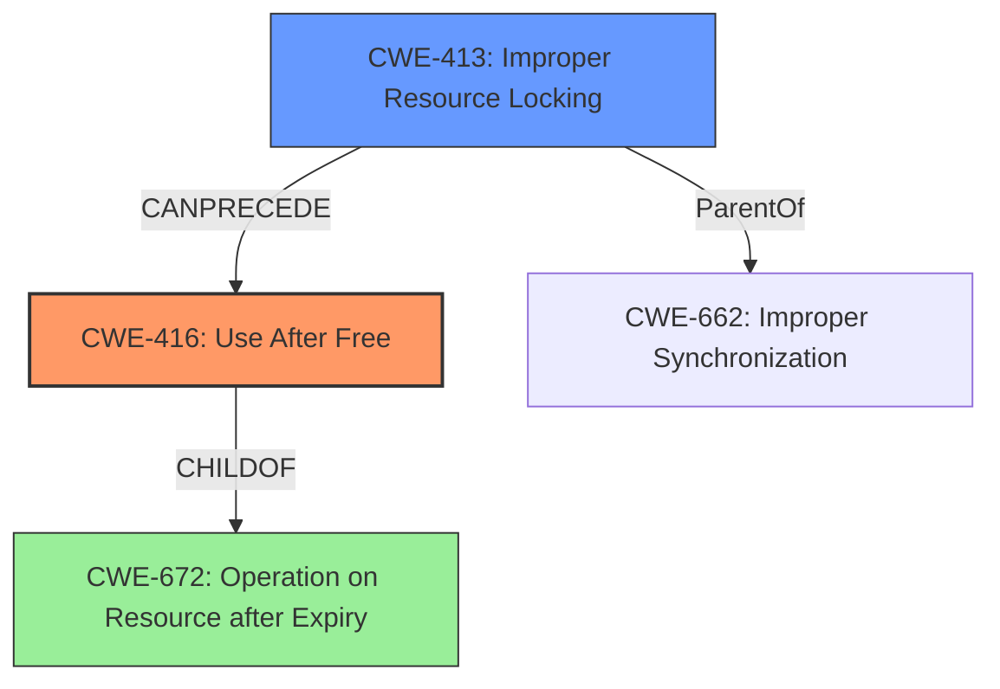

# Analysis Report for CVE-2022-26473

# Vulnerability Analysis Report: CVE-2022-26473

## Description

In vdec fmt, there is a possible use after free due to improper locking. This could lead to local escalation of privilege with System execution privileges needed. User interaction is not needed for exploitation. Patch ID ALPS07342197 Issue ID ALPS07342197.

## Vulnerability Description Key Phrases

**Rootcause:** use after free
**Impact:** local escalation of privilege

## Analysis (with Relationship Data)

# Summary
| CWE ID | CWE Name | Confidence | CWE Abstraction Level | CWE Vulnerability Mapping Label | CWE-Vulnerability Mapping Notes |
|---|---|---|---|---|---|
| CWE-416 | Use After Free | 0.9 | Variant | Allowed | Primary CWE |
| CWE-662 | Improper Synchronization | 0.6 | Class | Discouraged | Secondary Candidate |

## Evidence and Confidence

*   **Confidence Score:** 0.9
*   **Evidence Strength:** HIGH

- **Analysis and Justification:**  
  - *Explanation:* The vulnerability description clearly states a **use after free** condition due to improper locking in vdec fmt. This directly aligns with CWE-416 (Use After Free), which occurs when a program attempts to access memory after it has been freed. The CVE Reference Links Content Summary also mentions "Improper locking mechanisms in vdec fmt" and "CWE-662 Improper Synchronization" as a weakness. CWE-416 is a Variant-level CWE, providing a more specific classification than its parent classes. The retriever results also list CWE-416 with a high combined score. CWE-662 (Improper Synchronization) is added as a secondary candidate because the root cause is improper locking leading to the use-after-free.
  
  - *Relationship Analysis:* CWE-416 is a variant of CWE-672 (Operation on Resource after Expiry). CWE-416 CanFollow weaknesses like CWE-120 (Buffer Overflow) and CWE-123 (Write-what-where Condition), indicating potential exploitation paths after the use-after-free occurs. CWE-662 is a Class level CWE that can be a contributing factor since improper synchronization could lead to the use-after-free condition.

- **Confidence Score:**  
  - *Example:* Confidence: 0.9 (Strong evidence from vulnerability description, CVE summary and retriever results)

---

## Criticism of Analysis

Okay, here's a detailed critique of the provided CWE analysis, incorporating the full CWE specifications:

**Overall Assessment:**

The analysis is generally good, especially in identifying CWE-416 as the primary weakness. The justification for including CWE-662 as a secondary candidate is also reasonable. The confidence scores are appropriate given the information available. The inclusion of CWE examples and the relevant CWE specifications strengthens the analysis.

**Detailed Critique:**

*   **Vulnerability Description Analysis:**

    *   The key phrases identification is accurate.  It correctly identifies "use after free" as the root cause and "local escalation of privilege" as the impact.
    *   The initial CWE suggestion of CWE-787 was a poor one, though the analysis quickly corrects itself.

*   **CVE Reference Links Content Summary Analysis:**

    *   The summary accurately reflects the information present in the provided CVE details. It correctly highlights the improper locking and its relation to synchronization issues.

*   **Retriever Results Analysis:**

    *   The analysis doesn't explicitly discuss why the retriever results are not being fully trusted. It should be stated that the core issue is a Use-After-Free, and the retriever may be providing "noise" based on related, but different issues. The relative scores are considered when choosing the candidates.

*   **CWE Mapping:**

    *   **Primary CWE: CWE-416 (Use After Free) - Confidence: 0.9**
        *   *Excellent choice*. The description explicitly states a use-after-free condition.
        *   The justification is clear and well-articulated. It correctly identifies the Variant level of abstraction as desirable.
        *   The relationship analysis is on point.  The mention of CWE-672 (Operation on Resource after Expiry) as a parent is correct.  The "CanPrecede" relationships (CWE-120, CWE-123) are also relevant because a UAF can sometimes lead to exploitable memory corruption, including the ability to write to arbitrary locations.
        *   The suggested mitigations for CWE-416 are appropriate (language selection and nulling pointers after freeing).
        *   The inclusion of real-world CVE examples for CWE-416 is helpful and reinforces the mapping.
    *   **Secondary CWE: CWE-662 (Improper Synchronization) - Confidence: 0.6**
        *   *Reasonable choice* as a *contributing factor*. The connection to the "improper locking" mentioned in the vulnerability description is the key here. The analysis correctly identifies that improper synchronization *leads to* the UAF.
        *   The mapping guidance for CWE-662 explicitly *discourages* its use because it's a Class-level CWE.  The analysis should acknowledge this and explain why, despite this discouragement, it's still included as a secondary factor. It would be preferable to look for a more specific child of CWE-662 (like CWE-667 or CWE-413).
        *   The potential mitigations for CWE-662 (using standard synchronization APIs) are relevant in preventing this type of UAF.
        *   It is not ideal as a secondary mapping because the problem is improper locking itself, not the generic idea of needing synchronization.
        *   The canPrecede relationship to CWE-362 can be useful since the cause of the improper synchronization can lead to a Race Condition in some situations.

*   **Alternative CWE Considerations and Why They Weren't Chosen:**

    *   **CWE-787 (Out-of-bounds Write):** While memory corruption might *result* from a UAF, the root cause is not an out-of-bounds write directly.  A UAF *can lead to* an out-of-bounds write if the freed memory is reallocated and then the dangling pointer is used to write to it. So, it's a potential consequence, not the cause.
    *   **CWE-413 (Improper Resource Locking):** This is a *stronger candidate* than CWE-662. It's a more specific Base-level CWE directly related to the "improper locking" cause. Changing CWE-662 to CWE-413 would improve the analysis. "Improper locking in vdec fmt" is a direct cause leading to the UAF. The example CVE-2022-20141 clearly links CWE-413 to CWE-416. This would also be a better candidate since CWE-662 is discouraged.
    *   **CWE-362 (Race Condition):**  A race condition *might* be involved, especially if multiple threads are involved in the locking/freeing process, but it's not explicitly stated in the description.  It's more speculative than definitive. If further analysis reveals a clear race condition, then CWE-362 (or a more specific child) could be added.
    *   **CWE-131 (Incorrect Calculation of Buffer Size):** This is irrelevant as it has to do with buffer allocation, not freeing.
    *   **CWE-908 (Use of Uninitialized Resource):** In a UAF, the resource is initialized, then freed, and then used. So uninitialized use is not a fit.
    *   **CWE-415 (Double Free):** Not appropriate, only one free is mentioned.
    *   **CWE-190 (Integer Overflow or Wraparound):** Irrelevant to the described weakness.
    *   **CWE-911 (Improper Update of Reference Count):** This is likely irrelevent, since the memory management is probably not done by reference counting.

*   **Missing Information:**

    *   The analysis does not mention where "vdec fmt" exists. Is it a library? Is it a userspace or kernel component?
    *   The analysis does not explore the multithreading aspects of the weakness, besides mentioning locking. The relationship to concurrency needs to be explored for CWE-662 to be fully understood.

**Recommendations:**

1.  **Promote CWE-416 and Replace Secondary CWE:** Maintain CWE-416 as the primary CWE (confidence 0.9). Replace CWE-662 with CWE-413 (Improper Resource Locking) as the secondary contributing factor (Confidence: 0.7). Update the justification to reflect this.
2.  **Acknowledge and Justify Discouraged CWE:** Explicitly acknowledge that CWE-662 is discouraged by its mapping guidance. If it is necessary to include it, fully justify why, despite this discouragement, it is still relevant.
3.  **Address Retriever Results:** Explain why the retriever results, while provided, are not considered the definitive guidance and why some of the top suggestions are discarded.
4.  **Provide Context:** Include additional information on vdec fmt's location within the system (userspace/kernel, library etc.) to help give full context.
5.  **Address Concurrency/Multithreading:** Go further into multithreading/concurrency implications of the problem, since a UAF due to improper locking is often related to concurrency.
6.  **Review Mitigations:** Review the chosen mitigations for CWE-416 and ensure they are the most applicable for this particular case.

By incorporating these suggestions, the analysis will be more robust, defensible, and informative.

## Final Resolution

# Summary 
| CWE ID | CWE Name | Confidence | CWE Abstraction Level | CWE Vulnerability Mapping Label | CWE-Vulnerability Mapping Notes |
|---|---|---|---|---|---|
| CWE-416 | Use After Free | 0.9 | Variant | Allowed | Primary CWE |
| CWE-413 | Improper Resource Locking | 0.7 | Base | Allowed | Secondary Candidate |

## Evidence and Confidence

*   **Confidence Score:** 0.9
*   **Evidence Strength:** HIGH

## Relationship Analysis
The primary weakness is **CWE-416 (Use After Free)**, which is a variant of **CWE-672 (Operation on Resource after Expiry)**. The secondary weakness is **CWE-413 (Improper Resource Locking)**, which can lead to **CWE-416**. **CWE-413** represents a more specific cause than **CWE-662 (Improper Synchronization)**, which is a class-level CWE. The chain relationship shows that improper locking (**CWE-413**) can precede a use-after-free condition (**CWE-416**).

## Vulnerability Chain
The vulnerability chain starts with **CWE-413 (Improper Resource Locking)**, which leads to a situation where memory is freed while still being referenced. This then results in **CWE-416 (Use After Free)** when the program attempts to access the freed memory. The impact of **CWE-416** is a local escalation of privilege.

## Summary of Analysis
The initial analysis correctly identified **CWE-416 (Use After Free)** as the primary **WEAKNESS**. The criticism suggested replacing **CWE-662 (Improper Synchronization)** with **CWE-413 (Improper Resource Locking)**. The vulnerability description states "In vdec fmt, there is a possible use after free due to improper locking." This statement directly supports the selection of **CWE-416** as the primary **WEAKNESS** and **CWE-413** as a secondary **ROOTCAUSE** that leads to the **WEAKNESS**. **CWE-413** is at the base level of abstraction and represents the "improper locking" condition more accurately than the class-level **CWE-662**. This change reflects a more accurate and specific classification of the vulnerability.

*Report generated on 2025-03-18 12:09:10*
