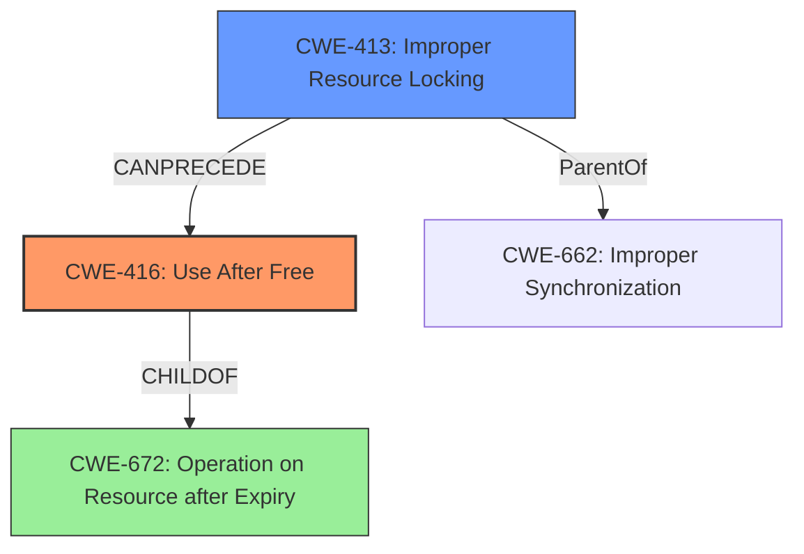

# Final Resolution for CVE-2022-26473

# Summary 
| CWE ID | CWE Name | Confidence | CWE Abstraction Level | CWE Vulnerability Mapping Label | CWE-Vulnerability Mapping Notes |
|---|---|---|---|---|---|
| CWE-416 | Use After Free | 0.9 | Variant | Allowed | Primary CWE |
| CWE-413 | Improper Resource Locking | 0.7 | Base | Allowed | Secondary Candidate |

## Evidence and Confidence

*   **Confidence Score:** 0.9
*   **Evidence Strength:** HIGH

## Relationship Analysis
The primary weakness is **CWE-416 (Use After Free)**, which is a variant of **CWE-672 (Operation on Resource after Expiry)**. The secondary weakness is **CWE-413 (Improper Resource Locking)**, which can lead to **CWE-416**. **CWE-413** represents a more specific cause than **CWE-662 (Improper Synchronization)**, which is a class-level CWE. The chain relationship shows that improper locking (**CWE-413**) can precede a use-after-free condition (**CWE-416**).

## Vulnerability Chain
The vulnerability chain starts with **CWE-413 (Improper Resource Locking)**, which leads to a situation where memory is freed while still being referenced. This then results in **CWE-416 (Use After Free)** when the program attempts to access the freed memory. The impact of **CWE-416** is a local escalation of privilege.

## Summary of Analysis
The initial analysis correctly identified **CWE-416 (Use After Free)** as the primary **WEAKNESS**. The criticism suggested replacing **CWE-662 (Improper Synchronization)** with **CWE-413 (Improper Resource Locking)**. The vulnerability description states "In vdec fmt, there is a possible use after free due to improper locking." This statement directly supports the selection of **CWE-416** as the primary **WEAKNESS** and **CWE-413** as a secondary **ROOTCAUSE** that leads to the **WEAKNESS**. **CWE-413** is at the base level of abstraction and represents the "improper locking" condition more accurately than the class-level **CWE-662**. This change reflects a more accurate and specific classification of the vulnerability.