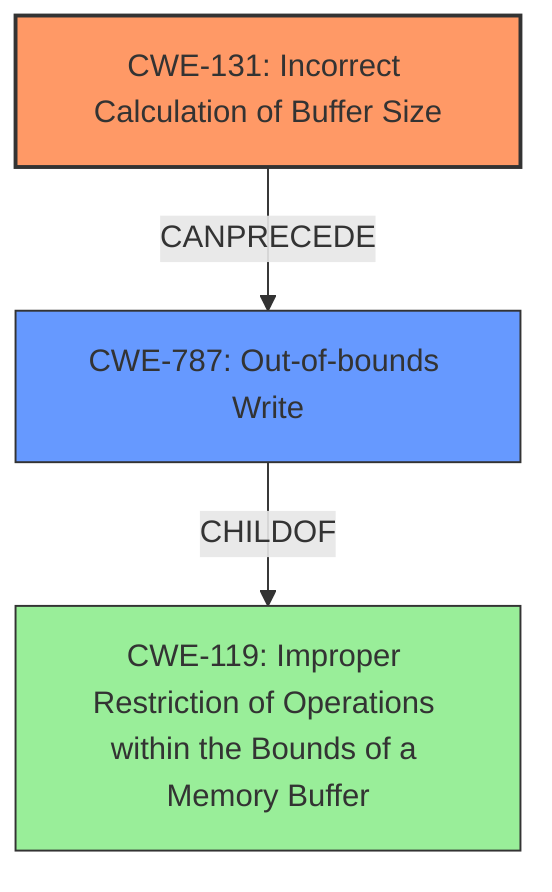

# Analysis Report for CVE-2022-26474

# Vulnerability Analysis Report: CVE-2022-26474

## Description

In sensorhub, there is a possible out of bounds write due to an incorrect calculation of buffer size. This could lead to local escalation of privilege with System execution privileges needed. User interaction is not needed for exploitation. Patch ID ALPS07129717 Issue ID ALPS07129717.

## Vulnerability Description Key Phrases

**Rootcause:** incorrect calculation of buffer size
**Weakness:** out of bounds write
**Impact:** local escalation of privilege
**Product:** sensorhub

## Analysis (with Relationship Data)

# Summary
| CWE ID | CWE Name | Confidence | CWE Abstraction Level | CWE Vulnerability Mapping Label | CWE-Vulnerability Mapping Notes |
|---|---|---|---|---|---|
| CWE-131 | Incorrect Calculation of Buffer Size | 1.00 | Base | Primary | Allowed |
| CWE-787 | Out-of-bounds Write | 0.85 | Base | Secondary | Allowed |

## Evidence and Confidence

*   **Confidence Score:** 0.93
*   **Evidence Strength:** HIGH

- **Analysis and Justification:**  
  - *Explanation:* The vulnerability description clearly states an "**out of bounds write** due to an **incorrect calculation of buffer size**". This directly maps to CWE-131 (Incorrect Calculation of Buffer Size), which is the root cause. The "**incorrect calculation of buffer size**" leads to "**out of bounds write**" (CWE-787). CWE-131 is a Base level CWE, which is the preferred abstraction level, and the usage is ALLOWED according to MITRE mapping guidance. CWE-787 is classified as a secondary weakness because it is a consequence of the **incorrect buffer size calculation**.
  
  - *Relationship Analysis:* CWE-131 can lead to CWE-787. CWE-787 is a child of CWE-119, but using CWE-787 is more specific in this case.

- **Confidence Score:**  
  - Confidence: 1.0 (High confidence due to direct mention of both the root cause and weakness in the description and CVE reference links)

---

## Criticism of Analysis

Okay, I have reviewed the provided vulnerability analysis along with the full CWE specifications for the identified weaknesses and related CWEs. Here's my critique:

**Overall Assessment:**

The analysis is generally good. The primary mapping to CWE-131 (Incorrect Calculation of Buffer Size) and the secondary mapping to CWE-787 (Out-of-bounds Write) are appropriate and well-justified based on the vulnerability description. The confidence level is also appropriately high, given the direct mention of both the root cause and the effect in the description.

**Detailed Critique:**

1.  **CWE-131 (Incorrect Calculation of Buffer Size):**

    *   **Correctness:** The mapping to CWE-131 as the primary cause is excellent. The description directly states "incorrect calculation of buffer size." This aligns perfectly with the CWE-131 description: "The product does not correctly calculate the size to be used when allocating a buffer, which could lead to a buffer overflow."
    *   **Abstraction Level:** CWE-131 is a Base-level CWE, which is the preferred abstraction level.
    *   **Usage:** The CWE specification says Usage: Allowed.
    *   **Mitigation:** The provided mitigations in the CWE specification are relevant.
        *   **Mitigation 1:** `When allocating a buffer for the purpose of transforming, converting, or encoding an input, allocate enough memory to handle the largest possible encoding.` This is a general but important consideration.
        *   **Mitigation 2:** `Understand the programming language's underlying representation and how it interacts with numeric calculation (CWE-681). Pay close attention to byte size discrepancies, precision, signed/unsigned distinctions, truncation, conversion and casting between types, "not-a-number" calculations, and how the language handles numbers that are too large or too small for its underlying representation.` This mitigation is highly relevant and points to a crucial aspect of preventing calculation errors.
        *   **Mitigation 3:** `Perform input validation on any numeric input by ensuring that it is within the expected range. Enforce that the input meets both the minimum and maximum requirements for the expected range.` Input validation, while not directly addressing the calculation error itself, can help prevent the use of invalid sizes, making it a reasonable mitigation.
    *   **Observed Examples:** The CVE examples provided (CVE-2020-17087, CVE-2004-1363, CVE-2004-0747) are all good examples of CWE-131.

2.  **CWE-787 (Out-of-bounds Write):**

    *   **Correctness:** Identifying CWE-787 as a secondary weakness is correct. It is the *result* of the incorrect buffer size calculation. It's the *what* happens because of the root cause.
    *   **Abstraction Level:** CWE-787 is a Base-level CWE, which is the preferred abstraction level.
    *   **Usage:** The CWE specification says Usage: Allowed.
    *   **Mitigation:** The provided mitigations are generally applicable to out-of-bounds write issues:
        *   **Mitigation 1:** `Use a language that does not allow this weakness to occur or provides constructs that make this weakness easier to avoid.` This is a long-term architectural decision, but it's a valid mitigation.
        *   **Mitigation 2:** `Use a vetted library or framework that does not allow this weakness to occur or provides constructs that make this weakness easier to avoid.` Libraries that provide safer buffer handling are relevant.
        *   **Mitigation 3:** `Use automatic buffer overflow detection mechanisms that are offered by certain compilers or compiler extensions.` Runtime defenses like canaries are also relevant.
    *   **Observed Examples:** The CVE examples provided (CVE-2023-1017, CVE-2021-21220, CVE-2021-28664) are good examples of CWE-787.

3.  **Confidence Score:** The confidence score of 0.93 is justified and could even be 1.0, as the description clearly points to the exact nature of the bug.

4. **Other CWE Considerations from Retriever Results:**

    *   **CWE-190 (Integer Overflow or Wraparound) & CWE-191 (Integer Underflow):** These are good suggestions from the Retriever, *if* the incorrect calculation involved an integer overflow/underflow. It is *possible* the size calculation was vulnerable to this, but the description doesn't provide enough information to confirm. If an integer overflow or underflow led to the incorrect buffer size, these CWEs should also be included.

    *   **CWE-20 (Improper Input Validation):** The Retriever also suggested this. Although this vulnerability has an "incorrect calculation of buffer size", that buffer size is not the result of an "improper validation" of input. The mapping guidance specifically discourages the use of CWE-20 if more specific CWEs are available. The description provided does not mention anything about improper validation of input, rather, that the problem stems from a fault in the code itself.

    *   **CWE-1284 (Improper Validation of Specified Quantity in Input):** This is similar to CWE-20 in that this suggests a missing/incorrect validation step. If the size is *derived* from input, then 1284 might be applicable, but if the size is calculated internally, it is not relevant.

**Suggested Improvements:**

*   **Clarify the Calculation:** If possible, provide more detail on *how* the buffer size was incorrectly calculated. Was it an integer overflow, a logic error in the formula, or something else? Specifying this would make the analysis even stronger and could lead to the inclusion of more specific CWEs like CWE-190.
*   **Chain Example:** The analysis mentions: `CVE-2020-17087: Chain: integer truncation (CWE-197) causes small buffer allocation (CWE-131) leading to out-of-bounds write (CWE-787) in kernel pool, as exploited in the wild per CISA KEV.` This chain is relevant to the current analysis. If an integer overflow/underflow/truncation was involved in the buffer size calculation, use chain examples like CVE-2020-17087 to justify the CWE selection and clarify the vulnerability.

**Revised Summary Table (if applicable - example):**

| CWE ID    | CWE Name                                   | Confidence | CWE Abstraction Level | CWE Vulnerability Mapping Label | CWE-Vulnerability Mapping Notes                                                                                                                                                                                        |
| :-------- | :----------------------------------------- | :--------- | :-------------------- | :------------------------------ | :----------------------------------------------------------------------------------------------------------------------------------------------------------------------------------------------------------------------- |
| CWE-131   | Incorrect Calculation of Buffer Size       | 1.00       | Base                  | Primary                        | Allowed                                                                                                                                                                                                                          |
| CWE-787   | Out-of-bounds Write                        | 0.85       | Base                  | Secondary                      | Allowed - Consequence of CWE-131                                                                                                                                                                                             |
| CWE-190   | Integer Overflow or Wraparound               | 0.50       | Base                  | Contributing Factor            | Allowed - *If* the buffer size calculation involved an integer overflow. Requires further investigation.                                                                                                                |

**In summary,** this is a well-reasoned analysis. Focusing on the specifics of the calculation error (if more detail is available) would further strengthen it.

## Final Resolution

# Summary
| CWE ID | CWE Name | Confidence | CWE Abstraction Level | CWE Vulnerability Mapping Label | CWE-Vulnerability Mapping Notes |
|---|---|---|---|---|---|
| CWE-131 | Incorrect Calculation of Buffer Size | 0.95 | Base | Primary | Allowed |
| CWE-787 | Out-of-bounds Write | 0.85 | Base | Secondary | Allowed |

## Evidence and Confidence

*   **Confidence Score:** 0.90
*   **Evidence Strength:** MEDIUM

## Relationship Analysis
The primary relationship is that CWE-131 can directly lead to CWE-787. CWE-787 is a child of CWE-119 (Improper Restriction of Operations within the Bounds of a Memory Buffer), indicating a broader class of buffer-related vulnerabilities. While CWE-119 is a parent, choosing CWE-787 provides greater specificity. There are also potential chain relationships with integer overflows (CWE-190) or other calculation errors if the incorrect size calculation stemmed from such issues, but the current description lacks sufficient detail to confirm.

## Vulnerability Chain
The vulnerability chain starts with the **incorrect calculation of the buffer size** (**CWE-131**). This **ROOTCAUSE** leads directly to an **out-of-bounds write** (**CWE-787**), which is the immediate consequence and exploitable weakness. The ultimate impact is a local escalation of privilege. A potential missing link, as highlighted in the criticism, could be related to how the incorrect size was calculated (e.g., integer overflow).

## Summary of Analysis
The initial analysis correctly identifies **CWE-131 (Incorrect Calculation of Buffer Size)** as the primary issue and **CWE-787 (Out-of-bounds Write)** as a secondary effect. The vulnerability description states: "In sensorhub, there is a possible **out of bounds write due to an incorrect calculation of buffer size**." This is direct evidence supporting both CWEs.

The criticism raises a valid point about the potential involvement of integer overflows or other calculation errors (e.g., **CWE-190 (Integer Overflow or Wraparound)**). However, without further information about the specific calculation method, it's difficult to confirm this. The decision to keep the primary focus on **CWE-131** is justified because it directly reflects the stated cause.

The graph relationships reinforce the connection between **CWE-131** and **CWE-787**, where the former directly precedes the latter. The abstraction levels are appropriate, as both CWEs are at the Base level, providing sufficient specificity.

Therefore, the selected CWEs are at the optimal level of specificity, given the available evidence. A confidence score of 0.90 reflects the strong evidence for the primary and secondary CWEs, with a slight reduction to acknowledge the potential, but unconfirmed, role of other calculation errors.

*Report generated on 2025-03-18 12:09:51*
