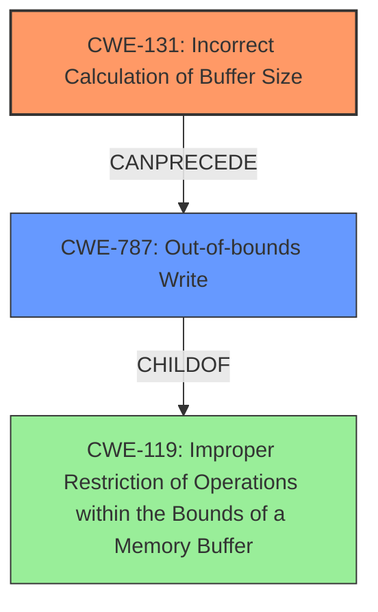

# Final Resolution for CVE-2022-26474

# Summary
| CWE ID | CWE Name | Confidence | CWE Abstraction Level | CWE Vulnerability Mapping Label | CWE-Vulnerability Mapping Notes |
|---|---|---|---|---|---|
| CWE-131 | Incorrect Calculation of Buffer Size | 0.95 | Base | Primary | Allowed |
| CWE-787 | Out-of-bounds Write | 0.85 | Base | Secondary | Allowed |

## Evidence and Confidence

*   **Confidence Score:** 0.90
*   **Evidence Strength:** MEDIUM

## Relationship Analysis
The primary relationship is that CWE-131 can directly lead to CWE-787. CWE-787 is a child of CWE-119 (Improper Restriction of Operations within the Bounds of a Memory Buffer), indicating a broader class of buffer-related vulnerabilities. While CWE-119 is a parent, choosing CWE-787 provides greater specificity. There are also potential chain relationships with integer overflows (CWE-190) or other calculation errors if the incorrect size calculation stemmed from such issues, but the current description lacks sufficient detail to confirm.

## Vulnerability Chain
The vulnerability chain starts with the **incorrect calculation of the buffer size** (**CWE-131**). This **ROOTCAUSE** leads directly to an **out-of-bounds write** (**CWE-787**), which is the immediate consequence and exploitable weakness. The ultimate impact is a local escalation of privilege. A potential missing link, as highlighted in the criticism, could be related to how the incorrect size was calculated (e.g., integer overflow).

## Summary of Analysis
The initial analysis correctly identifies **CWE-131 (Incorrect Calculation of Buffer Size)** as the primary issue and **CWE-787 (Out-of-bounds Write)** as a secondary effect. The vulnerability description states: "In sensorhub, there is a possible **out of bounds write due to an incorrect calculation of buffer size**." This is direct evidence supporting both CWEs.

The criticism raises a valid point about the potential involvement of integer overflows or other calculation errors (e.g., **CWE-190 (Integer Overflow or Wraparound)**). However, without further information about the specific calculation method, it's difficult to confirm this. The decision to keep the primary focus on **CWE-131** is justified because it directly reflects the stated cause.

The graph relationships reinforce the connection between **CWE-131** and **CWE-787**, where the former directly precedes the latter. The abstraction levels are appropriate, as both CWEs are at the Base level, providing sufficient specificity.

Therefore, the selected CWEs are at the optimal level of specificity, given the available evidence. A confidence score of 0.90 reflects the strong evidence for the primary and secondary CWEs, with a slight reduction to acknowledge the potential, but unconfirmed, role of other calculation errors.