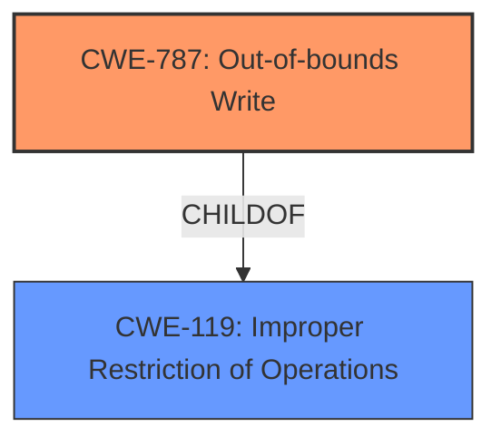

# Analysis Report for CVE-2022-26475

# Vulnerability Analysis Report: CVE-2022-26475

## Description

In wlan, there is a possible out of bounds write due to a missing bounds check. This could lead to local escalation of privilege with System execution privileges needed. User interaction is not needed for exploitation. Patch ID ALPS07310743 Issue ID ALPS07310743.

## Vulnerability Description Key Phrases

**Rootcause:** missing bounds check
**Weakness:** out of bounds write
**Impact:** local escalation of privilege
**Product:** wlan

## Analysis (with Relationship Data)

# Summary
| CWE ID  | CWE Name                         | Confidence | CWE Abstraction Level | CWE Vulnerability Mapping Label | CWE-Vulnerability Mapping Notes |
| :-------- | :--------------------------------- | :--------- | :-------------------- | :------------------------------ | :------------------------------ |
| CWE-787 | Out-of-bounds Write | 0.95 | Base | Allowed | Primary CWE |

## Evidence and Confidence

*   **Confidence Score:** 0.95
*   **Evidence Strength:** HIGH

- **Analysis and Justification:**
  - *Explanation:* The vulnerability description explicitly states "**out of bounds write** due to a **missing bounds check**". The CVE Reference Links Content Summary also confirms "A missing bounds check in the wlan component leads to an out-of-bounds write." This directly aligns with CWE-787 (Out-of-bounds Write), which describes the product writing data past the end or before the beginning of the intended buffer. The **missing bounds check** is the root cause that leads to this **out-of-bounds write**. CWE-787 is a base level CWE and the mapping guidance indicates it is ALLOWED.

  - *Relationship Analysis:* CWE-787 is a base CWE that is a child of CWE-119 (Improper Restriction of Operations within the Bounds of a Memory Buffer). It is more specific than CWE-119 due to the explicit mention of a write operation.

- **Confidence Score:**
  - *Example:* Confidence: 0.95 (High confidence due to direct evidence from the vulnerability description and CVE reference materials)

## Criticism of Analysis

Okay, I've reviewed the analysis and the full CWE specifications you've provided. Here's my critique, focusing on the accuracy of the CWE assignment, the confidence level, and whether alternative CWEs should be considered.

**Overall Assessment:**

The analysis correctly identifies **CWE-787 (Out-of-bounds Write)** as the primary weakness. The confidence level of 0.95 is justified based on the clear description of the vulnerability and the supporting CVE reference.

**Detailed Critique:**

1.  **CWE-787 (Out-of-bounds Write):**

    *   **Correctness:**  The selection of CWE-787 is highly accurate. The vulnerability description explicitly states "out of bounds write due to a missing bounds check." This aligns directly with CWE-787's description: "The product writes data past the end, or before the beginning, of the intended buffer." The absence of a bounds check is the root cause enabling this write.
    *   **Abstraction Level:** CWE-787 is a Base-level CWE, which is the preferred level for mapping root causes, as stated in its Mapping Guidance. The analysis correctly identifies this.
    *   **Mapping Guidance Adherence:** The analysis adheres to the Mapping Guidance, which states "This CWE entry is at the Base level of abstraction, which is a preferred level of abstraction for mapping to the root causes of vulnerabilities. Carefully read both the name and description to ensure that this mapping is an appropriate fit. Do not try to 'force' a mapping to a lower-level Base/Variant simply to comply with this preferred level of abstraction."
    *   **Confidence:**  The high confidence score of 0.95 is warranted.
    *   **Relationships:** The analysis correctly notes that CWE-787 is a child of CWE-119 (Improper Restriction of Operations within the Bounds of a Memory Buffer).
    *   **Mitigations:**  The provided mitigations for CWE-787 are relevant, including using memory-safe languages, libraries that prevent buffer overflows, and compiler-based buffer overflow detection mechanisms.

2.  **Consideration of Other CWEs from Retriever Results:**
    Let's examine why the Retriever results are generally less suitable.

    *   **CWE-131 (Incorrect Calculation of Buffer Size):** While a missing bounds check *could* be related to an incorrect buffer size calculation, the description focuses on the *absence* of a check, rather than an error in the calculation itself. If a calculation error was present in the vulnerability report, than this would be a valuable alternative to consider.

    *   **CWE-191 (Integer Underflow (Wrap or Wraparound)):**  Less relevant. Integer underflow isn't directly indicated in the vulnerability description.

    *   **CWE-908 (Use of Uninitialized Resource):** Not applicable. Uninitialized resources are not mentioned.

    *   **CWE-190 (Integer Overflow or Wraparound):**  Less relevant than CWE-787. Integer overflow isn't explicitly indicated.

    *   **CWE-770 (Allocation of Resources Without Limits or Throttling):** Not relevant. This CWE focuses on resource exhaustion, which isn't the primary issue here.

    *   **CWE-20 (Improper Input Validation):**  While technically a missing bounds check *is* a form of improper input validation, the Mapping Guidance for CWE-20 *discourages* its use when more specific CWEs are available.  CWE-787 is more specific and therefore more appropriate.

    *   **CWE-125 (Out-of-bounds Read):** Incorrect, the vulnerability indicates an out of bounds **write** not an out of bounds **read**.

    *   **CWE-1284 (Improper Validation of Specified Quantity in Input):** Might be applicable if the quantity was being read as input. However, this was not specifically stated in the vulnerability report.

    *   **CWE-367 (Time-of-check Time-of-use (TOCTOU) Race Condition):** Not applicable. There's no indication of a race condition.

3.  **CWE-119 (Improper Restriction of Operations within the Bounds of a Memory Buffer):**

    *   **Relationship to CWE-787:**  As correctly identified, CWE-787 is a child of CWE-119.  However, the Mapping Guidance for CWE-119 *discourages* its use when more specific child CWEs like CWE-787 are applicable. The analysis correctly avoids using CWE-119 directly.
    *   **Mitigations:** The mitigations listed for CWE-119 are generally applicable (memory-safe languages, safe libraries, compiler protections).

4.  **Other Considerations:**

    *   **Chaining:** While not explicitly mentioned in the analysis, it could be argued that the *missing bounds check* is a *cause* of the out-of-bounds write.  This could be expressed as a chain, such as: `CWE-399 -> CWE-787` where `CWE-399` is the root cause. Although the information from the retriever results didn't indicate this.

**Recommendations:**

*   The analysis is sound and requires no major changes. The confidence score is justified.

In summary, the analysis demonstrates a good understanding of the vulnerability and the relevant CWE specifications. The choice of CWE-787 is accurate and well-supported by the evidence. The analysis also considers other potential CWEs from the Retriever Results.

## Final Resolution

# Summary
| CWE ID  | CWE Name                         | Confidence | CWE Abstraction Level | CWE Vulnerability Mapping Label | CWE-Vulnerability Mapping Notes |
| :-------- | :--------------------------------- | :--------- | :-------------------- | :------------------------------ | :------------------------------ |
| CWE-787 | Out-of-bounds Write | 0.95 | Base | Allowed | Primary CWE |

## Evidence and Confidence

*   **Confidence Score:** 0.95
*   **Evidence Strength:** HIGH

## Relationship Analysis
The primary relationship considered was the parent-child relationship between CWE-787 and CWE-119. CWE-787 is a more specific child of the more general CWE-119. The analysis correctly chose the more specific CWE-787 since the vulnerability description explicitly mentioned an out-of-bounds *write*.

## Vulnerability Chain
The vulnerability chain starts with a **missing bounds check**, which directly leads to an **out-of-bounds write**. This **out-of-bounds write** can then result in a local escalation of privilege.

## Summary of Analysis
The initial analysis and the subsequent criticism both converge on the accurate identification of **CWE-787 (Out-of-bounds Write)** as the primary weakness. The vulnerability description explicitly states "out of bounds write due to a missing bounds check", and the CVE reference confirms this. This directly aligns with the description of **CWE-787**, which states, "The product writes data past the end, or before the beginning, of the intended buffer."

The choice of **CWE-787** is further supported by its base-level abstraction, which is preferred for mapping root causes. The mapping guidance for **CWE-787** indicates that it is ALLOWED.

The graph relationships influenced the decision by confirming that **CWE-787** is a more specific child of **CWE-119**, making it the optimal choice. The analysis avoids using **CWE-119** directly due to its discouraged usage when more specific CWEs are available.

The selected CWE is at the optimal level of specificity because it directly reflects the vulnerability's description and aligns with the recommended mapping practices. The analysis also considered other potential CWEs from the Retriever Results, confirming that they were less suitable due to their lack of direct relevance to the provided evidence.

*Report generated on 2025-03-18 12:10:34*
