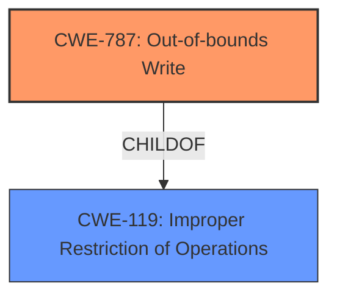

# Final Resolution for CVE-2022-26475

# Summary
| CWE ID  | CWE Name                         | Confidence | CWE Abstraction Level | CWE Vulnerability Mapping Label | CWE-Vulnerability Mapping Notes |
| :-------- | :--------------------------------- | :--------- | :-------------------- | :------------------------------ | :------------------------------ |
| CWE-787 | Out-of-bounds Write | 0.95 | Base | Allowed | Primary CWE |

## Evidence and Confidence

*   **Confidence Score:** 0.95
*   **Evidence Strength:** HIGH

## Relationship Analysis
The primary relationship considered was the parent-child relationship between CWE-787 and CWE-119. CWE-787 is a more specific child of the more general CWE-119. The analysis correctly chose the more specific CWE-787 since the vulnerability description explicitly mentioned an out-of-bounds *write*.

## Vulnerability Chain
The vulnerability chain starts with a **missing bounds check**, which directly leads to an **out-of-bounds write**. This **out-of-bounds write** can then result in a local escalation of privilege.

## Summary of Analysis
The initial analysis and the subsequent criticism both converge on the accurate identification of **CWE-787 (Out-of-bounds Write)** as the primary weakness. The vulnerability description explicitly states "out of bounds write due to a missing bounds check", and the CVE reference confirms this. This directly aligns with the description of **CWE-787**, which states, "The product writes data past the end, or before the beginning, of the intended buffer."

The choice of **CWE-787** is further supported by its base-level abstraction, which is preferred for mapping root causes. The mapping guidance for **CWE-787** indicates that it is ALLOWED.

The graph relationships influenced the decision by confirming that **CWE-787** is a more specific child of **CWE-119**, making it the optimal choice. The analysis avoids using **CWE-119** directly due to its discouraged usage when more specific CWEs are available.

The selected CWE is at the optimal level of specificity because it directly reflects the vulnerability's description and aligns with the recommended mapping practices. The analysis also considered other potential CWEs from the Retriever Results, confirming that they were less suitable due to their lack of direct relevance to the provided evidence.