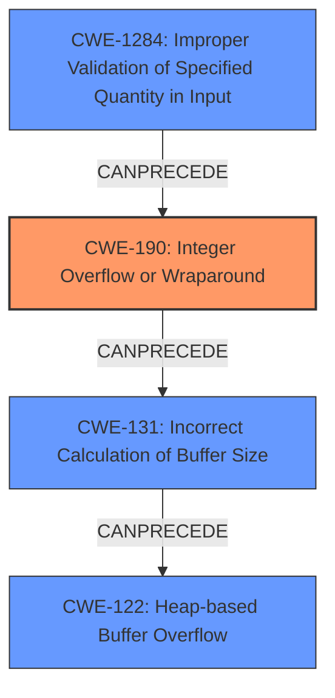

# Analysis Report for CVE-2022-26495

# Vulnerability Analysis Report: CVE-2022-26495

## Description

In nbd-server in nbd before 3.24, there is an integer overflow with a resultant heap-based buffer overflow. A value of 0xffffffff in the name length field will cause a zero-sized buffer to be allocated for the name, resulting in a write to a dangling pointer. This issue exists for the NBD_OPT_INFO, NBD_OPT_GO, and NBD_OPT_EXPORT_NAME messages.

## Vulnerability Description Key Phrases

**Rootcause:** integer overflow
**Weakness:** heap-based buffer overflow
**Impact:** write to dangling pointer
**Vector:** value of 0xffffffff in the name length field
**Product:** nbd-server
**Version:** before 3.24
**Component:** NBD_OPT_INFO, NBD_OPT_GO, and NBD_OPT_EXPORT_NAME messages

## Analysis (with Relationship Data)

# Summary
| CWE ID | CWE Name | Confidence | CWE Abstraction Level | CWE Vulnerability Mapping Label | CWE-Vulnerability Mapping Notes |
|---|---|---|---|---|---|
| CWE-190 | Integer Overflow or Wraparound | 0.95 | Base | Allowed | Root cause of heap-based buffer overflow |
| CWE-122 | Heap-based Buffer Overflow | 0.85 | Variant | Allowed | Result of integer overflow |

## Evidence and Confidence

*   **Confidence Score:** 0.90
*   **Evidence Strength:** HIGH

- **Analysis and Justification:**
  - *Explanation:* The vulnerability description clearly states an **integer overflow** leading to a **heap-based buffer overflow**. The `name length` field set to `0xffffffff` (or -1) causes an **integer overflow**, which results in a zero-sized buffer being allocated. Subsequently, writing to this undersized buffer leads to a **heap-based buffer overflow**. This aligns perfectly with CWE-190 (Integer Overflow or Wraparound) as the primary **root cause**, and CWE-122 (Heap-based Buffer Overflow) as the direct result of this overflow. The CVE reference links content summary also confirms this root cause and vulnerability. The retriever results also supports this analysis, placing CWE-190 and CWE-122 as top candidates.

  - *Relationship Analysis:* CWE-190 (Integer Overflow or Wraparound) can directly lead to CWE-122 (Heap-based Buffer Overflow). This is because the integer overflow results in an incorrect calculation of the buffer size, which then causes a heap overflow when data larger than the allocated buffer is written to it. While CWE-131 (Incorrect Calculation of Buffer Size) is also a valid candidate, CWE-122 is a more specific variant that describes the heap-based overflow.

- **Confidence Score:**
  - Confidence: 0.95 (High confidence due to clear description of integer overflow leading to heap-based buffer overflow and supporting CVE reference.)

---

## Criticism of Analysis

Okay, here's a review of the provided analysis, considering the full CWE specifications.

**Overall Assessment:**

The core analysis is sound.  Identifying CWE-190 as the root cause and CWE-122 as the direct consequence is accurate and well-justified. The confidence level of 0.95 for CWE-190 and 0.85 for CWE-122 is appropriate. The reasoning is clearly articulated and aligns with the vulnerability description and CVE summary.

**Detailed Review:**

*   **CWE-190: Integer Overflow or Wraparound:**

    *   **Strengths:** The analysis correctly identifies CWE-190 as the source of the problem. The explanation of how a large `name length` value causes an integer overflow, leading to an incorrect buffer size calculation, is accurate.  The inclusion of relevant CWE-190 examples, particularly those in chains leading to buffer overflows, strengthens the assessment.
    *   **Mapping Guidance:** The analysis follows the mapping guidance by using CWE-190, a Base-level CWE, to represent the root cause. The description mentions alternative CWE, Integer Underflow, but correctly dismisses it as the input `0xffffffff` is not a calculation that results in a result *less* than the minimum allowable integer value but an attempt to set the length to a maximum that overflows to a smaller number.
    *   **Potential Mitigations:**  The analysis implicitly acknowledges the mitigations provided by stating how SafeInt and IntegerLib packages can be used to prevent the integer overflow.
    *   **Critique:** None.  The mapping is accurate.

*   **CWE-122: Heap-based Buffer Overflow:**

    *   **Strengths:** The analysis correctly identifies the direct consequence of the integer overflow as a heap-based buffer overflow. The explanation of how the overflow leads to writing to a dangling pointer aligns with the CWE description. The examples of CWE-122 from the CWE database provides additional context.
    *   **Mapping Guidance:** The analysis follows the mapping guidance by using CWE-122, a Variant-level CWE, to represent the heap-based buffer overflow.
    *   **Potential Mitigations:** The mitigations suggested by the CWE specifications are relevant. Using languages or compilers with automatic bounds checking or libraries that abstract away risky APIs are valid defenses.
    *   **Critique:** None. The mapping is accurate.

**Additional Considerations and Potential Improvements:**

1.  **CWE-131: Incorrect Calculation of Buffer Size:** While CWE-122 is the *direct* consequence, CWE-131 is a strong, valid candidate that highlights the mechanism that *causes* the heap-based buffer overflow. It's worthwhile to consider *also* including CWE-131 as a contributing factor, even if you keep the primary focus on CWE-122. Specifically, the "Extended Description" of CWE-131 mentions the importance of not accounting for size differences and the need to transform one input to another format.
2.  **CWE-1284: Improper Validation of Specified Quantity in Input:** This CWE appears in the Retriever Results list. While the initial analysis doesn't explicitly mention it, CWE-1284 is certainly applicable. The vulnerability arises *because* the `name length` field is not properly validated. The code doesn't check if the length is within a reasonable range before allocating memory. The description of CWE-1284 describes how the input *quantity* is not validated, allowing attackers to cause excessive resource allocation. *Adding* CWE-1284 could strengthen the analysis by showing that the input value is not validated.

**Revised Analysis (incorporating the above suggestions):**

# Summary
| CWE ID | CWE Name | Confidence | CWE Abstraction Level | CWE Vulnerability Mapping Label | CWE-Vulnerability Mapping Notes |
|---|---|---|---|---|---|
| CWE-190 | Integer Overflow or Wraparound | 0.95 | Base | Allowed | Root cause of incorrect buffer size calculation and heap-based buffer overflow |
| CWE-131 | Incorrect Calculation of Buffer Size | 0.80 | Base | Allowed | Contributes to heap-based buffer overflow as a result of integer overflow.  Result of the integer overflow leading to incorrect memory allocation size. |
| CWE-1284 | Improper Validation of Specified Quantity in Input | 0.75 | Base | Allowed | Contributes to integer overflow by failing to validate the name length field, allowing an attacker to provide a malicious quantity. |
| CWE-122 | Heap-based Buffer Overflow | 0.85 | Variant | Allowed | Result of integer overflow and incorrect buffer size calculation |

**Revised Evidence and Confidence (for CWE-131, CWE-1284):**

*   **Confidence Score:** 0.75
*   **Evidence Strength:** MEDIUM

- **Analysis and Justification for CWE-131 and CWE-1284:**
  - *Explanation:* The integer overflow results in the allocation of a zero-sized buffer. The root cause is a failure to validate the input length `0xffffffff` that causes the integer overflow. This means the program *incorrectly calculates* the buffer size (CWE-131). The mitigations in CWE-131 describe that the size has to be calculated in such a way that the largest possible size is allocated for encoding purposes. The improper validation occurs in CWE-1284 as the *quantity* specified in the input is not validated.

  - *Relationship Analysis:*  CWE-190 leads to CWE-131. CWE-131 directly leads to CWE-122. Also, CWE-1284 leads to the integer overflow of CWE-190 as the length parameter is not validated.

**Conclusion:**

The original analysis provides a strong identification of the core vulnerabilities. Adding CWE-131 and CWE-1284 provides a more complete picture of the vulnerability by including the failures to validate the size parameter. Consider updating your analysis to include these elements for a more robust assessment.

## Final Resolution

# Summary
| CWE ID | CWE Name | Confidence | CWE Abstraction Level | CWE Vulnerability Mapping Label | CWE-Vulnerability Mapping Notes |
|---|---|---|---|---|---|
| CWE-190 | Integer Overflow or Wraparound | 0.95 | Base | Allowed | Primary CWE: Root cause of incorrect buffer size calculation and heap-based buffer overflow |
| CWE-1284 | Improper Validation of Specified Quantity in Input | 0.85 | Base | Allowed | Secondary CWE: Contributes to integer overflow by failing to validate the name length field, allowing an attacker to provide a malicious quantity. |
| CWE-131 | Incorrect Calculation of Buffer Size | 0.80 | Base | Allowed | Secondary CWE: Contributes to heap-based buffer overflow as a result of integer overflow. Result of the integer overflow leading to incorrect memory allocation size. |
| CWE-122 | Heap-based Buffer Overflow | 0.85 | Variant | Allowed | Secondary CWE: Result of integer overflow and incorrect buffer size calculation |

## Evidence and Confidence

*   **Confidence Score:** 0.90
*   **Evidence Strength:** HIGH

## Relationship Analysis
The analysis focuses on a chain of weaknesses:
  - **CWE-1284 (Improper Validation of Specified Quantity in Input)** leads to **CWE-190 (Integer Overflow or Wraparound)** because the `name length` field is not validated.
  - **CWE-190 (Integer Overflow or Wraparound)** then leads to **CWE-131 (Incorrect Calculation of Buffer Size)**, as the overflowed integer is used to calculate the buffer size.
  - **CWE-131 (Incorrect Calculation of Buffer Size)** results in **CWE-122 (Heap-based Buffer Overflow)** because the allocated buffer is too small for the intended data.

The hierarchical relationships are appropriate: **CWE-122** is a Variant of a buffer overflow, providing specificity. All selected CWEs are at the Base level except for CWE-122, which is a Variant and suitable as it specifies the type of buffer overflow.

## Vulnerability Chain
The chain of root cause and weaknesses:
  1. **CWE-1284: Improper Validation of Specified Quantity in Input**: The `name length` field in the NBD protocol is not validated.
  2. **CWE-190: Integer Overflow or Wraparound**: An attacker provides a large value (0xffffffff) for the `name length`, leading to an integer overflow.
  3. **CWE-131: Incorrect Calculation of Buffer Size**: The overflowed value is used to calculate the buffer size, resulting in a zero-sized buffer being allocated.
  4. **CWE-122: Heap-based Buffer Overflow**: Data is written to the zero-sized buffer, causing a heap-based buffer overflow.

The **root cause** is the missing input validation (**CWE-1284**), and the **impact** is the heap-based buffer overflow (**CWE-122**). **CWE-190** and **CWE-131** are intermediate steps in the chain.

## Summary of Analysis
The initial analysis correctly identified **CWE-190** and **CWE-122**, but the criticism pointed out the importance of including **CWE-131** and **CWE-1284** for a more complete picture. The vulnerability description clearly states an integer overflow leading to a heap-based buffer overflow.
The evidence provided supports this analysis: "A value of 0xffffffff in the name length field will cause a zero-sized buffer to be allocated for the name, resulting in a write to a dangling pointer."

The graph relationships highlight the chain of events, starting with the lack of input validation (**CWE-1284**), leading to the integer overflow (**CWE-190**), the incorrect buffer size calculation (**CWE-131**), and finally the heap-based buffer overflow (**CWE-122**).

The selected CWEs are at the optimal level of specificity. **CWE-190** is a Base CWE that describes the integer overflow. **CWE-1284** is a base CWE describing how the quantity specified in the input is not validated. **CWE-131** is a Base CWE that specifies the incorrect buffer size calculation and **CWE-122** is a Variant CWE, specifying the type of buffer overflow.
Including **CWE-1284** strengthens the analysis by explicitly stating that the `name length` field isn't validated, leading to the subsequent integer overflow.

*Report generated on 2025-03-18 12:11:47*
