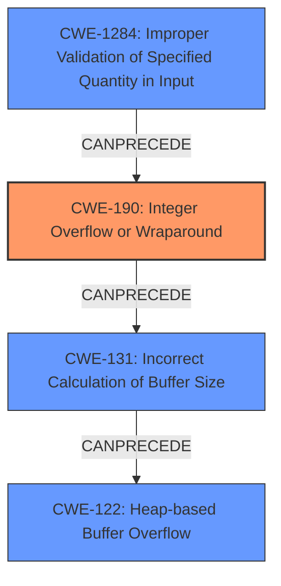

# Final Resolution for CVE-2022-26495

# Summary
| CWE ID | CWE Name | Confidence | CWE Abstraction Level | CWE Vulnerability Mapping Label | CWE-Vulnerability Mapping Notes |
|---|---|---|---|---|---|
| CWE-190 | Integer Overflow or Wraparound | 0.95 | Base | Allowed | Primary CWE: Root cause of incorrect buffer size calculation and heap-based buffer overflow |
| CWE-1284 | Improper Validation of Specified Quantity in Input | 0.85 | Base | Allowed | Secondary CWE: Contributes to integer overflow by failing to validate the name length field, allowing an attacker to provide a malicious quantity. |
| CWE-131 | Incorrect Calculation of Buffer Size | 0.80 | Base | Allowed | Secondary CWE: Contributes to heap-based buffer overflow as a result of integer overflow. Result of the integer overflow leading to incorrect memory allocation size. |
| CWE-122 | Heap-based Buffer Overflow | 0.85 | Variant | Allowed | Secondary CWE: Result of integer overflow and incorrect buffer size calculation |

## Evidence and Confidence

*   **Confidence Score:** 0.90
*   **Evidence Strength:** HIGH

## Relationship Analysis
The analysis focuses on a chain of weaknesses:
  - **CWE-1284 (Improper Validation of Specified Quantity in Input)** leads to **CWE-190 (Integer Overflow or Wraparound)** because the `name length` field is not validated.
  - **CWE-190 (Integer Overflow or Wraparound)** then leads to **CWE-131 (Incorrect Calculation of Buffer Size)**, as the overflowed integer is used to calculate the buffer size.
  - **CWE-131 (Incorrect Calculation of Buffer Size)** results in **CWE-122 (Heap-based Buffer Overflow)** because the allocated buffer is too small for the intended data.

The hierarchical relationships are appropriate: **CWE-122** is a Variant of a buffer overflow, providing specificity. All selected CWEs are at the Base level except for CWE-122, which is a Variant and suitable as it specifies the type of buffer overflow.

## Vulnerability Chain
The chain of root cause and weaknesses:
  1. **CWE-1284: Improper Validation of Specified Quantity in Input**: The `name length` field in the NBD protocol is not validated.
  2. **CWE-190: Integer Overflow or Wraparound**: An attacker provides a large value (0xffffffff) for the `name length`, leading to an integer overflow.
  3. **CWE-131: Incorrect Calculation of Buffer Size**: The overflowed value is used to calculate the buffer size, resulting in a zero-sized buffer being allocated.
  4. **CWE-122: Heap-based Buffer Overflow**: Data is written to the zero-sized buffer, causing a heap-based buffer overflow.

The **root cause** is the missing input validation (**CWE-1284**), and the **impact** is the heap-based buffer overflow (**CWE-122**). **CWE-190** and **CWE-131** are intermediate steps in the chain.

## Summary of Analysis
The initial analysis correctly identified **CWE-190** and **CWE-122**, but the criticism pointed out the importance of including **CWE-131** and **CWE-1284** for a more complete picture. The vulnerability description clearly states an integer overflow leading to a heap-based buffer overflow.
The evidence provided supports this analysis: "A value of 0xffffffff in the name length field will cause a zero-sized buffer to be allocated for the name, resulting in a write to a dangling pointer."

The graph relationships highlight the chain of events, starting with the lack of input validation (**CWE-1284**), leading to the integer overflow (**CWE-190**), the incorrect buffer size calculation (**CWE-131**), and finally the heap-based buffer overflow (**CWE-122**).

The selected CWEs are at the optimal level of specificity. **CWE-190** is a Base CWE that describes the integer overflow. **CWE-1284** is a base CWE describing how the quantity specified in the input is not validated. **CWE-131** is a Base CWE that specifies the incorrect buffer size calculation and **CWE-122** is a Variant CWE, specifying the type of buffer overflow.
Including **CWE-1284** strengthens the analysis by explicitly stating that the `name length` field isn't validated, leading to the subsequent integer overflow.