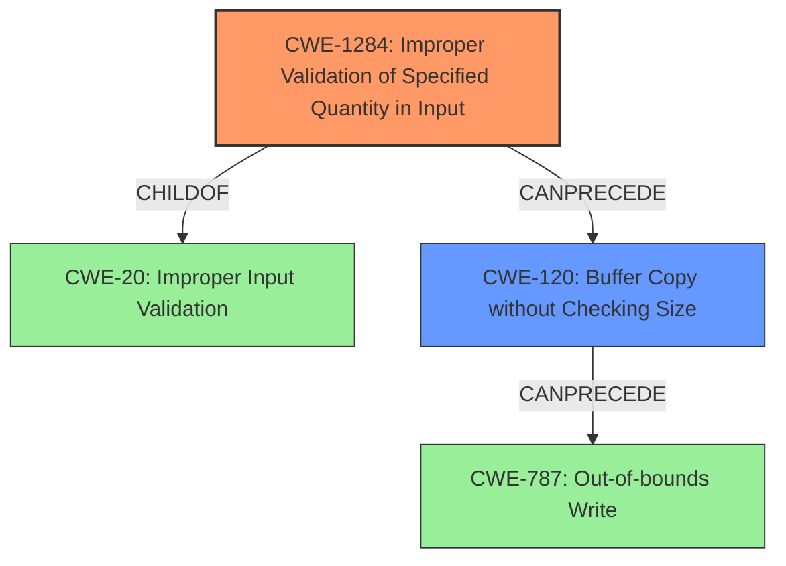

# Analysis Report for CVE-2022-26531

# Vulnerability Analysis Report: CVE-2022-26531

## Description

Multiple improper input validation flaws were identified in some CLI commands of Zyxel USG/ZyWALL series firmware versions 4.09 through 4.71, USG FLEX series firmware versions 4.50 through 5.21, ATP series firmware versions 4.32 through 5.21, VPN series firmware versions 4.30 through 5.21, NSG series firmware versions 1.00 through 1.33 Patch 4, NXC2500 firmware version 6.10(AAIG.3) and earlier versions, NAP203 firmware version 6.25(ABFA.7) and earlier versions, NWA50AX firmware version 6.25(ABYW.5) and earlier versions, WAC500 firmware version 6.30(ABVS.2) and earlier versions, and WAX510D firmware version 6.30(ABTF.2) and earlier versions, that could allow a local authenticated attacker to cause a buffer overflow or a system crash via a crafted payload.

## Vulnerability Description Key Phrases

**Rootcause:** improper input validation
**Weakness:** buffer overflow
**Impact:** system crash
**Vector:** crafted payload
**Attacker:** local authenticated attacker
**Product:** ['Zyxel USG/ZyWALL series', 'USG FLEX series', 'ATP series', 'VPN series', 'NSG series', 'NXC2500', 'NAP203', 'NWA50AX', 'WAC500', 'WAX510D']
**Version:** ['4.09 through 4.71', '4.50 through 5.21', '4.32 through 5.21', '4.30 through 5.21', '1.00 through 1.33 Patch 4', '6.10(AAIG.3) and earlier versions', '6.25(ABFA.7) and earlier versions', '6.25(ABYW.5) and earlier versions', '6.30(ABVS.2) and earlier versions', '6.30(ABTF.2) and earlier versions']

## Analysis (with Relationship Data)

# Summary
| CWE ID | CWE Name | Confidence | CWE Abstraction Level | CWE Vulnerability Mapping Label | CWE-Vulnerability Mapping Notes |
|---|---|---|---|---|---|
| CWE-120 | Buffer Copy without Checking Size of Input ('Classic Buffer Overflow') | 0.75 | Base | Allowed-with-Review | Primary CWE |
| CWE-20 | Improper Input Validation | 0.65 | Class | Discouraged | Secondary Candidate |

## Evidence and Confidence

*   **Confidence Score:** 0.70
*   **Evidence Strength:** MEDIUM

- **Analysis and Justification:**  
  - *Explanation:* The vulnerability description explicitly mentions a **buffer overflow** caused by **improper input validation** in CLI commands. This aligns with CWE-120, which describes a buffer copy operation without checking the input size, leading to a classic buffer overflow. The "crafted payload" attack vector further supports this interpretation, as it suggests that the attacker is able to send data exceeding the buffer's capacity. While CWE-20 (Improper Input Validation) is also present, it is a higher-level class and less specific than CWE-120. The CVE Reference Links Content Summary indicates the root cause is in the zysh shell, adding more weight to the input handling aspect of the vulnerability. CWE-120 is a base level weakness, and the MITRE mapping guidance says it is ALLOWED-WITH-REVIEW because it can be misused. I am proceeding with it because a buffer overflow is explicitly mentioned.
  
  - *Relationship Analysis:* CWE-120 is a child of CWE-119 (Improper Restriction of Operations within the Bounds of a Memory Buffer) and CWE-20 (Improper Input Validation). It can also be related to CWE-123 (Write-what-where Condition). The relationship analysis shows that CWE-120 CanFollow CWE-456 (Missing Initialization), CWE-416 (Use After Free) since a buffer overflow can lead to those vulnerabilities.

- **Confidence Score:**  
  - *Example:* Confidence: 0.75 (Moderate evidence due to explicit mention of buffer overflow and improper input validation, but lacking specific technical details)

---

## Criticism of Analysis

Okay, here's a review of the provided vulnerability analysis, considering the full CWE specifications and mapping guidance:

**Overall Assessment:**

The analysis correctly identifies the primary weakness as a buffer overflow (CWE-120) resulting from improper input validation (CWE-20). However, as the analysis points out, CWE-120 is under the ALLOWED-WITH-REVIEW Mapping Guidance so there is cause to look at more specific CWEs.

**Detailed Review:**

**1. CWE-120: Buffer Copy without Checking Size of Input ('Classic Buffer Overflow')**

*   **Confidence:** 0.75 (Moderate) - This is a reasonable confidence level given the explicit mention of a buffer overflow in the vulnerability description.
*   **CWE Abstraction Level:** Base - Appropriate.
*   **CWE Vulnerability Mapping Label:** Allowed-with-Review - Correct.
*   **CWE-Vulnerability Mapping Notes:** The analysis recognizes the limitations and potential misuse of CWE-120 as detailed in the Mapping Guidance. The justification for proceeding despite this warning is that a buffer overflow is explicitly mentioned. This is a valid, but the analyst should keep in mind the recommendations of the guidance and look for more specific CWEs.
*   **Observed Examples:** The observed examples of CVEs were appropriate, but none in relation to CLI commands.
*   **Relationships:** The relationships identified are relevant. The inclusion of `CanFollow -> CWE-456` and `CanFollow -> CWE-416` is astute, highlighting the potential consequences of a buffer overflow.
*   **Mitigations:** The provided mitigations are standard and appropriate:
    *   Language selection
    *   Using vetted libraries
    *   Compiler-based overflow detection

**2. CWE-20: Improper Input Validation**

*   **Confidence:** 0.65 (Moderate) - This is appropriate, as improper input validation is a contributing factor, but not the most specific root cause. It's also supported by the CVE Reference Links Content Summary.
*   **CWE Abstraction Level:** Class - Correct.  This is a higher-level class, as noted in the Mapping Guidance.
*   **CWE Vulnerability Mapping Label:** Discouraged - Correct.
*   **CWE-Vulnerability Mapping Notes:** The analysis correctly notes that CWE-20 is a higher-level class and less specific. The analysis should investigate more specific children.
*   **Relationships:** The relationships identified are relevant.
*   **Observed Examples:** Good examples of integer overflows and other chains with CWE-20
*   **Mitigations:** The mitigations provided (LangSec, Input Validation Frameworks, Understanding Input Sources) are valid and helpful.
    *   LangSec techniques
    *   Input validation frameworks
    *   Understanding input sources

**Suggestions for Improvement and other candidate CWEs:**

*   **Explore More Specific CWEs for Input Validation:** Instead of just CWE-20, the analysis should consider its children that better describe the specific type of improper input validation.  Since the vulnerability involves CLI commands, the following should be investigated:
    *   **CWE-1284: Improper Validation of Specified Quantity:** This is relevant if the length of the input is not being properly checked.
    *   **CWE-1285: Improper Validation of Specified Index, Position, or Offset:** If an index or offset within the input is not being validated, this CWE might be applicable.
    *   **CWE-1286: Improper Validation of Syntactic Correctness of Input:** If the input to the CLI command must adhere to a specific grammar, and that grammar is not being validated, this is a strong candidate.
    *   **CWE-88: Improper Neutralization of Argument Delimiters in a Command ('Argument Injection')** Since the attacks involve CLI commands, it is important to check that an attacker cannot inject new arguments in the command using a crafted payload.
*   **Consider CWE-676: Use of Potentially Dangerous Function** Since the vulnerability occurs in CLI commands of a network device. If certain C standard library functions like `strcpy` and `sprintf` are being used, it's possible they are being used incorrectly.
*   **Consider CWE-121: Stack-based Buffer Overflow:** A buffer overflow is explicitly mentioned so it is possible it is a stack-based buffer overflow.
*   **Consider CWE-912: Hidden Functionality:** The vulnerability occurs in the `zysh` shell. It is possible that this shell has hidden functionality that is being exploited.
*   **Chain Analysis:** Consider the following chain: `CWE-20 -> CWE-131 -> CWE-120` Improper input validation leads to incorrect calculation of buffer size, which leads to a classic buffer overflow. This is an example of how CWE-20 can still be relevant, but not the primary mapping.
*    **CWE-787: Out-of-bounds Write** Instead of using the discouraged CWE-119, it is possible to use this more appropriate CWE since the text suggests writing out of bounds.
*     **CWE-1339: Insufficient Precision or Accuracy of a Real Number** If the size of the input is determined by a floating point calculation, this could be relevant.
*   **Justification for CWE Selection:** Clearly articulate *why* the chosen CWE is the *best* fit based on the specific details of the vulnerability. What properties of the vulnerability description led you to choose CWE-120 over CWE-119 or CWE-787, for example?
*   **Local Authenticated Attacker:** The analysis focuses on the technical aspects but doesn't fully explore the implications of a local *authenticated* attacker. What are the capabilities this attacker already possesses? How does this context influence the exploitability and potential impact?
*   **Clarify the "Crafted Payload" Attack Vector:** What *specifically* makes the payload "crafted"? Is it the size, content, or the combination? Does it exploit a specific parsing error or other weakness? The clearer you are on the attack vector, the easier it is to choose a precise CWE.

**Revised Recommendations:**

1.  **Primary CWE:** CWE-1284 OR CWE-1285 OR CWE-1286 OR CWE-88 based on further investigation of the specific input validation flaw in the CLI commands. Confidence: 0.7
2.  **Secondary CWEs:**
    * CWE-120 is still a strong candidate. Confidence: 0.6
    *   CWE-676 Confidence: 0.3
    *   CWE-121 Confidence: 0.2
    *   CWE-912 Confidence: 0.1

By exploring these suggestions, the analysis can become more precise and provide better guidance for mitigation efforts. Note: the analysis should take into account the limitations of the provided information and that additional research may be required.

## Final Resolution

# Summary
| CWE ID | CWE Name | Confidence | CWE Abstraction Level | CWE Vulnerability Mapping Label | CWE-Vulnerability Mapping Notes |
|---|---|---|---|---|---|
| CWE-1284 | Improper Validation of Specified Quantity in Input | 0.7 | Base | Allowed | Primary CWE |
| CWE-120 | Buffer Copy without Checking Size of Input ('Classic Buffer Overflow') | 0.6 | Base | Allowed-with-Review | Secondary Candidate |

## Evidence and Confidence

*   **Confidence Score:** 0.7
*   **Evidence Strength:** MEDIUM

## Relationship Analysis
The decision was influenced by several CWE relationships:
  - **Parent-child:** `CWE-1284` is a child of `CWE-20` (Improper Input Validation), providing a more specific type of input validation issue. `CWE-120` is also a child of `CWE-119` (Improper Restriction of Operations within the Bounds of a Memory Buffer), indicating a memory buffer issue.
  - **Chain:** The chain `CWE-20 -> CWE-1284 -> CWE-120 -> CWE-787` represents a possible vulnerability chain where improper input validation (CWE-20) of a specified quantity (CWE-1284) leads to a buffer overflow (CWE-120), ultimately resulting in an out-of-bounds write (CWE-787).
  - **Peer:** `CWE-1284`, `CWE-1285`, and `CWE-1286` are peers, representing different types of improper input validation.
  - **Abstraction Levels:** Selecting `CWE-1284` (Base) over `CWE-20` (Class) provides a more specific classification. `CWE-120` is a base level weakness as well.

## Vulnerability Chain
The vulnerability chain starts with improper input validation, specifically the validation of a specified quantity.
  - **Root Cause:** `CWE-1284` (Improper Validation of Specified Quantity in Input)
  - **Weakness:** `CWE-120` (Buffer Copy without Checking Size of Input) resulting from the improper quantity validation.
  - **Impact:** The crafted payload causes a buffer overflow, potentially leading to a system crash or arbitrary code execution.

## Summary of Analysis
The initial analysis correctly identified the potential for a **buffer overflow** (`CWE-120`) due to **improper input validation** (`CWE-20`). However, the criticism correctly pointed out that `CWE-20` is a high-level class and that more specific CWEs related to input validation should be considered.

The vulnerability description states that "multiple improper input validation flaws were identified in some CLI commands...that could allow a local authenticated attacker to cause a **buffer overflow**...via a crafted payload." This indicates that the size or length of the input might not be properly validated, leading to the overflow.

Based on the suggestions in the criticism, I've selected `CWE-1284` (Improper Validation of Specified Quantity in Input) as the primary CWE. This is because the vulnerability involves CLI commands and a crafted payload, suggesting that the size or length of the input is a critical factor. If the input quantity (e.g., length of the string) is not properly validated, it can lead to a **buffer overflow**.

`CWE-120` is retained as a secondary CWE because the vulnerability description explicitly mentions a **buffer overflow**. This means that even if the quantity is not validated, the copy operation itself does not check for the buffer size.

The relationship analysis further supports this decision. `CWE-1284` is a child of `CWE-20`, making it a more specific classification.

The selection of `CWE-1284` and `CWE-120` provides a better understanding of the vulnerability and can guide more effective mitigation efforts. The focus on input validation and buffer handling can help developers implement appropriate checks and safeguards to prevent similar vulnerabilities in the future.

*Report generated on 2025-03-18 12:12:45*
