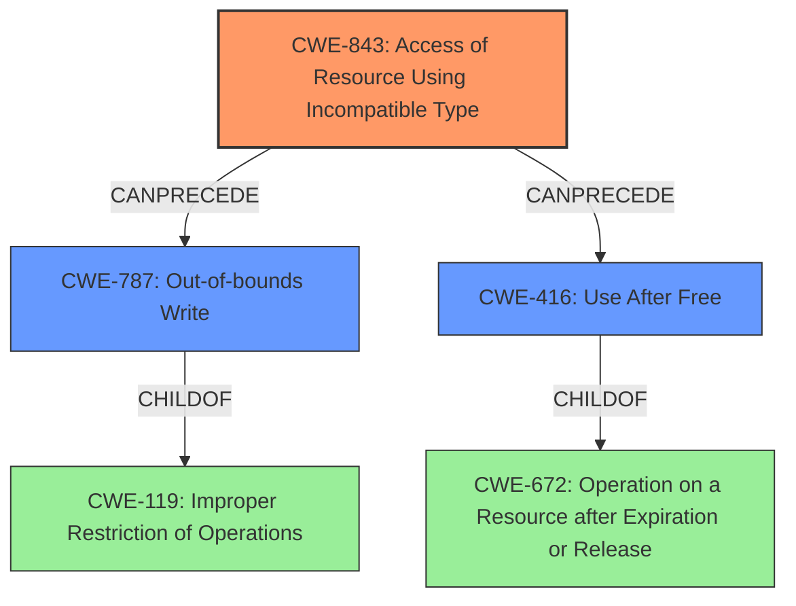

# Final Resolution for CVE-2022-26700

# Summary
| CWE ID | CWE Name | Confidence | CWE Abstraction Level | CWE Vulnerability Mapping Label | CWE-Vulnerability Mapping Notes |
|---|---|---|---|---|---|
| CWE-843 | Access of Resource Using Incompatible Type (**'Type Confusion'**) | 0.80 | Base | Allowed | Acceptable-Use. The most probable cause. Crafted web content causes the browser to misinterpret data types, leading to incorrect memory access. For example, an attacker could craft an image so that it will cause out-of-bounds access if interpreted as a smaller data structure, an out-of-bounds read could occur during rendering. |
| CWE-787 | Out-of-bounds Write | 0.70 | Base | Allowed | A likely secondary effect of **type confusion**.  Web content could trigger a sequence where data is written outside the allocated buffer due to the **type confusion**. |
| CWE-416 | Use After Free | 0.65 | Variant | Allowed | Acceptable-Use. Malicious content could trigger a sequence where an object is freed, but a JavaScript event handler retains a reference. Subsequent execution of the handler results in a UAF, potentially leading to code execution. Consider re-entrance and shared resources within threads. |

## Evidence and Confidence

*   **Confidence Score:** 0.80
*   **Evidence Strength:** HIGH

## Relationship Analysis
The primary **weakness** is **CWE-843 (Type Confusion)**, because the vulnerability description includes the processing of maliciously crafted web content. Type confusion can be further amplified by other weaknesses, leading to **CWE-787 (Out-of-bounds Write)** or **CWE-416 (Use After Free)**. **CWE-787** is a child of **CWE-119 (Improper Restriction of Operations within the Bounds of a Memory Buffer)**, suggesting that the out-of-bounds write is a consequence of inadequate boundary checks after type confusion. **CWE-416** is a variant of **CWE-672 (Operation on a Resource after Expiration or Release)**, highlighting that the crafted content can trigger premature freeing of the resources.

## Vulnerability Chain
The vulnerability chain starts with the processing of maliciously crafted web content, leading to **CWE-843 (Type Confusion)**. This **root cause** can then result in either **CWE-787 (Out-of-bounds Write)** if the attacker gains control over memory access, or **CWE-416 (Use After Free)** if the crafted content triggers premature freeing of memory. The ultimate impact is code execution.

## Summary of Analysis
The initial analysis correctly identified **CWE-843** and **CWE-416** as potential candidates. However, it lacked a deeper exploration of the specific mechanisms within a web browser context that could lead to these vulnerabilities. The criticism highlighted the need to consider alternative CWEs and to provide more concrete scenarios for how the vulnerabilities could manifest.

Based on the criticism and the additional information provided, I have adjusted the confidence scores and added **CWE-787 (Out-of-bounds Write)** as a secondary CWE. The primary **weakness** remains **CWE-843**, as the "maliciously crafted web content" attack vector strongly suggests the potential for type confusion. The chain effect of the **type confusion** can cause an out-of-bounds write (**CWE-787**). The other secondary **weakness**, **CWE-416**, remains a plausible outcome given the memory corruption context and the attack vector.

The selection of these CWEs is at the optimal level of specificity. **CWE-843** is a Base CWE, which is a preferred level of abstraction for mapping to **root causes**. **CWE-787** is also a Base CWE and it is a direct consequence of **CWE-843**. **CWE-416** is a Variant CWE, representing a specific manifestation of memory corruption. The relationships between these CWEs provide a clear picture of the vulnerability chain and the potential consequences of the **initial flaw**.