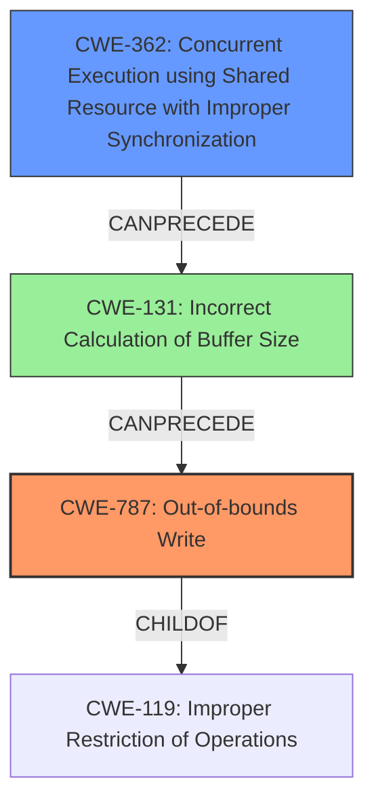

# Final Resolution for CVE-2022-26716

# Summary

| CWE ID  | CWE Name | Confidence | CWE Abstraction Level | CWE Vulnerability Mapping Label | CWE-Vulnerability Mapping Notes |
|---|---|---|---|---|---|
| **CWE-787** | **Out-of-bounds Write** | 0.85 | Base | Allowed | Primary CWE |
| **CWE-362** | **Concurrent Execution using Shared Resource with Improper Synchronization** | 0.60 | Class | Allowed-with-Review | Secondary Candidate |
| **CWE-131** | **Incorrect Calculation of Buffer Size** | 0.50 | Base | Allowed | Tertiary Candidate |

## Evidence and Confidence

*   **Confidence Score:** 0.80
*   **Evidence Strength:** MEDIUM

## Relationship Analysis

The selection of CWE-787 as the primary CWE is appropriate due to its specific nature as a **Base** level weakness directly related to **memory corruption** through out-of-bounds writing. While CWE-119 (Improper Restriction of Operations within the Bounds of a Memory Buffer) is a parent, CWE-787 offers a more precise characterization of the vulnerability.

CWE-362 and CWE-131 are considered as secondary and tertiary candidates, respectively, because they could potentially contribute to the root cause leading to the out-of-bounds write. CWE-362 could lead to inconsistent state, and CWE-131 may result in an undersized buffer.

## Vulnerability Chain

The vulnerability chain begins with potential concurrency issues (CWE-362) leading to an incorrect buffer size calculation (CWE-131). This results in a buffer that is too small, ultimately leading to an out-of-bounds write (CWE-787) when processing maliciously crafted web content.

- **Root Cause:** Possible concurrency issues (CWE-362) leading to incorrect state.
- **Weakness:** Incorrect calculation of buffer size (CWE-131).
- **Impact:** Out-of-bounds write (CWE-787) resulting in arbitrary code execution.

## Summary of Analysis

The initial analysis correctly identifies CWE-787 as the primary candidate due to the **memory corruption** issue leading to arbitrary code execution. The criticism highlights the need to explore deeper causes related to "improved state management" in the fix.

The decision to include CWE-362 and CWE-131 as secondary and tertiary candidates, respectively, stems from the criticism's emphasis on the root cause. The "improved state management" suggests a potential race condition (CWE-362) that could lead to incorrect buffer size calculations (CWE-131), ultimately causing the out-of-bounds write (CWE-787).

The graph relationships confirm that CWE-787 is the most specific **Base** level CWE to describe the vulnerability. CWE-362 and CWE-131 are potential contributing factors.

The evidence is based on the vulnerability description that mentions **memory corruption** and "improved state management". While there isn't explicit evidence to confirm CWE-362 and CWE-131, their inclusion is justified based on the potential vulnerability chain.

The selected CWEs are at the optimal level of specificity. CWE-787 directly describes the out-of-bounds write, while CWE-362 and CWE-131 represent potential root causes that contribute to the vulnerability.

The revised summary table reflects the inclusion of CWE-362 and CWE-131 as secondary and tertiary candidates, respectively, based on the criticism's recommendation to explore deeper causes and the potential vulnerability chain.