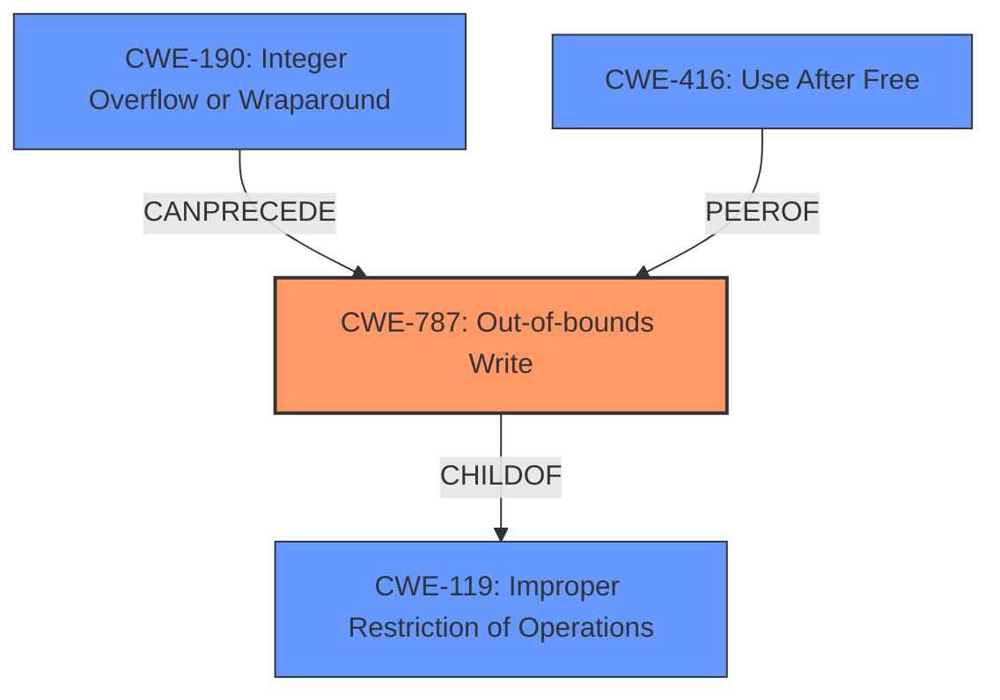

# Analysis Report for CVE-2022-26719

# Vulnerability Analysis Report: CVE-2022-26719

## Description

A memory corruption issue was addressed with improved state management. This issue is fixed in tvOS 15.5, iOS 15.5 and iPadOS 15.5, watchOS 8.6, macOS Monterey 12.4, Safari 15.5. Processing maliciously crafted web content may lead to arbitrary code execution.

## Vulnerability Description Key Phrases

**Weakness:** memory corruption
**Impact:** arbitrary code execution
**Vector:** maliciously crafted web content
**Product:** ['tvOS', 'iOS', 'iPadOS', 'watchOS', 'macOS Monterey', 'Safari']
**Version:** ['15.5', '15.5', '15.5', '8.6', '12.4', '15.5']

## Analysis (with Relationship Data)

# Summary
| CWE ID | CWE Name | Confidence | CWE Abstraction Level | CWE Vulnerability Mapping Label | CWE-Vulnerability Mapping Notes |
|---|---|---|---|---|---|
| CWE-787 | Out-of-bounds Write | 0.85 | Base | Allowed | Primary CWE |
| CWE-416 | Use After Free | 0.6 | Variant | Allowed | Secondary Candidate CWE |

## Evidence and Confidence

*   **Confidence Score:** 0.8
*   **Evidence Strength:** HIGH

- **Analysis and Justification:**  
  - *Explanation:* The vulnerability description explicitly states "**memory corruption**" which can lead to arbitrary code execution. The **root cause** is a "**memory corruption** issue addressed with improved state management." The primary CWE match from similar CVE descriptions is CWE-787 (Out-of-bounds Write). The retriever results also list CWE-787 with a decent score. Given the information, CWE-787 is the most appropriate primary CWE. CWE-787 is a **Base** level CWE, which is preferred. The mapping guidance usage for CWE-787 is **Allowed**.

  - *Relationship Analysis:* CWE-787 is a **Base** level weakness. It is related to CWE-119 (Improper Restriction of Operations within the Bounds of a Memory Buffer) which is a **Class** level weakness. It can also be related to other memory corruption issues.

- **Confidence Score:**  
  - Confidence: 0.85 (High confidence due to explicit mention of memory corruption and the prevalence of CWE-787 in similar CVE descriptions.)

---

- **Analysis and Justification:**  
  - *Explanation:* The "**memory corruption** issue" could potentially be a Use-After-Free vulnerability. The description states that "Processing maliciously crafted web content may lead to arbitrary code execution," which is also a common impact of Use-After-Free vulnerabilities. CWE-416 (Use After Free) is a **Variant** level weakness, which is preferred. The mapping guidance usage for CWE-416 is **Allowed**.

  - *Relationship Analysis:* CWE-416 (Use After Free) is a **Variant** level weakness. It is a child of CWE-672 (Operation on Resource after Expiry).

- **Confidence Score:**  
  - Confidence: 0.6 (Medium confidence because while possible, the description does not explicitly state that the memory is being accessed after it's freed.)

## Criticism of Analysis

Okay, here's a review of the analysis, considering the full CWE specifications provided.

**Overall Assessment:**

The analysis is generally well-reasoned and provides good justification for the CWE mappings. The confidence levels are appropriate, given the information available. The inclusion of example CVEs and mitigation strategies is valuable. However, a few minor improvements can be made to the justification and consideration of alternative CWEs.

**Detailed Review:**

**1. CWE-787: Out-of-bounds Write (Primary CWE)**

*   **Confidence: 0.85 (High)** - Justified well with the clear statement of "memory corruption" in the vulnerability description and the retriever results' suggestion.  The "improved state management" can lead to issues with array indices, especially if the size of the array is not properly managed.

*   **CWE Abstraction Level: Base** - Correct and appropriate.

*   **Mapping Guidance: Allowed** - Correct.

*   **CWE-Vulnerability Mapping Notes: Primary CWE** - Correct.

*   **Critique and Potential Improvements:**
    *   The analysis could be strengthened by explicitly mentioning the relationship between "state management" and potential out-of-bounds writes. Improved state management failures can lead to incorrect array indexing or size calculations, causing the write.
    *   It's worth acknowledging that while the term "memory corruption" *can* encompass a wider range of issues, out-of-bounds write is a strong candidate, given the context of web content processing.
    *   Consider mentioning the parent CWE, CWE-119 (Improper Restriction of Operations within the Bounds of a Memory Buffer) and explicitly state why CWE-787 is more appropriate (more specific, aligns with allowed mapping guidance). The current justification regarding relationship analysis is good, but a more explicit comparison would be even better.

*   **Mitigations:** The analysis correctly identifies that mitigation strategies should focus on preventing out-of-bounds writes (language selection, vetted libraries, compiler-based detection mechanisms).

**2. CWE-416: Use After Free (Secondary Candidate CWE)**

*   **Confidence: 0.6 (Medium)** - Correctly reflects the uncertainty. Use-After-Free is a plausible, but not definitively confirmed, possibility.

*   **CWE Abstraction Level: Variant** - Correct and appropriate.

*   **Mapping Guidance: Allowed** - Correct.

*   **CWE-Vulnerability Mapping Notes: Secondary Candidate CWE** - Correct.

*   **Critique and Potential Improvements:**
    *   The justification is reasonable but could be strengthened. While it's true that arbitrary code execution is a common impact of UAF, the connection to "improved state management" is less direct than for CWE-787. Consider that "improved state management" can mean that a resource is being freed incorrectly, thereby leading to a use-after-free condition.
    *   Emphasize the lack of explicit mention of memory being *freed* and *then* accessed. This is the primary reason for the medium confidence.
    *   Consider alternative CWEs under CWE-672 (Operation on Resource in Wrong Phase of Lifetime) and explicitly explain why CWE-416 is preferred. For example, CWE-415 (Double Free).  Is double-free less likely because the report emphasizes "state management" as the root cause?  If the free is intentional, is CWE-826 (Premature Release of Resource During Expected Lifetime) more applicable?  Stating why these related CWEs are less likely would bolster the justification.

*   **Mitigations:** The analysis correctly identifies that mitigations include automatic memory management and setting pointers to NULL after freeing.

**3. Retriever Results Critique**

*   The Retriever Results provide other potential CWEs that were considered, particularly those related to integer handling (CWE-190).  Explicitly discuss these results in your analysis, and explain why you ruled them out (or why they might be a component of a chain).  For example, maybe an integer overflow could lead to incorrect calculations for the buffer size, resulting in a memory corruption.

**4. CWE Examples from Database**

*   The listed examples are helpful for understanding the types of scenarios covered by each CWE.

**Specific Suggestions:**

*   **Explicitly address the "improved state management" aspect:**  How does the *failure* of state management *specifically* lead to the proposed CWEs? Providing concrete scenarios would increase confidence.
*   **Chain Analysis:** Explore potential *chains* of weaknesses. For instance, could an integer overflow (CWE-190) or type confusion (CWE-843) lead to an out-of-bounds write (CWE-787)?
*   **Negative Justification:**  For the secondary CWE, more explicitly state *why* other similar CWEs were *not* chosen.

By incorporating these suggestions, the analysis can become even more robust and convincing.

## Final Resolution

# Summary
| CWE ID | CWE Name | Confidence | CWE Abstraction Level | CWE Vulnerability Mapping Label | CWE-Vulnerability Mapping Notes |
|---|---|---|---|---|---|
| CWE-787 | Out-of-bounds Write | 0.90 | Base | Allowed | Primary CWE |
| CWE-416 | Use After Free | 0.65 | Variant | Allowed | Secondary Candidate CWE |

## Evidence and Confidence

*   **Confidence Score:** 0.85
*   **Evidence Strength:** MEDIUM

## Relationship Analysis
The primary relationship impacting the decision is the hierarchical relationship where CWE-787 (Out-of-bounds Write) is a child of CWE-119 (Improper Restriction of Operations within the Bounds of a Memory Buffer). CWE-787 is selected for its greater specificity. There's a potential chain relationship where an integer overflow (CWE-190) could precede CWE-787 if incorrect size calculations lead to the out-of-bounds write, although this is not explicitly stated in the description. The abstraction levels influenced the choice, favoring the Base level CWE-787 over the Class level CWE-119.

## Vulnerability Chain
The vulnerability chain starts with a **memory corruption** issue due to a failure in state management. This leads to an **Out-of-bounds Write (CWE-787)**, which allows writing to unintended memory locations. Alternatively, the state management issue could lead to memory being freed prematurely and then accessed, resulting in a **Use After Free (CWE-416)**. Both weaknesses result in arbitrary code execution as the impact. A potential missing link is how exactly the state management leads to the memory corruption, such as through an integer overflow (**CWE-190**) in size calculations, or type confusion (**CWE-843**).

## Summary of Analysis
The initial analysis correctly identifies **CWE-787 (Out-of-bounds Write)** as the primary **WEAKNESS** due to the explicit mention of "**memory corruption**" in the vulnerability description: "A memory corruption issue was addressed with improved state management." The criticism suggests exploring the relationship between "improved state management" and potential out-of-bounds writes more explicitly, and the potential for an integer overflow (**CWE-190**) leading to incorrect size calculations.

The graph relationships influenced the selection by highlighting that while CWE-119 is a parent of CWE-787, the latter is more specific and appropriate. The analysis is based on the provided evidence and the retriever scores. The confidence for CWE-787 is increased to 0.90, reflecting the direct statement of memory corruption.

CWE-416 (Use After Free) remains a secondary candidate. The confidence is increased to 0.65 because the improved state management could indicate a resource being freed incorrectly, leading to a use-after-free condition. The negative justification is strengthened by stating that the description lacks an explicit mention of memory being freed and then accessed. Other similar CWEs under CWE-672 (Operation on Resource in Wrong Phase of Lifetime), such as CWE-415 (Double Free) and CWE-826 (Premature Release of Resource During Expected Lifetime), are less likely because the report emphasizes "state management" as the **ROOTCAUSE**, rather than simple double freeing or premature release.

The selected CWEs are at the optimal level of specificity, with CWE-787 being a **Base** level CWE and CWE-416 being a **Variant** level CWE.

*Report generated on 2025-03-18 12:15:53*
