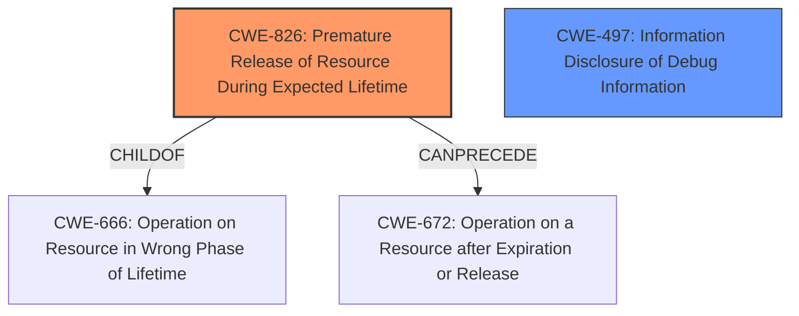

# Final Resolution for CVE-2022-27499

# Summary
| CWE ID | CWE Name | Confidence | CWE Abstraction Level | CWE Vulnerability Mapping Label | CWE-Vulnerability Mapping Notes |
|---|---|---|---|---|---|
| CWE-826 | Premature Release of Resource During Expected Lifetime | 0.9 | Base | Allowed | Primary CWE: The description explicitly states "premature release of resource during expected lifetime". |
| CWE-497 | Information Disclosure of Debug Information | 0.6 | Base | Allowed | Secondary Candidate: Premature release could potentially lead to sensitive information being leaked. |

## Evidence and Confidence

*   **Confidence Score:** 0.8
*   **Evidence Strength:** MEDIUM

## Relationship Analysis
The primary relationship considered was the direct match of CWE-826 to the vulnerability description. The secondary consideration involved the potential information disclosure aspect.

-   Parent-child hierarchical relationships: CWE-826 is a child of CWE-666 (Operation on Resource in Wrong Phase of Lifetime).
-   Chain relationships: CWE-826 can precede CWE-672 (Operation on a Resource after Expiration or Release).
-   Peer relationships: None directly impacted the decision.
-   Abstraction levels: The Base level of CWE-826 is appropriate for mapping the root cause.

## Vulnerability Chain
The vulnerability chain starts with the **premature release of a resource** (CWE-826). This can lead to the resource being in an unexpected state, potentially exposing sensitive information through debugging information (CWE-497).

-   Initial Flaw: **Premature release of a resource** (CWE-826)
-   Weakness: The resource is released before it should be.
-   Impact: Information disclosure (CWE-497).

## Summary of Analysis
The initial analysis correctly identified CWE-826 as the primary weakness due to the direct match with the vulnerability description: "Premature release of resource during expected lifetime." The criticism suggested considering the information disclosure mechanism more specifically. Given the context of "Intel(R) SGX SDK software", the **information disclosure** is more likely to involve debug information or system-level information, making CWE-497 (Information Disclosure of Debug Information) a more suitable secondary CWE than CWE-201. The vulnerability description mentions "may allow a privileged user to potentially enable information disclosure via local access", which supports the choice of CWE-497.

The relationship analysis reinforces the selection of CWE-826 as the Base level CWE. The vulnerability chain highlights how the **premature release** can lead to **information disclosure**.

The decision is based on the provided evidence and the understanding of the specific software involved (SGX SDK), with a confidence score of 0.8.