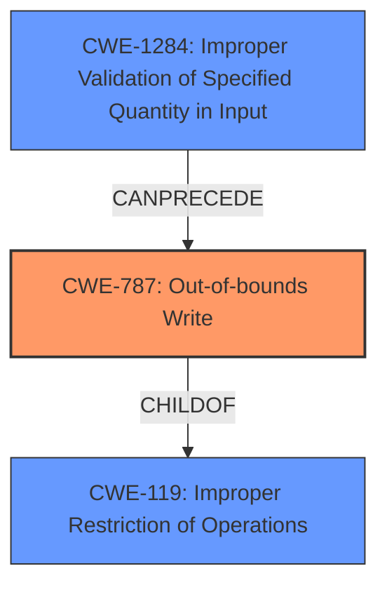

# Analysis Report for CVE-2022-27624

# Vulnerability Analysis Report: CVE-2022-27624

## Description

A vulnerability regarding improper restriction of operations within the bounds of a memory buffer is found in the packet decryption functionality of Out-of-Band (OOB) Management. This allows remote attackers to execute arbitrary commands via unspecified vectors. The following models with Synology DiskStation Manager (DSM) versions before 7.1.1-42962-2 may be affected DS3622xs+, FS3410, and HD6500.

## Vulnerability Description Key Phrases

**Rootcause:** improper restriction of operations within the bounds of a memory buffer
**Impact:** arbitrary command execution
**Vector:** Out-of-Band (OOB) Management
**Attacker:** remote attackers
**Product:** ['Synology DiskStation Manager (DSM)', 'DS3622xs+', 'FS3410', 'HD6500']
**Version:** before 7.1.1-42962-2
**Component:** packet decryption functionality

## Analysis (with Relationship Data)

# Summary
| CWE ID | CWE Name | Confidence | CWE Abstraction Level | CWE Vulnerability Mapping Label | CWE-Vulnerability Mapping Notes |
|---|---|---|---|---|---|
| CWE-787 | Out-of-bounds Write | 0.85 | Base | Allowed | Primary CWE |
| CWE-119 | Improper Restriction of Operations within the Bounds of a Memory Buffer | 0.6 | Class | Discouraged | Secondary Candidate |

## Evidence and Confidence

*   **Confidence Score:** 0.8
*   **Evidence Strength:** HIGH

- **Analysis and Justification:**  
  - *Explanation:* The vulnerability description highlights an **improper restriction of operations within the bounds of a memory buffer**, leading to arbitrary command execution. The CVE Reference Links Content Summary confirms that a root cause is **improper restriction of operations within the bounds of a memory buffer** in the packet decryption functionality, and that **out-of-bounds write/memory corruption** is present. This aligns with CWE-787 (Out-of-bounds Write), a base-level CWE, where the product writes data past the end of the intended buffer. While CWE-119 (Improper Restriction of Operations within the Bounds of a Memory Buffer) is a broader class-level weakness, the more specific nature of the write operation makes CWE-787 a better fit.
  
  - *Relationship Analysis:* CWE-787 is a child of CWE-119, indicating a more specific type of buffer handling issue. CWE-787 can precede CWE-824 (Access of Uninitialized Pointer) and CWE-825 (Missing Initialization). The parent of CWE-787 includes CWE-122 (Heap-based Buffer Overflow) and CWE-121 (Stack-based Buffer Overflow).

- **Confidence Score:**  
  - Confidence: 0.85 (High evidence from technical description and CVE reference materials)

---

## Criticism of Analysis

Okay, I've reviewed the provided analysis with the full CWE specifications, paying attention to mapping guidance and potential mitigations. Here's my critique:

**Overall Assessment:**

The analysis is generally good and correctly identifies CWE-787 (Out-of-bounds Write) as the primary CWE. The justification is well-reasoned and supported by the provided evidence. The confidence score of 0.85 is justified.  The analysis also correctly notes that while CWE-119 is relevant, it's a broader, less specific classification.

**Detailed Critique:**

*   **CWE-787: Out-of-bounds Write**

    *   **Strengths:** The choice of CWE-787 is accurate. The description clearly indicates a write operation occurring outside the intended buffer boundaries. The justification is strong, referencing the "improper restriction of operations within the bounds of a memory buffer" and the presence of "out-of-bounds write/memory corruption."
    *   **Mapping Guidance:** The analysis accurately follows the mapping guidance by choosing a Base level CWE rather than the Class level CWE-119.
    *   **Potential Mitigations:** While not explicitly stated, the analysis implicitly acknowledges the mitigations for CWE-787, such as using memory-safe languages or libraries, and employing buffer overflow detection mechanisms.
    *   **Relationships:** The analysis correctly points out the relationship of CWE-787 as a child of CWE-119 and potential following CWEs.

*   **CWE-119: Improper Restriction of Operations within the Bounds of a Memory Buffer**

    *   **Strengths:** Recognizing CWE-119 as a secondary candidate is appropriate, as it is the parent class of CWE-787. This acknowledges the general category of the issue.
    *   **Mapping Guidance:** The analysis accurately refers to the Mapping Guidance of CWE-119 that the CWE is discouraged and more specific weakness should be used.
    *   **Weaknesses:** Using it as primary would have been less optimal as it's a general categorization.

**Suggestions for Improvement:**

*   **Specificity on Write Location:** If possible, adding more detail about where the out-of-bounds write occurs (e.g., stack, heap, specific data structure) would further strengthen the analysis. This could allow for a more specific CWE mapping if the necessary information existed. For example, If it's on the heap then could be classified as CWE-122.
*   **Input Validation Connection:** While the analysis focuses on the out-of-bounds write, it could briefly mention the potential connection to CWE-20 (Improper Input Validation). An out-of-bounds write often results from a failure to properly validate the size or format of input before writing it to the buffer. Input validation error can preceed CWE-787.
*   **Connection to OOB Management:** Connecting the root cause to the "packet decryption functionality of Out-of-Band (OOB) Management" more explicitly could be beneficial. For instance, is there a specific field in the packet that controls the size of the buffer or the amount of data written?
*   **CWE Chains:** While not strictly required, briefly mentioning a potential CWE chain could add further value. For example: `CWE-20 -> CWE-131 -> CWE-787`. This suggests that improper input validation could lead to an incorrect buffer size calculation, which in turn leads to an out-of-bounds write. This was also pointed out by retriever results.

**Addressing Retriever Results**

The retriever results suggest other CWEs. It's good that the analysis considered these, but here's how they might relate:

*   **CWE-125 (Out-of-bounds Read):** While the primary issue is a write, an out-of-bounds *read* could be present in a related part of the decryption process, potentially to determine the size of the write. If there were evidence of this, it could be added as a secondary CWE or a chain.
*   **CWE-190 (Integer Overflow or Wraparound):** As mentioned in my suggestions, If an integer overflow is present, then it would fit into the chain of weaknesses.
*   **CWE-1284 (Improper Validation of Specified Quantity in Input):** This relates to the input validation concerns already discussed. If a length field in the packet isn't validated, CWE-1284 would be relevant.
*   **CWE-824 (Access of Uninitialized Pointer):** While not a direct cause, if the out-of-bounds write corrupts an uninitialized pointer, leading to a crash or further exploitation, this could be a secondary effect. The analysis already covers this in relationship analysis.
*   **CWE-193 (Off-by-one Error):** A specific case that could lead to CWE-787.

**Revised Summary Table (with potential Chain mentioned):**

| CWE ID | CWE Name | Confidence | CWE Abstraction Level | CWE Vulnerability Mapping Label | CWE-Vulnerability Mapping Notes |
|---|---|---|---|---|---|
| CWE-787 | Out-of-bounds Write | 0.85 | Base | Allowed | Primary CWE |
| CWE-20 | Improper Input Validation | 0.4 | Class | Allowed | Root cause that may result in insufficient size of buffer. |
| CWE-119 | Improper Restriction of Operations within the Bounds of a Memory Buffer | 0.6 | Class | Discouraged | Secondary Candidate |

**Conclusion:**

The analysis is well-done and accurately identifies the primary weakness. The suggestions above are intended to further refine the analysis and provide a more complete picture of the vulnerability. The addition of a potential CWE chain can highlight the relationships between various weaknesses.

## Final Resolution

# Summary
| CWE ID | CWE Name | Confidence | CWE Abstraction Level | CWE Vulnerability Mapping Label | CWE-Vulnerability Mapping Notes |
|---|---|---|---|---|---|
| CWE-787 | Out-of-bounds Write | 0.85 | Base | Allowed | Primary CWE |
| CWE-1284 | Improper Validation of Specified Quantity in Input | 0.5 | Base | Allowed | Secondary Candidate: Root cause that may result in insufficient size of buffer. |
| CWE-119 | Improper Restriction of Operations within the Bounds of a Memory Buffer | 0.6 | Class | Discouraged | Secondary Candidate |

## Evidence and Confidence

*   **Confidence Score:** 0.8
*   **Evidence Strength:** MEDIUM

## Relationship Analysis
The primary CWE is CWE-787 (**Out-of-bounds Write**), which is a child of CWE-119 (**Improper Restriction of Operations within the Bounds of a Memory Buffer**). This indicates that CWE-787 is a more specific type of buffer handling issue than CWE-119, which is a more general class. CWE-1284 (**Improper Validation of Specified Quantity in Input**) is added as a secondary candidate because the **out-of-bounds write** often results from a failure to properly validate the size or format of input before writing it to the buffer. The retriever results also support the inclusion of this CWE.

## Vulnerability Chain
The vulnerability chain starts with CWE-1284 (**Improper Validation of Specified Quantity in Input**), where the input data's size or format isn't adequately validated. This leads to CWE-787 (**Out-of-bounds Write**), where data is written past the intended buffer's boundaries. CWE-119 (**Improper Restriction of Operations within the Bounds of a Memory Buffer**) is the broader class that encompasses these issues.

## Summary of Analysis
The initial analysis correctly identified CWE-787 as the primary weakness. The criticism provided valuable suggestions, particularly the connection to input validation. The vulnerability description states that there is "improper restriction of operations within the bounds of a memory buffer," leading to arbitrary command execution, with "out-of-bounds write/memory corruption" being present.

Based on the retriever results and the criticism, CWE-1284 (**Improper Validation of Specified Quantity in Input**) has been added as a secondary candidate since input validation often precedes **out-of-bounds writes**. The relationships between these CWEs (CWE-1284 CanPrecede CWE-787) support this assessment. The selected CWEs are at the optimal level of specificity, with CWE-787 being a base-level CWE and CWE-1284 providing more context to the root cause. The mapping guidance for CWE-787 and CWE-1284 both indicate that they are allowed.

*Report generated on 2025-03-18 12:20:06*
