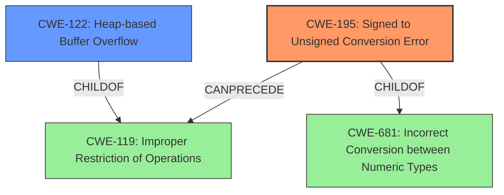

# Final Resolution for CVE-2022-27882

# Summary
| CWE ID | CWE Name | Confidence | CWE Abstraction Level | CWE Vulnerability Mapping Label | CWE-Vulnerability Mapping Notes |
|---|---|---|---|---|---|
| CWE-195 | Signed to Unsigned Conversion Error | 0.95 | Variant | Allowed | Primary CWE |
| CWE-122 | Heap-based Buffer Overflow | 0.75 | Variant | Allowed | Secondary Candidate |

## Evidence and Confidence

*   **Confidence Score:** 0.90
*   **Evidence Strength:** HIGH

## Relationship Analysis
The primary relationship influencing the decision is the chain where **CWE-195** [CWE-195: Signed to Unsigned Conversion Error] *CanPrecede* **CWE-119** [CWE-119: Improper Restriction of Operations within the Bounds of a Memory Buffer], ultimately leading to **CWE-122** [CWE-122: Heap-based Buffer Overflow]. **CWE-195** is a variant of **CWE-681** [CWE-681: Incorrect Conversion between Numeric Types], highlighting the type conversion issue. The variant level of **CWE-195** and **CWE-122** provide sufficient specificity.

## Vulnerability Chain
The vulnerability chain starts with a crafted IPv6 router advertisement containing a malicious DNSSL option. This leads to a signed integer storing a negative length. The negative signed integer is then treated as an unsigned integer, resulting in a large unsigned value being passed to `memcpy`. This ultimately triggers a heap overflow.

## Summary of Analysis
The initial analysis and criticism are both accurate and well-justified. The selection of **CWE-195** [CWE-195: Signed to Unsigned Conversion Error] as the primary **ROOTCAUSE** and **CWE-122** [CWE-122: Heap-based Buffer Overflow] as the secondary **WEAKNESS** is correct.

The vulnerability description clearly states: "slaacd in OpenBSD 6.9 and 7.0 before 2022-03-22 has an **integer signedness error** and resultant heap-based buffer overflow triggerable by a crafted IPv6 router advertisement." This evidence directly supports the selection of **CWE-195** [CWE-195: Signed to Unsigned Conversion Error] as the primary cause.

The relationship analysis further reinforces this by showing how **CWE-195** [CWE-195: Signed to Unsigned Conversion Error] can precede **CWE-119** [CWE-119: Improper Restriction of Operations within the Bounds of a Memory Buffer], leading to the **CWE-122** [CWE-122: Heap-based Buffer Overflow].

The selected CWEs are at the optimal level of specificity. **CWE-195** [CWE-195: Signed to Unsigned Conversion Error] is a Variant that accurately describes the **ROOTCAUSE**, and **CWE-122** [CWE-122: Heap-based Buffer Overflow] is a Variant that accurately describes the impact. Using a more general CWE would lose the precision needed to understand the nature of the vulnerability.