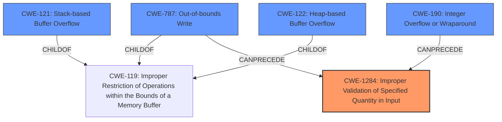

# Final Resolution for CVE-2022-28193

# Summary
| CWE ID | CWE Name | Confidence | CWE Abstraction Level | CWE Vulnerability Mapping Label | CWE-Vulnerability Mapping Notes |
|---|---|---|---|---|---|
| CWE-1284 | Improper Validation of Specified Quantity in Input | 0.70 | Base | Primary | Allowed |
| CWE-787 | Out-of-bounds Write | 0.60 | Variant | Secondary | Allowed |
| CWE-121 | Stack-based Buffer Overflow | 0.50 | Variant | Secondary | Allowed |
| CWE-122 | Heap-based Buffer Overflow | 0.50 | Variant | Secondary | Allowed |
| CWE-190 | Integer Overflow or Wraparound | 0.50 | Base | Secondary | Allowed |

## Evidence and Confidence

*   **Confidence Score:** 0.70
*   **Evidence Strength:** MEDIUM

## Relationship Analysis
The primary change involves shifting from CWE-120 to CWE-1284 as the primary **WEAKNESS**. This reflects a move from a general buffer overflow to the specific cause of "insufficient validation of untrusted data". CWE-787 (Out-of-bounds Write) is added as a secondary to represent the actual write outside the buffer. CWE-121, CWE-122, and CWE-190 remain as secondary contributing factors.

## Vulnerability Chain
The vulnerability chain starts with **CWE-1284 (Improper Validation of Specified Quantity in Input)**. If the input quantity (such as buffer size) is not properly validated, it can lead to an **out-of-bounds write (CWE-787)**. An **integer overflow (CWE-190)** could also lead to an incorrect size calculation, contributing to the **WEAKNESS**. The overflow can occur on either the stack (**CWE-121**) or the heap (**CWE-122**), resulting in potential code execution, loss of integrity, limited denial of service, and some impact to confidentiality.

## Summary of Analysis
The initial analysis identified a buffer overflow (**CWE-120**) as the primary **ROOTCAUSE**. However, the criticism correctly pointed out that the description mentions "insufficient validation of untrusted data," indicating that the root cause is more accurately represented by **CWE-1284 (Improper Validation of Specified Quantity in Input)**. This **WEAKNESS** directly aligns with the vulnerability description and provides a more specific understanding of the **ROOTCAUSE**.

The decision to switch to **CWE-1284** is based on the following evidence from the vulnerability description: "insufficient validation of untrusted data may allow a local attacker with elevated privileges to cause a memory buffer overflow". The retriever results also support this decision, with CWE-1284 having a high score.

**CWE-787** is added as a secondary because it represents the actual out-of-bounds write operation.

The confidence scores have been adjusted to reflect the uncertainty due to the generic nature of the description. The selected CWEs are at the optimal level of specificity, with **CWE-1284** representing the root cause and the other CWEs contributing to the vulnerability chain.