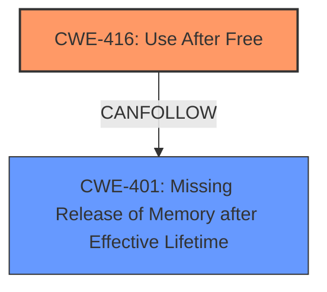

# Final Resolution for CVE-2022-28269

# Summary
| CWE ID | CWE Name | Confidence | CWE Abstraction Level | CWE Vulnerability Mapping Label | CWE-Vulnerability Mapping Notes |
|---|---|---|---|---|---|
| CWE-416 | Use After Free | 0.95 | Variant | Allowed | Primary CWE. This is a Use-After-Free (UAF) vulnerability, which occurs when a program attempts to use memory that has already been freed. |
| CWE-401 | Missing Release of Memory after Effective Lifetime | 0.70 | Variant | Allowed | Secondary CWE. Exploitation of the Use-After-Free vulnerability *could* lead to a memory leak. |

## Evidence and Confidence

*   **Confidence Score:** 0.90
*   **Evidence Strength:** HIGH

## Relationship Analysis
The primary relationship influencing the decision is the potential chain relationship where **CWE-416 (Use After Free)** can lead to **CWE-401 (Missing Release of Memory after Effective Lifetime)**. While a UAF doesn't always result in a memory leak, the vulnerability description explicitly states that the UAF "could result in a memory leak," making CWE-401 a relevant secondary consideration. The abstraction levels (both are Variants) are appropriate for the specificity of the description. We considered other related CWEs like **CWE-787 (Out-of-bounds Write)**, **CWE-122 (Heap-based Buffer Overflow)** and **CWE-121 (Stack-based Buffer Overflow)** but they are consequences of the **CWE-416 (Use After Free)** and not the root cause in this case.

## Vulnerability Chain
The vulnerability chain starts with **CWE-416 (Use After Free)**, where the application attempts to use memory that has already been freed. This occurs during the processing of Annotation objects. The use of freed memory *can* lead to **CWE-401 (Missing Release of Memory after Effective Lifetime)**, potentially resulting in a memory leak in the context of the current user. The initial flaw is the failure to properly manage the lifecycle of the Annotation objects, resulting in a dangling pointer. The consequence is the potential exposure of sensitive information or denial of service due to memory exhaustion.

## Summary of Analysis
The analysis is based on the explicit mention of "use-after-free" in the vulnerability description: "Acrobat Reader DC versions 22.001.20085 (and earlier), 20.005.3031x (and earlier) and 17.012.30205 (and earlier) are affected by a use-after-free vulnerability in the processing of Annotation objects that could result in a memory leak...". This provides strong evidence for classifying the vulnerability as **CWE-416 (Use After Free)**. The graph relationships helped to identify potential secondary CWEs, with **CWE-401 (Missing Release of Memory after Effective Lifetime)** being selected due to the vulnerability description stating that the UAF "could result in a memory leak". Other CWEs, while potentially related as consequences, were deemed less directly relevant as root causes. The selected CWEs are at the optimal level of specificity, with CWE-416 being a Variant that directly matches the vulnerability description. The confidence score is high (0.90) due to the clear evidence and the explicit mention of the vulnerability type.