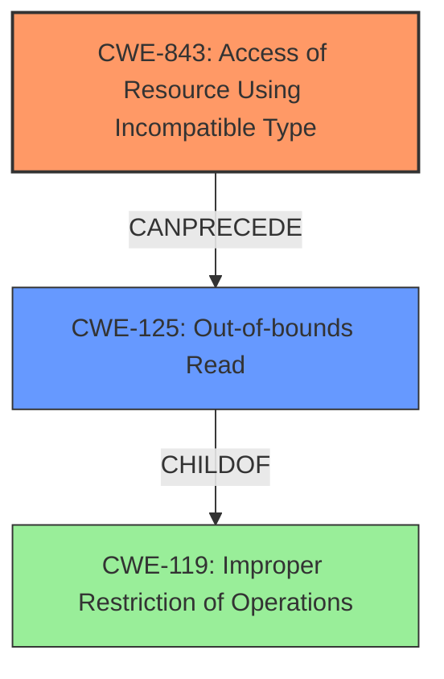

# Analysis Report for CVE-2022-28285

# Vulnerability Analysis Report: CVE-2022-28285

## Description

When generating the assembly code for MLoadTypedArrayElementHole, an incorrect AliasSet was used. In conjunction with another vulnerability this could have been used for an out of bounds memory read. This vulnerability affects Thunderbird < 91.8, Firefox < 99, and Firefox ESR < 91.8.

## Vulnerability Description Key Phrases

**Rootcause:** incorrect AliasSet was used
**Impact:** out of bounds memory read
**Product:** ['Thunderbird', 'Firefox', 'Firefox ESR']
**Version:** ['< 91.8', '< 99', '< 91.8']
**Component:** assembly code for MLoadTypedArrayElementHole

## Analysis (with Relationship Data)

# Summary
| CWE ID | CWE Name | Confidence | CWE Abstraction Level | CWE Vulnerability Mapping Label | CWE-Vulnerability Mapping Notes |
|---|---|---|---|---|---|
| CWE-125 | Out-of-bounds Read | 0.95 | Base | Allowed | Primary CWE |

## Evidence and Confidence

*   **Confidence Score:** 0.95
*   **Evidence Strength:** HIGH

- **Analysis and Justification:**  
  - *Explanation:* The vulnerability description clearly states that it could be used for an **out of bounds memory read**. The "Vulnerability Description Key Phrases" section notes the impact as "out of bounds memory read". The "CVE Reference Links Content Summary" section further details the root cause as an **incorrect AliasSet** leading to the possibility of bypassing memory safety checks and causing an out-of-bounds read. CWE-125 (Out-of-bounds Read) directly addresses this issue. The MITRE mapping guidance for CWE-125 indicates that its usage is ALLOWED and it's at the Base level of abstraction, making it a preferred level for mapping.

  - *Relationship Analysis:* Although other CWEs such as CWE-787 (Out-of-bounds Write) and CWE-843 (Access of Resource Using Incompatible Type) are potential candidates based on retriever results, the explicit mention of "out of bounds memory read" makes CWE-125 the most appropriate primary CWE. CWE-125 is a child of CWE-119 (Improper Restriction of Operations within the Bounds of a Memory Buffer), but CWE-125 is more specific to the read operation.

- **Confidence Score:**
  - *Example:* Confidence: 0.95 (High confidence due to clear evidence from the vulnerability description and CVE reference materials.)

## Criticism of Analysis

## Critique of CWE Analysis

Overall, the analysis is well-structured and arrives at a reasonable conclusion, but there are a few points that could be strengthened and considered more carefully. The choice of CWE-125 as the primary CWE is justified based on the provided information, however it could be improved by considering the root cause more.

**Strengths:**

*   **Clear Explanation:** The justification for choosing CWE-125 is clearly articulated and supported by evidence extracted from the vulnerability description and CVE reference links.
*   **Relationship Analysis:** The analysis acknowledges other potentially relevant CWEs like CWE-787 and CWE-843 and explains why CWE-125 is the most appropriate primary mapping.
*   **Confidence Score:** The confidence score of 0.95 is reasonable given the direct mention of "out of bounds memory read."
*   **Evidence Strength:** The evidence strength is high because it's explicitly called out.
*   **Usage of CWE Specifications:** The inclusion of relevant CWE specifications provides context and supports the analysis.

**Areas for Improvement:**

1.  **Root Cause Consideration:** While the *impact* is clearly an out-of-bounds read, the *root cause* is an incorrect `AliasSet`. The analysis should consider if there's a more specific CWE that captures the *incorrect usage* of `AliasSet`, rather than just the consequence. The fix involved adding `AliasSet::ArrayBufferViewLengthOrOffset` and `AliasSet::ObjectFields` to the `MLoadTypedArrayElementHole`'s `AliasSet`. This hints at a potential type confusion issue where the incorrect `AliasSet` doesn't properly represent the memory layout or types being accessed. Therefore, considering **CWE-843** and the chain leading to CWE-125 would improve the analysis. Although CWE-843 is the base level, so it is preferred, it could be the appropriate CWE.

2.  **CWE-119 Discouragement:** The analysis could directly address the CWE-119 note that states, "CWE-119 is commonly misused in low-information vulnerability reports when lower-level CWEs could be used instead." Given the explicit "out of bounds memory read" impact, mapping directly to CWE-125 bypasses this discouragement by using a more specific child of CWE-119. The analysis does address this indirectly.

3.  **Missing Context on Memory Safety Checks:** The analysis mentions bypassing "memory safety checks," but doesn't elaborate on *how* the incorrect `AliasSet` leads to this bypass. More detail on the specific mechanisms and how they are circumvented would strengthen the analysis.

4.  **Mitigations:** While the "Potential Mitigations" sections from the CWE specifications are provided, the analysis could be improved by suggesting mitigations specific to the root cause (incorrect AliasSet) and the component (JIT compiler). For example, the analysis could suggest improvements in JIT compiler testing to verify the correctness of AliasSet usage for memory access operations. Dynamic taint analysis could also be used to catch OOB reads at runtime.

5.  **Chaining Analysis:** The description mentions that this vulnerability is exploitable in conjunction with another vulnerability. While the analysis recognizes this, exploring potential CWEs for the "other vulnerability" and creating a complete chain would be beneficial. For example, if the "other vulnerability" allows for arbitrary code execution, then the chain could be something like: `[CWE-XXX] -> [CWE-843] -> [CWE-125]`.

**Revised Recommendation:**

Keep CWE-125 as the primary CWE with a confidence of 0.9, but include **CWE-843 Access of Resource Using Incompatible Type ('Type Confusion')** as a related CWE.

**Confidence Score:** Reduced to 0.9 since it requires another issue to be exploitable.

**Revised Analysis Points:**

*   **Root Cause:** The root cause is an incorrect `AliasSet` leading to potential type confusion and incorrect memory access information. The `MLoadTypedArrayElementHole` instruction's `AliasSet` was set to `AliasSet::Load(AliasSet::UnboxedElement)` which did not account for the access to `ArrayBufferViewObject::dataOffset()` and the need for `AliasSet::ArrayBufferViewLengthOrOffset` and `AliasSet::ObjectFields`. This may be considered as **CWE-843**, Access of Resource Using Incompatible Type ('Type Confusion').

*   **Impact:** This type confusion then leads to the possibility of bypassing memory safety checks and causing an out-of-bounds read (**CWE-125**), when combined with a secondary vulnerability.

*   **Relationship Analysis:** CWE-125 is the direct impact, but CWE-843 reflects the root cause of the incorrect memory access leading to the OOB read. The vulnerability can be represented by a potential chain: `[CWE-843] -> [CWE-125]`.

**Mitigation Considerations:**

*   Beyond the standard mitigations for OOB reads (input validation, language selection), focus on strengthening the JIT compiler's type analysis and AliasSet usage.
*   Implement more rigorous testing of the JIT compiler, specifically targeting AliasSet assignments and memory access patterns. Use fuzzing and symbolic execution techniques to identify potential type confusion issues.
*   Explore dynamic taint analysis to detect OOB reads at runtime, even if the static analysis is insufficient.
*   Consider using memory tagging (if supported by the hardware) to catch incorrect memory accesses.

By incorporating these suggestions, the analysis will be more comprehensive and provide a deeper understanding of the vulnerability.

## Final Resolution

# Summary
| CWE ID | CWE Name | Confidence | CWE Abstraction Level | CWE Vulnerability Mapping Label | CWE-Vulnerability Mapping Notes |
|---|---|---|---|---|---|
| CWE-843 | Access of Resource Using Incompatible Type ('Type Confusion') | 0.9 | Base | Allowed | Primary CWE |
| CWE-125 | Out-of-bounds Read | 0.8 | Base | Allowed | Secondary Candidate |

## Evidence and Confidence

*   **Confidence Score:** 0.9
*   **Evidence Strength:** MEDIUM

## Relationship Analysis
The primary relationship considered here is a chain relationship. The **CWE-843** (**Access of Resource Using Incompatible Type**) *CanPrecedes* **CWE-125** (**Out-of-bounds Read**). **CWE-125** is a child of the class **CWE-119** (**Improper Restriction of Operations within the Bounds of a Memory Buffer**), but **CWE-125** is more specific and thus preferred. The **CWE-843** better represents the root cause, while **CWE-125** represents the impact.

## Vulnerability Chain
The chain of events starts with an **incorrect AliasSet** being used, which leads to type confusion (**CWE-843**). This type confusion then enables bypassing memory safety checks, resulting in an **out-of-bounds read** (**CWE-125**). This is further complicated by the need for another vulnerability to be present for exploitation, but is separate from the root cause. The chain is **CWE-843** *CanPrecedes* **CWE-125**.

## Summary of Analysis
The initial analysis correctly identified **CWE-125** (**Out-of-bounds Read**) as a potential candidate, however, it focused primarily on the impact of the vulnerability. The criticism correctly pointed out that the root cause lies in the **incorrect AliasSet** and the resulting type confusion.

The vulnerability description states that "When generating the assembly code for MLoadTypedArrayElementHole, an incorrect AliasSet was used. In conjunction with another vulnerability this could have been used for an out of bounds memory read." This clearly indicates that the incorrect AliasSet is the root cause.

By considering the relationship between **CWE-843** and **CWE-125**, a more complete picture of the vulnerability emerges. **CWE-843** directly addresses the type confusion aspect, while **CWE-125** describes the resulting out-of-bounds read. The decision to make **CWE-843** the primary CWE is based on the fact that it represents the root cause of the vulnerability, while **CWE-125** represents the impact. This aligns with the principle of identifying the most fundamental weakness.

The selected CWEs are at the optimal level of specificity. **CWE-843** is a Base level CWE that accurately describes the type confusion, and **CWE-125** is a Base level CWE that accurately describes the out-of-bounds read. Both CWEs are more specific than their parent class CWEs, such as **CWE-119**.

*Report generated on 2025-03-18 12:23:58*
