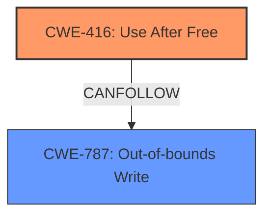

# Final Resolution for CVE-2022-2852

# Summary

| CWE ID  | CWE Name                                                                         | Confidence | CWE Abstraction Level | CWE Vulnerability Mapping Label | CWE-Vulnerability Mapping Notes |
| :------- | :------------------------------------------------------------------------------- | :--------- | :-------------------- | :------------------------------ | :------------------------------ |
| CWE-416 | **CWE-416: Use After Free**                                                        | 1.0        | Variant               | Primary                         | Allowed                         |
| CWE-787 | **CWE-787: Out-of-bounds Write**                                                    | 0.4        | Base                  | Secondary Candidate             | Allowed                         |

## Evidence and Confidence

*   **Confidence Score:** 0.95
*   **Evidence Strength:** HIGH

## Relationship Analysis

The primary relationship is that CWE-787 (Out-of-bounds Write) can be a consequence of CWE-416 (**Use After Free**). While CWE-416 is a Variant, it directly reflects the vulnerability description. CWE-787, as a Base CWE, is a potential outcome if the freed memory is reallocated and then improperly written to. No parent-child relationships influenced the decision, but the CanFollow relationship (CWE-416 CanFollow CWE-787) highlights the potential vulnerability chain.

## Vulnerability Chain

The vulnerability chain starts with **CWE-416 (Use After Free)**, which occurs when memory is accessed after it has been freed. This can potentially lead to **CWE-787 (Out-of-bounds Write)** if the freed memory is reallocated and overwritten. The final impact is heap corruption, as stated in the vulnerability description, potentially leading to arbitrary code execution.

## Summary of Analysis

The initial analysis correctly identified **CWE-416 (Use After Free)** as the primary **ROOTCAUSE** of the vulnerability, supported by the explicit mention of "use after free" in the vulnerability description: "Use after free in FedCM in Google Chrome prior to 104.0.5112.101...". The criticism also supports this decision. The direct match between the vulnerability description and **CWE-416**'s description, combined with the CVE reference confirmation, gives high confidence in this classification.

The inclusion of **CWE-787 (Out-of-bounds Write)** as a secondary candidate is reasonable because **heap corruption**, which is a consequence of a use-after-free, can manifest as an out-of-bounds write. The confidence score for **CWE-787** has been slightly increased to 0.4 to reflect the likelihood of this consequence.

The graph relationships, particularly the CanFollow relationship from **CWE-416** to **CWE-787**, reinforce the potential chain of events.

The decision to classify **CWE-416** as the primary weakness is at the optimal level of specificity because it directly addresses the **ROOTCAUSE** of the vulnerability. **CWE-787** is a potential consequence, but not the initiating factor.