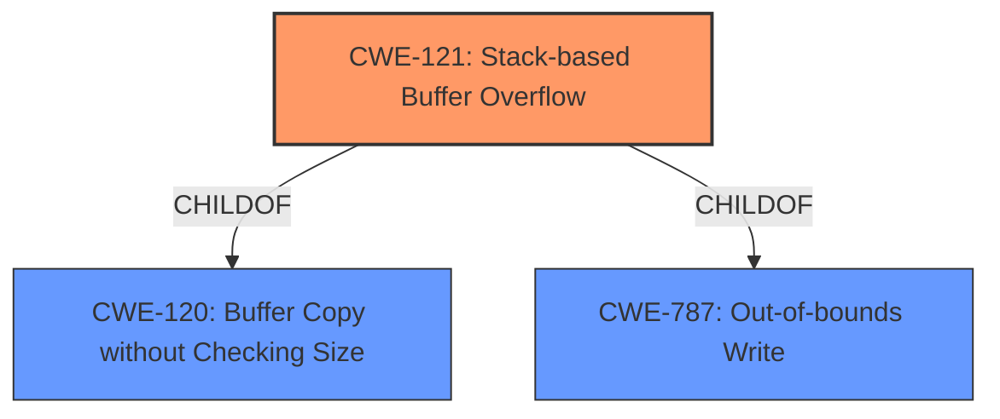

# Analysis Report for CVE-2022-28556

# Vulnerability Analysis Report: CVE-2022-28556

## Description

Tenda AC15 US_AC15V1.0BR_V15.03.05.20_multi_TDE01.bin is vulnerable to Buffer Overflow. The stack overflow vulnerability lies in the /goform/setpptpservercfg interface of the web. The sent post data startip and endip are copied to the stack using the sanf function, resulting in stack overflow. Similarly, this vulnerability can be used together with CVE-2021-44971

## Vulnerability Description Key Phrases

**Weakness:** stack overflow
**Vector:** post data
**Product:** Tenda AC15
**Version:** US_AC15V1.0BR_V15.03.05.20_multi_TDE01.bin
**Component:** /goform/setpptpservercfg interface

## Analysis (with Relationship Data)

# Summary
| CWE ID | CWE Name | Confidence | CWE Abstraction Level | CWE Vulnerability Mapping Label | CWE-Vulnerability Mapping Notes |
|---|---|---|---|---|---|
| CWE-121 | Stack-based Buffer Overflow | 0.9 | Variant | Allowed | Primary CWE |
| CWE-120 | Buffer Copy without Checking Size of Input ('Classic Buffer Overflow') | 0.6 | Base | Allowed-with-Review | Secondary Candidate |

## Evidence and Confidence

*   **Confidence Score:** 0.9
*   **Evidence Strength:** HIGH

- **Analysis and Justification:**  
  - *Explanation:* The vulnerability description clearly states a **stack overflow** in the `/goform/setpptpservercfg` interface of the Tenda AC15 router. The **weakness** occurs when post data (`startip` and `endip`) is copied to the stack using the `sanf` function without proper size validation, leading to a **stack overflow**. This aligns directly with CWE-121 (Stack-based Buffer Overflow). CWE-121 is a Variant of buffer overflow which makes it a good fit. The Retriever Results also suggest CWE-121.
  - *Relationship Analysis:* CWE-121 is a variant of buffer overflow. The provided relationships do not indicate specific chain patterns, but buffer overflows can often lead to other vulnerabilities like remote code execution or privilege escalation. While CWE-120 (Buffer Copy without Checking Size of Input) is a more general case of buffer overflow, CWE-121 is more specific since it mentions Stack. CWE-120 is a parent of multiple buffer overflow related CWEs.

- **Confidence Score:**  
  - *Example:* Confidence: 0.9 (Strong evidence from the vulnerability description explicitly stating a stack overflow.)

---

## Criticism of Analysis

Okay, here's a review of the analysis, incorporating the full CWE specifications, mapping guidance, and potential mitigations.

**Overall Assessment:**

The analysis is generally strong and well-justified. The primary CWE mapping to CWE-121 (Stack-based Buffer Overflow) is appropriate and supported by the vulnerability description. The inclusion of CWE-120 (Buffer Copy without Checking Size of Input) as a secondary candidate is also reasonable, offering a broader perspective on the underlying issue. The confidence scores are justifiable.

**Detailed Review:**

**1. CWE-121: Stack-based Buffer Overflow (Primary CWE)**

*   **Strengths:**
    *   The analysis accurately identifies the core problem: a buffer overflow occurring on the stack.
    *   The justification clearly links the vulnerability description's mention of a "stack overflow" and the copying of `startip` and `endip` data without size validation to the definition of CWE-121.
    *   The confidence score of 0.9 is well-supported by the explicit language in the vulnerability description.

*   **Improvements/Considerations:**
    *   **Mitigation Focus:** Consider emphasizing mitigations specifically tailored to *stack*-based overflows, versus generic buffer overflow mitigations.  While environment hardening (like /GS flag) mentioned in the general mitigations is relevant, consider also including information about Address Space Layout Randomization (ASLR), which, while not a complete solution, can make stack-based overflows more difficult to exploit. Data Execution Prevention (DEP) which prevents code execution in memory sections can also be mentioned.
    *   **Relationship Enhancement:** The analysis mentions general buffer overflow exploitation but could be strengthened by specifically mentioning how stack-based overflows can overwrite return addresses, function pointers, or other critical stack data to gain control of execution. This is explicitly mentioned in the 'Additional Notes' section of the CWE-121 specification ("Stack-based buffer overflows can instantiate in return address overwrites, stack pointer overwrites or frame pointer overwrites...").  This provides a clearer understanding of the *impact* of the vulnerability.
    *   **CWE-787 Consideration:** Could it be argued, given that the description identifies a *write* to a specific memory location, that CWE-787 Out-of-bounds Write (Base) might be even *more* directly relevant as a parent for CWE-121?  While CWE-121 is very specific, sometimes a more generic Base CWE is appropriate as primary.  This is a minor point and the current mapping is acceptable.

**2. CWE-120: Buffer Copy without Checking Size of Input (Secondary Candidate)**

*   **Strengths:**
    *   Recognizes that the root cause is a lack of input size validation during the buffer copy operation.
    *   Acknowledges that CWE-120 is a more general case of buffer overflow, providing a broader context.

*   **Improvements/Considerations:**
    *   **Mapping Guidance Adherence:** The analysis correctly acknowledges the "Allowed-with-Review" usage of CWE-120 and the rationale behind it (potential for misuse as a generic "buffer overflow" label).  The current usage is justified.
    *   **Alternative CWE Consideration:** When assessing if a different CWE might be more appropriate than CWE-120, review the comments of CWE-120: "If there is a calculation error for buffer sizes, consider CWE-131 or similar." Since the analysis indicates the `sanf` function is used (presumably for string formatting), and *if* there's a calculation error in how much space is allocated by `sanf`, then CWE-131 might be considered as an alternate primary, with CWE-120 as a secondary. However, without further code analysis, this is speculation.
    *   **Input Validation:** If there is ANY attempt at input validation, review children of CWE-20.

**General Comments and Potential Additional Considerations:**

*   **Retriever Results Review:** The Retriever Results suggest several other CWEs with relatively high scores. While CWE-121 and CWE-120 are the most direct matches, it's worth briefly considering why some of the others might have been suggested:
    *   **CWE-193 (Off-by-one Error):** This could be relevant if there's a subtle error in the size calculation that leads to writing one byte beyond the allocated buffer. However, without more information, this is less likely than a general lack of size checking.
    *   **CWE-190/191 (Integer Overflow/Underflow):** These could be relevant if the size calculation involves arithmetic operations that could overflow or underflow, leading to a smaller-than-expected buffer allocation. This is less likely given the description, but possible.
    *   **CWE-770 (Allocation of Resources Without Limits or Throttling):** This is a more general CWE and less directly related to the buffer overflow itself. While a lack of limits could contribute, the primary issue is the lack of size checking during the copy.

*   **Combining with CVE-2021-44971:** Since the vulnerability description mentions CVE-2021-44971, it would be beneficial to investigate how this vulnerability can be used together with the identified stack overflow. This could reveal further attack vectors or dependencies that would need to be considered.

*   **Mitigation Detail:** For the mitigation section, specifically mention mitigations like using safe string handling functions (e.g., `strncpy` with explicit null termination, `snprintf`) and implementing robust input validation (e.g., checking the length of the input string before copying it to the buffer). Explain that using these mitigations helps to prevent the buffer overflow by ensuring that the input data does not exceed the buffer's capacity.

*   **Example CWE Review:** The included CVE examples for CWE-120 and CWE-121 are helpful for demonstrating real-world instances of these weaknesses.

**Revised Summary Table (Including Minor Suggestions):**

| CWE ID | CWE Name | Confidence | CWE Abstraction Level | CWE Vulnerability Mapping Label | CWE-Vulnerability Mapping Notes |
|---|---|---|---|---|---|
| CWE-121 | Stack-based Buffer Overflow | 0.9 | Variant | Allowed | Primary CWE.  Exploitability can involve overwriting return addresses or other stack data. Consider mitigations like ASLR and DEP.  |
| CWE-120 | Buffer Copy without Checking Size of Input ('Classic Buffer Overflow') | 0.6 | Base | Allowed-with-Review | Secondary Candidate.  Highlights the lack of input size validation. |

**In conclusion, the analysis is well-reasoned and provides a solid foundation for understanding and addressing this vulnerability. The suggestions above are primarily aimed at enhancing the analysis by providing more specific details about exploitability and potential mitigations, as well as ensuring full adherence to CWE mapping guidance.**

## Final Resolution

# Summary
| CWE ID | CWE Name | Confidence | CWE Abstraction Level | CWE Vulnerability Mapping Label | CWE-Vulnerability Mapping Notes |
|---|---|---|---|---|---|
| CWE-121 | Stack-based Buffer Overflow | 0.9 | Variant | Allowed | Primary CWE. Exploitability can involve overwriting return addresses or other stack data. Consider mitigations like ASLR and DEP. |
| CWE-120 | Buffer Copy without Checking Size of Input ('Classic Buffer Overflow') | 0.6 | Base | Allowed-with-Review | Secondary Candidate. Highlights the lack of input size validation. |

## Evidence and Confidence

*   **Confidence Score:** 0.9
*   **Evidence Strength:** HIGH

## Relationship Analysis
The primary CWE is CWE-121, which is a variant of buffer overflow. CWE-120 is a parent of CWE-121, representing a more general case of buffer copy without size checking. While CWE-787 (Out-of-bounds Write) could be considered a parent, CWE-121 is more specific to stack-based overflows, making it a more appropriate primary classification given the vulnerability description. The abstraction levels influenced the decision to choose the more specific variant (CWE-121) over the base class (CWE-120).

## Vulnerability Chain
The vulnerability chain starts with the **lack of input size validation** when copying the `startip` and `endip` data to a stack-based buffer using the `sanf` function. This leads to **CWE-121 (Stack-based Buffer Overflow)**, where the buffer on the stack is overwritten. The consequence is potential **control of execution** by overwriting return addresses or other critical stack data.

## Summary of Analysis
The initial analysis correctly identified **CWE-121 (Stack-based Buffer Overflow)** as the primary **weakness**. The vulnerability description explicitly states a stack overflow, which provides strong evidence for this classification. The criticism suggested considering CWE-787 but ultimately agreed that CWE-121 is the better fit due to its specificity. The chain relationship clarifies the progression from the initial flaw (lack of input validation) to the impact (potential for code execution). The selection of CWE-121 is at the optimal level of specificity because it directly reflects the stack-based nature of the buffer overflow, as indicated in the vulnerability description: "The stack overflow vulnerability lies in the /goform/setpptpservercfg interface of the web. The sent post data startip and endip are copied to the stack using the sanf function, resulting in stack overflow."

*Report generated on 2025-03-18 12:28:30*
