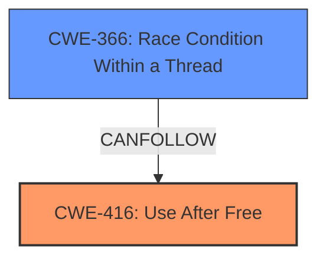

# Final Resolution for CVE-2022-2857

# Summary
| CWE ID  | CWE Name                      | Confidence | CWE Abstraction Level | CWE Vulnerability Mapping Label | CWE-Vulnerability Mapping Notes |
| :-------- | :---------------------------- | :--------- | :-------------------- | :------------------------------ | :------------------------------ |
| CWE-416 | Use After Free                | 1.00      | Variant             | Allowed                       | Primary CWE                     |
| CWE-366 | Race Condition Within a Thread | 0.50      | Base                 | Allowed                       | Secondary CWE (if concurrency is involved), contributes to UAF by allowing memory to be freed prematurely |

## Evidence and Confidence

*   **Confidence Score:** 0.95
*   **Evidence Strength:** HIGH

## Relationship Analysis
The primary relationship that impacted my decision was the *CanFollow* relationship between **CWE-416 (Use After Free)** and **CWE-366 (Race Condition Within a Thread)**. While the vulnerability description doesn't explicitly mention a race condition, the criticism correctly points out that UAF vulnerabilities are frequently caused by race conditions in concurrent environments. If the vulnerability occurs in a concurrent context, **CWE-366** becomes a relevant secondary CWE. The choice of **CWE-416** is also at the recommended Variant level of abstraction, making it a good fit.

## Vulnerability Chain
The vulnerability chain starts with a potential **ROOTCAUSE** of concurrency and a race condition (**CWE-366**). This leads to memory being freed while it is still in use, resulting in a **WEAKNESS** of **CWE-416 (Use After Free)**. The impact is potential heap corruption that could allow a remote attacker to execute arbitrary code via a crafted HTML page.

## Summary of Analysis
The initial analysis correctly identified **CWE-416 (Use After Free)** as the primary CWE based on the explicit vulnerability description: "Use after free in Blink in Google Chrome...allowed a remote attacker to potentially exploit heap corruption via a crafted HTML page." The criticism highlighted the importance of considering the *CanFollow* relationships, particularly with **CWE-366 (Race Condition Within a Thread)**, which is a common cause of UAF vulnerabilities.

I agree with the assessment that **CWE-416** is the most appropriate primary CWE because it directly describes the vulnerability. However, I am adding **CWE-366** as a secondary CWE with a confidence score of 0.50, acknowledging that a race condition may be a contributing factor, especially if the Blink component of Chrome handles multiple threads. Without further information about the specifics of the vulnerability, it is difficult to determine with certainty whether a race condition is involved.

The decision to include **CWE-366** is influenced by the *CanFollow* relationship in the CWE specifications and the fact that **CWE-366** was the second highest match in the Retriever Results. The abstraction levels of **CWE-416** (Variant) and **CWE-366** (Base) are appropriate for describing the vulnerability at the right level of specificity.